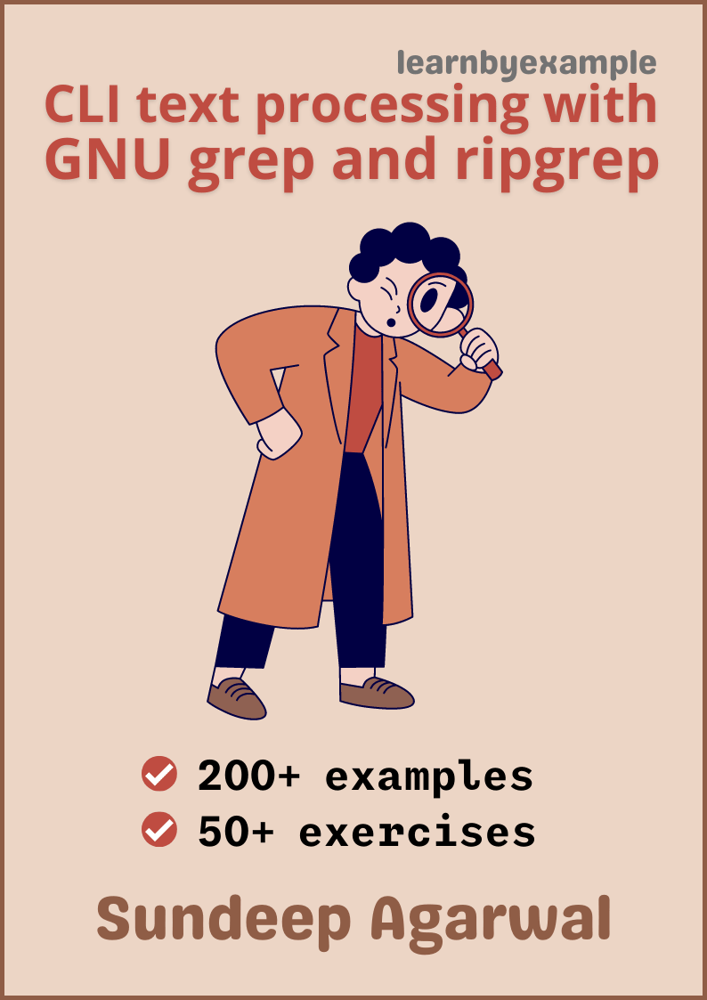

# GNU GREP and RIPGREP

Example based guide to mastering GNU grep and ripgrep.

    

The book also includes exercises to test your understanding, which is presented together as a single file in this repo - [Exercises.md](./exercises/Exercises.md)

See [Version_changes.md](./Version_changes.md) to keep track of changes made to the book.

 

# E-book

You can purchase the book using these links:

* https://gumroad.com/l/gnugrep_ripgrep
* https://leanpub.com/gnugrep_ripgrep
* https://www.instamojo.com/learnbyexample/gnu-grep-and-ripgrep/

For a preview of the book, see [sample chapters](https://github.com/learnbyexample/learn_gnugrep_ripgrep/blob/master/sample_chapters/grep_sample_v1p0.pdf)

 

# Table of Contents

1) Preface
2) Introduction
3) Frequently used options
4) BRE/ERE Regular Expressions
5) Context matching
6) Recursive search
7) Miscellaneous options
8) Perl Compatible Regular Expressions
9) Gotchas and Tricks
10) ripgrep
11) Further Reading

 

# License

The code snippets are licensed under MIT, see [LICENSE](./LICENSE) file
