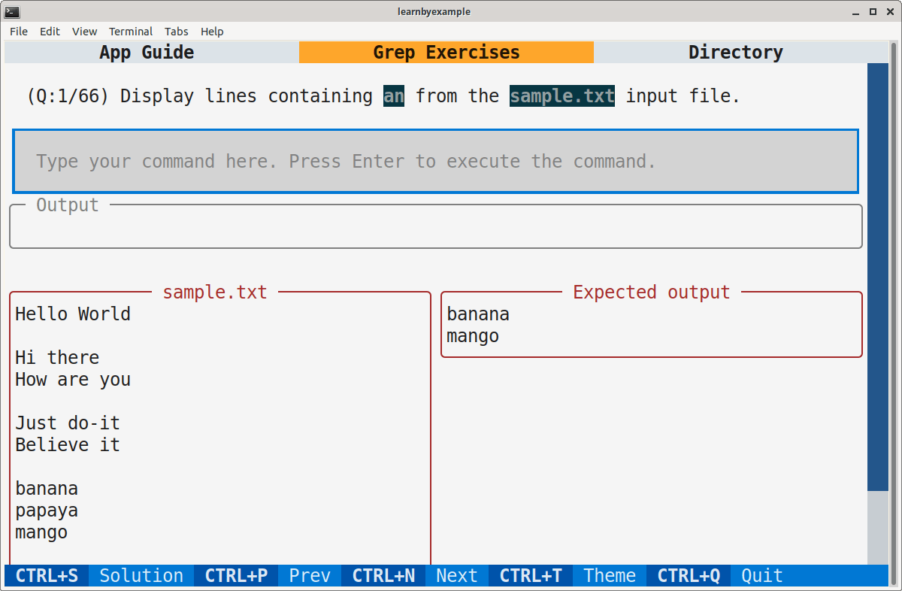

# Preface

You are likely to be familiar with using a search dialog (usually invoked with the `Ctrl+F` shortcut) to locate the occurrences of a particular string. Graphical User Interface (GUI) tools such as a text editor, word processor, web browser and programming IDE usually support such a search feature. The `grep` command is a versatile and feature-rich version of that search functionality usable from the command line. An important feature that GUI applications may lack is **regular expressions**, a mini-programming language to precisely define a matching criteria.

Modern requirements have given rise to tools like `ripgrep` that provide out-of-box features such as recursive search while respecting the ignore rules of a version controlled directory. 

This book heavily leans on examples to present features one by one. In addition to command options, regular expressions will also be discussed in detail. It is recommended that you manually type each example. Make an effort to understand the sample input as well as the solution presented and check if the output changes (or not!) when you alter some part of the input and the command. As an analogy, consider learning to drive a car — no matter how much you read about them or listen to explanations, you'd need practical experience to become proficient.

## Prerequisites

You should be familiar with command line usage in a Unix-like environment. You should also be comfortable with concepts like file redirection and command pipelines.

You are also expected to get comfortable with reading manuals, searching online, visiting external links provided for further reading, tinkering with illustrated examples, asking for help when you are stuck and so on. In other words, be proactive and curious instead of just consuming the content passively.

If you are new to the world of the command line, check out my [Computing from the Command Line](https://github.com/learnbyexample/cli-computing) ebook and curated resources on [Linux CLI and Shell scripting](https://learnbyexample.github.io/curated_resources/linux_cli_scripting.html) before starting this book.

## Conventions

* Code snippets are copy pasted from the Bash shell (version **5.0.17**) for **GNU grep 3.10** and **ripgrep 13.0.0**. Such snippets have been modified for presentation purposes — some commands are preceded by comments to provide context and explanations, blank lines have been added to improve readability and so on.
* Unless otherwise noted, all examples and explanations are meant for **ASCII** input.
* External links are provided throughout the book for you to explore certain topics in more depth.
* The [learn_gnugrep_ripgrep repo](https://github.com/learnbyexample/learn_gnugrep_ripgrep) has all the [example files and scripts](https://github.com/learnbyexample/learn_gnugrep_ripgrep/tree/master/example_files) used in the book. The repo also includes [code snippets](https://github.com/learnbyexample/learn_gnugrep_ripgrep/tree/master/code_snippets) and [exercises](https://github.com/learnbyexample/learn_gnugrep_ripgrep/tree/master/exercises) used in the book. Solutions file is also provided. If you are not familiar with the `git` command, click the **Code** button on the webpage to get the files.

## Acknowledgements

* [GNU grep documentation](https://www.gnu.org/software/grep/manual/grep.html) — manual and examples
* [ripgrep](https://github.com/BurntSushi/ripgrep) — user guide and examples
* [stackoverflow](https://stackoverflow.com/) and [unix.stackexchange](https://unix.stackexchange.com/) — for getting answers to pertinent questions on `grep` and related commands
* [tex.stackexchange](https://tex.stackexchange.com/) — for help on [pandoc](https://github.com/jgm/pandoc/) and `tex` related questions
* [/r/commandline/](https://old.reddit.com/r/commandline), [/r/linux4noobs/](https://old.reddit.com/r/linux4noobs/), [/r/linuxquestions/](https://old.reddit.com/r/linuxquestions/) and [/r/linux/](https://old.reddit.com/r/linux/) — helpful forums
* [canva](https://www.canva.com/) — cover image
* [oxipng](https://github.com/shssoichiro/oxipng), [pngquant](https://pngquant.org/) and [svgcleaner](https://github.com/RazrFalcon/svgcleaner) — optimizing images
* [Warning](https://commons.wikimedia.org/wiki/File:Warning_icon.svg) and [Info](https://commons.wikimedia.org/wiki/File:Info_icon_002.svg) icons by [Amada44](https://commons.wikimedia.org/wiki/User:Amada44) under public domain
* [carbon](https://carbon.now.sh/) — creating terminal screenshots with highlighted text
* [Andrew Gallant](https://blog.burntsushi.net/about/) (author of `ripgrep`), [mikeblas](https://old.reddit.com/user/mikeblas) and [Pound-Hash](https://github.com/Pound-Hash) for critical feedback

Special thanks to all my friends and online acquaintances for their help, support and encouragement, especially during difficult times.

## Feedback and Errata

I would highly appreciate it if you'd let me know how you felt about this book. It could be anything from a simple thank you, pointing out a typo, mistakes in code snippets, which aspects of the book worked for you (or didn't!) and so on. Reader feedback is essential and especially so for self-published authors.

You can reach me via:

* Issue Manager: [https://github.com/learnbyexample/learn_gnugrep_ripgrep/issues](https://github.com/learnbyexample/learn_gnugrep_ripgrep/issues)
* E-mail: learnbyexample.net@gmail.com
* Twitter: [https://twitter.com/learn_byexample](https://twitter.com/learn_byexample)

## Author info

Sundeep Agarwal is a lazy being who prefers to work just enough to support his modest lifestyle. He accumulated vast wealth working as a Design Engineer at Analog Devices and retired from the corporate world at the ripe age of twenty-eight. Unfortunately, he squandered his savings within a few years and had to scramble trying to earn a living. Against all odds, selling programming ebooks saved his lazy self from having to look for a job again. He can now afford all the fantasy ebooks he wants to read and spends unhealthy amount of time browsing the internet.

When the creative muse strikes, he can be found working on yet another programming ebook (which invariably ends up having at least one example with regular expressions). Researching materials for his ebooks and everyday social media usage drowned his bookmarks, so he maintains curated resource lists for sanity sake. He is thankful for free learning resources and open source tools. His own contributions can be found at [https://github.com/learnbyexample](https://github.com/learnbyexample).

**List of books:** https://learnbyexample.github.io/books/

## License

This work is licensed under a [Creative Commons Attribution-NonCommercial-ShareAlike 4.0 International License](https://creativecommons.org/licenses/by-nc-sa/4.0/).

Code snippets are available under [MIT License](https://github.com/learnbyexample/learn_gnugrep_ripgrep/blob/master/LICENSE).

Resources mentioned in Acknowledgements section above are available under original licenses.

## Book version

2.0

See [Version_changes.md](https://github.com/learnbyexample/learn_gnugrep_ripgrep/blob/master/Version_changes.md) to track changes across book versions.

# Introduction

Quoting from [wikipedia](https://en.wikipedia.org/wiki/Grep):

>**`grep`** is a command-line utility for searching plain-text data sets for lines that match a regular expression. Its name comes from the ed command `g/re/p` (***g**lobal / **r**egular **e**xpression search / and **p**rint*), which has the same effect.

Use of `grep` has become so ubiquitous that it has found its way into the [Oxford dictionary](https://www.lexico.com/en/definition/grep) as well. As part of everyday computer usage, the need to search comes up often. It could be finding the right emoji by name on social media, searching your browser bookmarks, locating a particular function in a programming file and so on. Some of these tools have options for refining a search further, like controlling case sensitivity, restricting matches to whole words, using regular expressions, etc.

`grep` provides all of the above features and much more when it comes to searching and extracting content from text files. After getting used to `grep`, the search features provided by GUI programs feel slower and inadequate.

## Installation

If you are on a Unix-like system, you will most likely have some version of `grep` already installed. This book is primarily about `GNU grep` and also has a chapter on `ripgrep`. As there are syntax and feature differences between various implementations, make sure to have these particular commands to follow along the examples presented in this book.

`GNU grep` is part of the [text creation and manipulation](https://www.gnu.org/manual/manual.html) tools and comes by default on GNU/Linux distributions. To install a particular version, visit [gnu: grep software](https://www.gnu.org/software/grep/). See also [release notes](https://savannah.gnu.org/news/?group_id=67) for an overview of changes between versions and [bug list](https://debbugs.gnu.org/cgi/pkgreport.cgi?package=grep) if you think some command isn't working as expected.

Sample instructions for compiling the latest version are shown below. You might need to install a PCRE library first, for example `sudo apt install libpcre2-dev`.

```bash
$ wget https://ftp.gnu.org/gnu/grep/grep-3.10.tar.xz
$ tar -xf grep-3.10.tar.xz
$ cd grep-3.10/
# see https://askubuntu.com/q/237576 if you get compiler not found error
$ ./configure
$ make
$ sudo make install

$ grep -V | head -n1
grep (GNU grep) 3.10
```

If you are not using a Linux distribution, you may be able to access `GNU grep` using an option below:

* [Git for Windows](https://git-scm.com/downloads) — provides a Bash emulation used to run Git from the command line
* [Windows Subsystem for Linux](https://en.wikipedia.org/wiki/Windows_Subsystem_for_Linux) — compatibility layer for running Linux binary executables natively on Windows
* [brew](https://brew.sh/) — Package Manager for macOS (or Linux)

## Options overview

It is always good to know where to find documentation. From the command line, you can use `man grep` for a short manual and `info grep` for the full documentation. I prefer using the [online gnu grep manual](https://www.gnu.org/software/grep/manual/grep.html), which feels much easier to use and navigate.

```bash
$ man grep
NAME
       grep - print lines that match patterns

SYNOPSIS
       grep [OPTION...] PATTERNS [FILE...]
       grep [OPTION...] -e PATTERNS ... [FILE...]
       grep [OPTION...] -f PATTERN_FILE ... [FILE...]

DESCRIPTION
       grep searches for PATTERNS in each FILE.  PATTERNS is one or more
       patterns separated by newline characters, and  grep  prints  each
       line that matches a pattern.  Typically PATTERNS should be quoted
       when grep is used in a shell command.

       A FILE of “-” stands for standard input.  If no  FILE  is  given,
       recursive   searches   examine   the   working   directory,   and
       nonrecursive searches read standard input.
```

For a quick overview of all the available options, use `grep --help` from the command line. These are shown below in table format:

**Regexp selection**:

| Option                   | Description    |
| ------------------------ | -------------- |
|   -E, --extended-regexp  | PATTERNS are extended regular expressions |
|   -F, --fixed-strings    | PATTERNS are strings |
|   -G, --basic-regexp     | PATTERNS are basic regular expressions |
|   -P, --perl-regexp      | PATTERNS are Perl regular expressions |
|   -e, --regexp=PATTERNS  | use PATTERNS for matching |
|   -f, --file=FILE        | take PATTERNS from FILE |
|   -i, --ignore-case      | ignore case distinctions in patterns and data |
|       --no-ignore-case   | do not ignore case distinctions (default) |
|   -w, --word-regexp      | match only whole words |
|   -x, --line-regexp      | match only whole lines |
|   -z, --null-data        | a data line ends in 0 byte, not newline |

**Miscellaneous**:

| Option                   | Description    |
| ------------------------ | -------------- |
|  -s, --no-messages       | suppress error messages |
|  -v, --invert-match      | select non-matching lines |
|  -V, --version           | display version information and exit |
|      --help              | display this help text and exit |

**Output control**:

| Option                       | Description    |
| ------------------------     | -------------- |
| -m, --max-count=NUM          | stop after NUM selected lines |
| -b, --byte-offset            | print the byte offset with output lines |
| -n, --line-number            | print line number with output lines |
|     --line-buffered          | flush output on every line |
| -H, --with-filename          | print file name with output lines |
| -h, --no-filename            | suppress the file name prefix on output |
|     --label=LABEL            | use LABEL as the standard input file name prefix |
| -o, --only-matching          | show only nonempty parts of lines that match |
| -q, --quiet, --silent        | suppress all normal output |
|     --binary-files=TYPE      | assume that binary files are TYPE; |
|                              | TYPE is 'binary', 'text', or 'without-match' |
| -a, --text                   | equivalent to --binary-files=text |
| -I                           | equivalent to --binary-files=without-match |
| -d, --directories=ACTION     | how to handle directories; |
|                              | ACTION is 'read', 'recurse', or 'skip' |
| -D, --devices=ACTION         | how to handle devices, FIFOs and sockets; |
|                              | ACTION is 'read' or 'skip' |
| -r, --recursive              | like --directories=recurse |
| -R, --dereference-recursive  | likewise, but follow all symlinks |
|     --include=GLOB           | search only files that match GLOB (a file pattern) |
|     --exclude=GLOB           | skip files that match GLOB |
|     --exclude-from=FILE      | skip files that match any file pattern from FILE |
|     --exclude-dir=GLOB       | skip directories that match GLOB |
| -L, --files-without-match    | print only names of FILEs with no selected lines |
| -l, --files-with-matches     | print only names of FILEs with selected lines |
| -c, --count                  | print only a count of selected lines per FILE |
| -T, --initial-tab            | make tabs line up (if needed) |
| -Z, --null                   | print 0 byte after FILE name |

**Context control**:

| Option                     | Description    |
| ------------------------   | -------------- |
|  -B, --before-context=NUM  |  print NUM lines of leading context |
|  -A, --after-context=NUM   |  print NUM lines of trailing context |
|  -C, --context=NUM         |  print NUM lines of output context |
|  -NUM                      |  same as --context=NUM |
|      --group-separator=SEP |  print SEP on line between matches with context |
|      --no-group-separator  |  do not print separator for matches with context |
|      --color[=WHEN],       |  use markers to highlight the matching strings; |
|      --colour[=WHEN]       |  WHEN is 'always', 'never', or 'auto' |
|  -U, --binary              |  do not strip CR characters at EOL (MSDOS/Windows) |

# Frequently used options

This chapter will cover many of the options provided by `GNU grep`. Regular expressions will be covered later, so the examples in this chapter will only use literal strings as search patterns. Literal (fixed string) matching refers to exact string comparison, so no special meaning is assigned for any of the search characters.

> The [example_files](https://github.com/learnbyexample/learn_gnugrep_ripgrep/tree/master/example_files) directory has all the files used in the examples.

## Basic string search

By default, `grep` will print all the input *lines* that match the given search patterns. The newline character `\n` is the line separator by default. This section will show you how to filter lines matching a given search string using `grep`. Consider this sample input file:

```bash
$ cat ip.txt
it is a warm and cozy day
listen to what I say
go play in the park
come back before the sky turns dark

There are so many delights to cherish
Apple, Banana and Cherry
Bread, Butter and Jelly
Try them all before you perish
```

To filter desired lines, invoke the `grep` command, pass the search string and then specify one or more filenames that have to be searched. As a good practice, always use single quotes around the search string. Examples requiring shell interpretation will be discussed later.

```bash
$ grep 'play' ip.txt
go play in the park

$ grep 'y t' ip.txt
come back before the sky turns dark
Try them all before you perish
```

`grep` will perform the search on `stdin` data if there are no file arguments or if `-` is used as a filename.

```bash
$ printf 'apple\nbanana\nmango\nfig\n' | grep 'an'
banana
mango

$ printf 'apple\nbanana\nmango\nfig\n' | grep 'an' -
banana
mango
```

Here's an example where `grep` reads user written `stdin` data and the filtered output is redirected to a file.

```bash
# press Ctrl+d after the line containing 'histogram'
$ grep 'is' > op.txt
hi there
this is a sample line
have a nice day
histogram

$ cat op.txt
this is a sample line
histogram

$ rm op.txt
```

> If your input file has `\r\n` (carriage return and newline characters) as the line ending, convert the input file to Unix-style before processing. See [stackoverflow: Why does my tool output overwrite itself and how do I fix it?](https://stackoverflow.com/q/45772525/4082052) for a detailed discussion and mitigation methods.
> 
> ```bash
> # Unix style
> $ printf '42\n' | file -
> /dev/stdin: ASCII text
> 
> # DOS style
> $ printf '42\r\n' | file -
> /dev/stdin: ASCII text, with CRLF line terminators
> ```

## Fixed string search

The search string (pattern) is treated as a Basic Regular Expression (BRE) by default. But regular expressions is a topic for the next chapter. For now, use the `-F` option to indicate that the patterns should be matched literally.

```bash
# oops, why did it not match?
$ echo 'int a[5]' | grep 'a[5]'
# where did that error come from??
$ echo 'int a[5]' | grep 'a['
grep: Invalid regular expression
# what is going on???
$ echo 'int a[5]' | grep 'a[5'
grep: Unmatched [, [^, [:, [., or [=

# use the -F option to match strings literally
$ echo 'int a[5]' | grep -F 'a[5]'
int a[5]
```

> If the search string doesn't have any regular expression metacharacters, `GNU grep` will try a literal search even if the `-F` option isn't used.

## Case insensitive search

Sometimes, you don't know if a log file contains case variable search terms, such as `error`, `Error`, or `ERROR`. In such cases, you can use the `-i` option to ignore case.

```bash
$ grep -i 'the' ip.txt
go play in the park
come back before the sky turns dark
There are so many delights to cherish
Try them all before you perish

$ printf 'Cat\ncOnCaT\ncut\n' | grep -i 'cat'
Cat
cOnCaT
```

## Invert matching lines

Use the `-v` option to get lines other than those matching the search term.

```bash
$ seq 4 | grep -v '3'
1
2
4

$ printf 'goal\nrate\neat\npit' | grep -v 'at'
goal
pit
```

> Text processing often involves negating a logic to arrive at a solution or to make it simpler. Look out for opposite pairs like `-l -L`, `-h -H`, negative logic in regular expressions and so on in the examples to follow.

## Line number and count

The `-n` option will prefix line numbers to matching results, using a colon character as the separator. This is useful to quickly locate matching lines for further processing.

```bash
$ grep -n 'to' ip.txt
2:listen to what I say
6:There are so many delights to cherish

$ printf 'great\nneat\nuser' | grep -n 'eat'
1:great
2:neat
```

Having to count the total number of matching lines comes up often. Somehow piping `grep` output to the `wc` command is prevalent instead of simply using the `-c` option.

```bash
# number of lines matching the pattern
$ grep -c 'is' ip.txt
4

# number of lines NOT matching the pattern
$ printf 'goal\nrate\neat\npit' | grep -vc 'g'
3
```

When multiple input files are passed, the count is displayed for each file separately. Use `cat` if you need a combined count.

```bash
# here - represents the stdin data
$ printf 'this\nis\ncool\n' | grep -c 'is' ip.txt -
ip.txt:4
(standard input):2

# useful application of the cat command
$ cat <(printf 'this\nis\ncool\n') ip.txt | grep -c 'is'
6
```

> The output given by the `-c` option is the total number of **lines** matching the given patterns, not the total number of matches. Use the `-o` option, and pipe the output to `wc -l` to count every occurrence (example shown later).

## Limiting output lines

Sometimes, there are too many results, in which case you could pipe the output to a **pager** tool like `less`. Or use the `-m` option to limit how many matching lines should be displayed for each input file. `grep` will stop processing an input file as soon as the condition specified by `-m` is satisfied. Note that just like the `-c` option, `-m` works by line count and not based on the total number of matches.

```bash
$ grep -m2 'is' ip.txt
it is a warm and cozy day
listen to what I say

$ seq 1000 | grep -m4 '2'
2
12
20
21
```

## Multiple search strings

The `-e` option can be used to specify multiple search strings from the command line. This is similar to conditional OR boolean logic.

```bash
# search for 'what' or 'But'
$ grep -e 'what' -e 'But' ip.txt
listen to what I say
Bread, Butter and Jelly
```

If you have a huge list of strings to search, save them in a file, one search string per line. Make sure there are no empty lines. Then use the `-f` option to specify a file as the source of search strings. You can use this option multiple times and also add more patterns from the command line using the `-e` option. Also, add the `-F` option when searching for literal matches. It is easy to miss regular expression metacharacters in a big list of terms.

```bash
$ cat search.txt
say
you

$ grep -Ff search.txt ip.txt
listen to what I say
Try them all before you perish

# example with both -f and -e options
$ grep -Ff search.txt -e 'it' -e 'are' ip.txt
it is a warm and cozy day
listen to what I say
There are so many delights to cherish
Try them all before you perish
```

To find lines matching more than one search term, you'd need to either resort to using regular expressions (covered later) or workaround by using shell pipes. This is similar to conditional AND boolean logic.

```bash
# match lines containing both 'is' and 'to' in any order
# same as: grep 'to' ip.txt | grep 'is'
$ grep 'is' ip.txt | grep 'to'
listen to what I say
There are so many delights to cherish
```

## Get filename instead of matching lines

Often, you just want a list of filenames that match the search patterns. The output might get saved for future reference or passed to another command like `sed`, `awk`, `perl`, `sort`, etc for further processing. Some of these commands can handle search by themselves, but `grep` is a fast and specialized tool for searching and using shell pipes can improve performance if parallel processing is available. Similar to the `-m` option, `grep` will stop processing the input file as soon as the given condition is satisfied.

* `-l` will list files matching the pattern
* `-L` will list files NOT matching the pattern

Here are some examples:

```bash
# list filename if it contains 'are'
$ grep -l 'are' ip.txt search.txt
ip.txt
# no output because no match was found
$ grep -l 'xyz' ip.txt search.txt
# list filename if it contains 'say'
$ grep -l 'say' ip.txt search.txt
ip.txt
search.txt

# list filename if it does NOT contain 'xyz'
$ grep -L 'xyz' ip.txt search.txt
ip.txt
search.txt
# list filename if it does NOT contain 'are'
$ grep -L 'are' ip.txt search.txt
search.txt
```

## Filename prefix for matching lines

If there are multiple input files, `grep` will automatically prefix the filename when displaying the matching lines. You can also control whether or not to add the prefix using the following options:

* `-h` option will prevent filename prefix in the output (default for single input file)
* `-H` option will always show filename prefix (default for multiple input files)

```bash
# -h is on by default for single input file
$ grep 'say' ip.txt
listen to what I say
# using -h to suppress filename prefix for multiple input files
$ printf 'say\nyou\n' | grep -h 'say' - ip.txt
say
listen to what I say

# -H is on by default for multiple input files
$ printf 'say\nyou\n' | grep 'say' - ip.txt
(standard input):say
ip.txt:listen to what I say
# use -H to always show filename prefix
# instead of -H, you can also provide /dev/null as an additional input file
$ grep -H 'say' ip.txt
ip.txt:listen to what I say
```

## Quickfix

The `vim` editor has a quickfix option `-q` that makes it easy to edit the matching lines from `grep`'s output. Make sure that the output has both line numbers and filename prefixes.

```bash
# -H ensures filename prefix and -n provides line numbers
$ grep -Hn 'say' ip.txt search.txt
ip.txt:2:listen to what I say
search.txt:1:say

# use :cn and :cp to navigate to next/previous occurrences
# command-line area at the bottom will show number of matches and filenames
# you can also save the grep output and pass that filename instead of <()
$ vim -q <(grep -Hn 'say' ip.txt search.txt)
```

## Colored output

When working from the terminal, having the `--color` option enabled makes it easier to spot the matching portions in the output. Especially useful when you are experimenting to find the correct regular expression. Modern terminals will usually have color support, see [unix.stackexchange: How to check if bash can print colors?](https://unix.stackexchange.com/q/9957/109046) for details.

The `--color` (or `--colour`) option will highlight matching patterns, line numbers, filenames, etc. There are three different settings:

* `auto` will result in color highlighting when results are displayed on terminal, but not when the output is redirected to another command, file, etc. This is the default setting
* `always` will result in color highlighting when results are displayed on terminal as well as when the output is redirected to another command, file, etc
* `never` explicitly disables color highlighting

Here are couple of examples with the `--color` option enabled (default is `auto`).


It is typical to alias both the `ls` and `grep` commands to include `--color=auto`.

```bash
# aliases are usually saved in ~/.bashrc or ~/.bash_aliases
$ alias ls='ls --color=auto'
$ alias grep='grep --color=auto'
```

Using `--color=always` is handy if you want to retain color information even when the output is redirected. For example, piping the results to the `less` command.

```bash
$ grep --color=always -i 'the' ip.txt | less -R
```

The below image will help you understand the difference between the `auto` and `always` features. In the first case, `is` gets highlighted even after piping, while in the second case `is` loses the color information. In practice, `always` is rarely used as it provides extra information to matching lines, which could cause undesirable results when processed.


## Match whole word

A word character is any alphabet (irrespective of case), digit and the underscore character. You might wonder why there are digits and underscores as well, why not only alphabets? This comes from variable and function naming conventions — typically alphabets, digits and underscores are allowed. So, the definition is more programming oriented than natural language. The `-w` option will ensure that given patterns are not surrounded by other word characters. For example, this helps to distinguish `par` from `spar`, `park`, `apart`, `par2`, `_par`, etc.

```bash
# this matches 'par' anywhere in the line
$ printf 'par value\nheir apparent\n' | grep 'par'
par value
heir apparent
# this matches 'par' only as a whole word
$ printf 'par value\nheir apparent\n' | grep -w 'par'
par value
```

> The `-w` option behaves a bit differently than word boundaries in regular expressions. See the [Word boundary differences](#word-boundary-differences) section for details.

## Match whole line

Another useful option is `-x`, which will display a line only if the entire line satisfies the given pattern.

```bash
# this matches 'my book' anywhere in the line
$ printf 'see my book list\nmy book\n' | grep 'my book'
see my book list
my book
# this matches 'my book' only as a whole line
$ printf 'see my book list\nmy book\n' | grep -x 'my book'
my book

$ grep 'say' ip.txt search.txt
ip.txt:listen to what I say
search.txt:say
$ grep -x 'say' ip.txt search.txt
search.txt:say

# count empty lines, won't work for files with DOS style line endings
$ grep -cx '' ip.txt
1
```

## Comparing lines between files

The `-f` and `-x` options can be combined to get common lines between two files or the difference when `-v` is used as well. If you want to match the lines literally, it is advised to use the `-F` option as well, because you might not know if there are regular expression metacharacters present in the input files or not.

```bash
$ printf 'teal\nlight blue\nbrown\nyellow\n' > colors_1
$ printf 'blue\nblack\ndark green\nyellow\n' > colors_2

# common lines between two files
$ grep -Fxf colors_1 colors_2
yellow

# lines present in colors_2 but not in colors_1
$ grep -Fvxf colors_1 colors_2
blue
black
dark green

# lines present in colors_1 but not in colors_2
$ grep -Fvxf colors_2 colors_1
teal
light blue
brown
```

See also [stackoverflow: Fastest way to find lines of a text file from another larger text file](https://stackoverflow.com/q/42239179/4082052) — go through all the answers.

## Extract only matching portion

If the total number of matches is required, use the `-o` option to display only the matching portions (one per line), and then use `wc` to count them. This option is more commonly used with regular expressions.

```bash
$ grep -oi 'the' ip.txt
the
the
The
the

# -c only gives count of matching lines
$ grep -c 'an' ip.txt
4
# use -o to get each match on a separate line
$ grep -o 'an' ip.txt | wc -l
6
```

## Summary

In my initial years of CLI usage as a VLSI engineer, I knew only some of the options listed in this chapter. Didn't even know about the `--color` option. I've come across comments about not knowing the `-c` option in online forums. These are some of the reasons why I'd advise going through the list of all the options if you use a command frequently. Bonus points for maintaining a cheatsheet of example usage for future reference, passing on to your colleagues, etc.

## Interactive exercises

I wrote a TUI app to help you solve some of the exercises from this book interactively. See [GrepExercises](https://github.com/learnbyexample/TUI-apps/tree/main/GrepExercises) repo for installation steps and [app_guide.md](https://github.com/learnbyexample/TUI-apps/blob/main/GrepExercises/app_guide.md) for instructions on using this app.

Here's a sample screenshot:



## Exercises

> All the exercises are also collated together in one place at [Exercises.md](https://github.com/learnbyexample/learn_gnugrep_ripgrep/blob/master/exercises/Exercises.md). For solutions, see [Exercise_solutions.md](https://github.com/learnbyexample/learn_gnugrep_ripgrep/blob/master/exercises/Exercise_solutions.md).

> The [exercises](https://github.com/learnbyexample/learn_gnugrep_ripgrep/tree/master/exercises) directory has all the files used in this section.

**1)** Display lines containing `an` from the `sample.txt` input file.

```bash
##### add your solution here
banana
mango
```

**2)** Display lines containing `do` as a whole word from the `sample.txt` input file.

```bash
##### add your solution here
Just do-it
```

**3)** Display lines from `sample.txt` that satisfy both of these conditions:

* `he` matched irrespective of case
* either `World` or `Hi` matched case sensitively

```bash
##### add your solution here
Hello World
Hi there
```

**4)** Display lines from `code.txt` containing `fruit[0]` literally.

```bash
##### add your solution here
fruit[0] = 'apple'
```

**5)** Display only the first two matching lines containing `t` from the `sample.txt` input file.

```bash
##### add your solution here
Hi there
Just do-it
```

**6)** Display only the first three matching lines that do *not* contain `he` from the `sample.txt` input file.

```bash
##### add your solution here
Hello World

How are you
```

**7)** Display lines from `sample.txt` that contain `do` along with line number prefix.

```bash
##### add your solution here
6:Just do-it
13:Much ado about nothing
```

**8)** For the input file `sample.txt`, count the number of times the string `he` is present, irrespective of case.

```bash
##### add your solution here
5
```

**9)** For the input file `sample.txt`, count the number of empty lines.

```bash
##### add your solution here
4
```

**10)** For the input files `sample.txt` and `code.txt`, display matching lines based on the search terms (one per line) present in the `terms.txt` file. Results should be prefixed with the corresponding input filename.

```bash
$ cat terms.txt
are
not
go
fruit[0]

##### add your solution here
sample.txt:How are you
sample.txt:mango
sample.txt:Much ado about nothing
sample.txt:Adios amigo
code.txt:fruit[0] = 'apple'
```

**11)** For the input file `sample.txt`, display lines containing `amigo` prefixed by the input filename as well as the line number.

```bash
##### add your solution here
sample.txt:15:Adios amigo
```

**12)** For the input files `sample.txt` and `code.txt`, display only the filename if it contains `apple`.

```bash
##### add your solution here
code.txt
```

**13)** For the input files `sample.txt` and `code.txt`, display only whole matching lines based on the search terms (one per line) present in the `lines.txt` file. Results should be prefixed with the corresponding input filename as well as the line number.

```bash
$ cat lines.txt
banana
fruit = []

##### add your solution here
sample.txt:9:banana
code.txt:1:fruit = []
```

**14)** For the input files `sample.txt` and `code.txt`, count the number of lines that do *not* match any of the search terms (one per line) present in the `terms.txt` file.

```bash
##### add your solution here
sample.txt:11
code.txt:3
```

**15)** Count the total number of lines containing `banana` in the input files `sample.txt` and `code.txt`.

```bash
##### add your solution here
2
```

**16)** Which two conditions are necessary for the output of the `grep` command to be suitable for the `vim -q` quickfix mode?

**17)** What's the default setting for the `--color` option? Give an example where the `always` setting would be useful.

**18)** The command shown below tries to get the number of empty lines, but apparently shows the wrong result, why?

```bash
$ grep -cx '' dos.txt
0
```

# BRE/ERE Regular Expressions

This chapter covers Basic and Extended Regular Expressions as implemented in `GNU grep`. Unless otherwise indicated, examples and descriptions will assume ASCII input. `GNU grep` also supports Perl Compatible Regular Expressions, which will be discussed in a [later chapter](#perl-compatible-regular-expressions).

By default, `grep` treats the search pattern as Basic Regular Expression (BRE). Here are the various options available to choose a particular flavor:

* `-G` option can be used to specify explicitly that BRE is needed
* `-E` option will enable Extended Regular Expression (ERE)
    * in `GNU grep`, BRE and ERE only differ in how metacharacters are specified, no difference in features
* `-F` option will cause the search patterns to be treated literally
* `-P` if available, this option will enable Perl Compatible Regular Expression (PCRE)

> The [example_files](https://github.com/learnbyexample/learn_gnugrep_ripgrep/tree/master/example_files) directory has all the files used in the examples.

> See [grep manual: Problematic Regular Expressions](https://www.gnu.org/software/grep/manual/grep.html#Problematic-Regular-Expressions) if you are working on portable scripts. See also [POSIX specification for BRE and ERE](https://pubs.opengroup.org/onlinepubs/9699919799/basedefs/V1_chap09.html).

## Line Anchors

Instead of matching anywhere in the line, restrictions can be specified. For now, you'll see the ones that are already part of BRE/ERE. In later sections and chapters, you'll get to know how to define your own rules for restriction. These restrictions are made possible by assigning special meaning to certain characters and escape sequences.

The characters with special meaning are known as **metacharacters** in regular expressions parlance. In case you need to match those characters literally, you need to escape them with a `\` (discussed in the [Escaping metacharacters](#escaping-metacharacters) section).

There are two line anchors:

* `^` metacharacter restricts the matching to the start of the line
* `$` metacharacter restricts the matching to the end of the line

Here are some examples:

```bash
$ cat anchors.txt
sub par
spar
apparent effort
two spare computers
cart part tart mart

# lines starting with 's'
$ grep '^s' anchors.txt
sub par
spar

# lines ending with 'rt'
$ grep 'rt$' anchors.txt
apparent effort
cart part tart mart
```

You can combine these two anchors to match only whole lines. Or, use the `-x` option.

```bash
$ printf 'spared no one\npar\nspar\ndare' | grep '^par$'
par
$ printf 'spared no one\npar\nspar\ndare' | grep -x 'par'
par
```

## Word Anchors

The second type of restriction is word anchors. A word character is any alphabet (irrespective of case), digit and the underscore character. This is similar to using `-w` option, with added flexibility of using word anchor only at the start or end of a word.

The escape sequence `\b` denotes a word boundary. This works for both the start of word and the end of word anchoring. Start of word means either the character prior to the word is a non-word character or there is no character (start of line). Similarly, end of word means the character after the word is a non-word character or no character (end of line). This implies that you cannot have word boundaries without a word character. Here are some examples:

```bash
$ cat anchors.txt
sub par
spar
apparent effort
two spare computers
cart part tart mart

# match words starting with 'par'
$ grep '\bpar' anchors.txt
sub par
cart part tart mart

# match words ending with 'par'
$ grep 'par\b' anchors.txt
sub par
spar

# match only whole word 'par'
$ grep '\bpar\b' anchors.txt
sub par
$ grep -w 'par' anchors.txt
sub par
```

> Word boundaries behave a bit differently than the `-w` option. See the [Word boundary differences](#word-boundary-differences) section for details.

> Alternatively, you can use `\<` to indicate the start of word anchor and `\>` to indicate the end of word anchor. Using `\b` is preferred as it is more commonly used in other regular expression implementations and has `\B` as its opposite.

## Opposite Word Anchor

The word boundary has an opposite anchor too. `\B` matches wherever `\b` doesn't match. This duality will be seen with some other escape sequences too.

```bash
# match 'par' if it is surrounded by word characters
$ grep '\Bpar\B' anchors.txt
apparent effort
two spare computers

# match 'par' but not as start of word
$ grep '\Bpar' anchors.txt
spar
apparent effort
two spare computers

# match 'par' but not as end of word
$ grep 'par\B' anchors.txt
apparent effort
two spare computers
cart part tart mart
```

> Negative logic is handy in many text processing situations. But use it with care, you might end up matching things you didn't intend.

## Alternation

Many a times, you'd want to search for multiple terms. In a conditional expression, you can use the logical operators to combine multiple conditions. With regular expressions, the `|` metacharacter is similar to logical OR. The regular expression will match if any of the patterns separated by `|` is satisfied.

Alternation is similar to using multiple `-e` option, but provides more flexibility when combined with grouping. The `|` metacharacter syntax varies between BRE and ERE. Quoting from the manual:

>In basic regular expressions the meta-characters `?`, `+`, `{`, `|`, `(`, and `)` lose their special meaning; instead use the backslashed versions `\?`, `\+`, `\{`, `\|`, `\(`, and `\)`.

Here are some examples:

```bash
$ cat pets.txt
I like cats
I like parrots
I like dogs

# three different ways to match either 'cat' or 'dog'
$ grep 'cat\|dog' pets.txt
I like cats
I like dogs
$ grep -E 'cat|dog' pets.txt
I like cats
I like dogs
$ grep -e 'cat' -e 'dog' pets.txt
I like cats
I like dogs

# extract either 'cat' or 'dog' or 'fox' case insensitively
$ printf 'CATs dog bee parrot FoX' | grep -ioE 'cat|dog|fox'
CAT
dog
FoX
```

Here's an example of alternate patterns with their own anchors:

```bash
# match lines starting with 't' or a line containing a word ending with 'ar'
$ grep -E '^t|ar\b' anchors.txt
sub par
spar
two spare computers
```

Sometimes, you want to view the entire input file with only the required search patterns highlighted. You can use an empty alternation to match any line.


## Alternation precedence

There are some tricky corner cases when using alternation. If it is used for filtering a line, there is no ambiguity. However, for matching portion extraction with `-o` option, it depends on a few factors. Say, you want to extract `are` or `spared` — which one should get precedence? The bigger word `spared` or the substring `are` inside it or based on something else?

The alternative which matches earliest in the input gets precedence.

```bash
$ echo 'car spared spar' | grep -oE 'are|spared'
spared
$ echo 'car spared spar' | grep -oE 'spared|are'
spared
```

In case of matches starting from same location, for example `party` and `par`, the longest matching portion gets precedence. See [Longest match wins](#longest-match-wins) section for more examples. See [regular-expressions: alternation](https://www.regular-expressions.info/alternation.html) for more information on this topic.

```bash
# same output irrespective of alternation order
$ echo 'pool party 2' | grep -oE 'party|par'
party
$ echo 'pool party 2' | grep -oE 'par|party'
party

# other implementations like PCRE have left-to-right priority
$ echo 'pool party 2' | grep -oP 'par|party'
par
```

## Grouping

Often, there are some common things among the regular expression alternatives. It could be common characters or qualifiers like the anchors. In such cases, you can group them using a pair of parentheses metacharacters. Similar to `a(b+c)d = abd+acd` in maths, you get `a(b|c)d = abd|acd` in regular expressions.

```bash
# without grouping
$ printf 'red\nreform\nread\ncrest' | grep -E 'reform|rest'
reform
crest
# with grouping
$ printf 'red\nreform\nread\ncrest' | grep -E 're(form|st)'
reform
crest

# without grouping
$ grep -E '\bpar\b|\bpart\b' anchors.txt
sub par
cart part tart mart
# taking out common anchors
$ grep -E '\b(par|part)\b' anchors.txt
sub par
cart part tart mart
# taking out common characters as well
# you'll later learn a better technique instead of using empty alternate
$ grep -E '\bpar(|t)\b' anchors.txt
sub par
cart part tart mart
```

## Escaping metacharacters

You have already seen a few metacharacters and escape sequences that help compose a regular expression. To match the metacharacters literally, i.e. to remove their special meaning, prefix those characters with a `\` character. To indicate a literal `\` character, use `\\`. Some of the metacharacters, like the line anchors, lose their special meaning when not used in their customary positions with BRE syntax.

If there are many metacharacters to be escaped, try to work out alternate solutions by using `-F` (paired with regular expression like options such as `-e`, `-f`, `-i`, `-w`, `-x`, etc) or by switching between ERE and BRE. Another option is to use PCRE (covered later), which has special constructs to mark whole or portion of pattern to be matched literally — especially useful when using shell variables.

```bash
# line anchors aren't special away from customary positions with BRE
$ echo 'a^2 + b^2 - C*3' | grep 'b^2'
a^2 + b^2 - C*3
$ echo '$a = $b + $c' | grep '$b'
$a = $b + $c

# escape line anchors to match literally if you are using ERE
# or if you want to match them at customary positions with BRE
$ echo '$a = $b + $c' | grep -o '\$' | wc -l
3

# or use -F where possible
$ echo '$a = $b + $c' | grep -oF '$' | wc -l
3
```

Here's another example to show differences between BRE and ERE:

```bash
# cannot use -F here as line anchor is needed
$ printf '(a/b) + c\n3 + (a/b) - c' | grep '^(a/b)'
(a/b) + c
$ printf '(a/b) + c\n3 + (a/b) - c' | grep -E '^\(a/b)'
(a/b) + c
```

## Matching characters like tabs

`GNU grep` doesn't support escape sequences like `\t` (tab) and `\n` (newline). Neither does it support formats like `\xNN` (specifying a character by its codepoint value in hexadecimal format). Shells like Bash support [ANSI-C Quoting](https://www.gnu.org/software/bash/manual/bash.html#ANSI_002dC-Quoting) as an alternate way to use such escape sequences.

```bash
# $'..' is ANSI-C quoting syntax
$ printf 'go\tto\ngo to' | grep $'go\tto'
go      to

# \x20 in hexadecimal represents the space character
$ printf 'go\tto\ngo to' | grep $'go\x20to'
go to
```

> Undefined escape sequences are treated as the character it escapes. Newer versions of `GNU grep` will generate a warning for such escapes and might become errors in future versions.
> 
> ```bash
> $ echo 'sea eat car rat eel tea' | grep 's\ea'
> grep: warning: stray \ before e
> sea eat car rat eel tea
> ```

## The dot metacharacter

The dot metacharacter serves as a placeholder to match any character. Later you'll learn how to define your own custom placeholders for a limited set of characters.

```bash
# extract 'c', followed by any character and then 't'
$ echo 'tac tin cot abc:tuv excite' | grep -o 'c.t'
c t
cot
c:t
cit

$ printf '42\t33\n'
42      33
# extract '2', followed by any character and then '3'
$ printf '42\t33\n' | grep -o '2.3'
2       3
```

If you are using a Unix-like distribution, you'll likely have the `/usr/share/dict/words` dictionary file. This will be used as an input file to illustrate regular expression examples in this chapter. This file is included in the [learn_gnugrep_ripgrep repo](https://github.com/learnbyexample/learn_gnugrep_ripgrep/blob/master/example_files/words.txt) as `words.txt` file (modified to make it ASCII only).

```bash
$ wc -l words.txt
98927 words.txt

# 5 character lines starting with 'du' and ending with 'ts' or 'ky'
$ grep -xE 'du.(ky|ts)' words.txt
ducts
duets
dusky
dusts
```

## Quantifiers

Alternation helps you match one among multiple patterns. Combining the dot metacharacter with quantifiers (and alternation if needed) paves a way to perform logical AND between patterns. For example, to check if a string matches two patterns with any number of characters in between. Quantifiers can be applied to characters, groupings and some more constructs that'll be discussed later. Apart from the ability to specify exact quantity and bounded range, these can also match unbounded varying quantities.

BRE/ERE support only one type of quantifiers, whereas PCRE supports three types. Quantifiers in `GNU grep` behave mostly like greedy quantifiers supported by PCRE, but there are subtle differences, which will be discussed with examples later on.

First up, the `?` metacharacter which quantifies a character or group to match `0` or `1` times. This helps to define optional patterns and build terser patterns compared to alternation and groupings for some cases.

```bash
# same as: grep -E '\b(fe.d|fed)\b'
# BRE version: grep -w 'fe.\?d'
$ printf 'fed\nfod\nfe:d\nfeed' | grep -wE 'fe.?d'
fed
fe:d
feed

# same as: grep -E '\bpar(|t)\b'
$ printf 'sub par\nspare\npart time' | grep -wE 'part?'
sub par
part time

# same as: grep -oE 'part|parrot'
$ echo 'par part parrot parent' | grep -oE 'par(ro)?t'
part
parrot
# same as: grep -oE 'part|parrot|parent'
$ echo 'par part parrot parent' | grep -oE 'par(en|ro)?t'
part
parrot
parent
```

The `*` metacharacter quantifies a character or group to match `0` or more times.

```bash
# extract 'f' followed by zero or more of 'e' followed by 'd'
$ echo 'fd fed fod fe:d feeeeder' | grep -o 'fe*d'
fd
fed
feeeed

# extract zero or more of '1' followed by '2'
$ echo '3111111111125111142' | grep -o '1*2'
11111111112
2
```

The `+` metacharacter quantifies a character or group to match `1` or more times.

```bash
# extract 'f' followed by one or more of 'e' followed by 'd'
# BRE version: grep -o 'fe\+d'
$ echo 'fd fed fod fe:d feeeeder' | grep -oE 'fe+d'
fed
feeeed

# extract 'f' followed by at least one of 'e' or 'o' or ':' followed by 'd'
$ echo 'fd fed fod fe:d feeeeder' | grep -oE 'f(e|o|:)+d'
fed
fod
fe:d
feeeed

# extract one or more of '1' followed by '2'
$ echo '3111111111125111142' | grep -oE '1+2'
11111111112
# extract one or more of '1' followed by optional '4' and then '2'
$ echo '3111111111125111142' | grep -oE '1+4?2'
11111111112
111142
```

You can specify a range of integer numbers, both bounded and unbounded, using `{}` metacharacters. There are four ways to use this quantifier as listed below:

| Quantifier | Description |
| ---------- | ----------- |
| `{m,n}`    | match `m` to `n` times |
| `{m,}`     | match at least `m` times |
| `{,n}`     | match up to `n` times (including `0` times) |
| `{n}`      | match exactly `n` times |

```bash
# note that stray characters like space is not allowed anywhere within {}
# BRE version: grep -o 'ab\{1,4\}c'
$ echo 'abc ac adc abbc xabbbcz bbb bc abbbbbc' | grep -oE 'ab{1,4}c'
abc
abbc
abbbc

$ echo 'abc ac adc abbc xabbbcz bbb bc abbbbbc' | grep -oE 'ab{3,}c'
abbbc
abbbbbc

$ echo 'abc ac adc abbc xabbbcz bbb bc abbbbbc' | grep -oE 'ab{,2}c'
abc
ac
abbc

$ echo 'abc ac adc abbc xabbbcz bbb bc abbbbbc' | grep -oE 'ab{3}c'
abbbc
```

> To match `{}` metacharacters literally (assuming ERE), escaping `{` alone is enough. Or if it doesn't conform strictly to any of the four forms listed above, escaping is not needed at all.
> 
> ```bash
> $ echo 'a{5} = 10' | grep -E 'a\{5}'
> a{5} = 10
> 
> $ echo 'report_{a,b}.txt' | grep -E '_{a,b}'
> report_{a,b}.txt
> ```

## Conditional AND

Next up, constructing AND conditional using dot metacharacter and quantifiers. To allow matching in any order, you'll have to bring in alternation as well. That is somewhat manageable for 2 or 3 patterns. With PCRE, you can use [lookarounds for a comparatively easier approach](#conditional-and-with-lookarounds).

```bash
# match 'Error' followed by zero or more characters followed by 'valid'
$ echo 'Error: not a valid input' | grep -o 'Error.*valid'
Error: not a valid

$ echo 'cat and dog and parrot' | grep -oE 'cat.*dog|dog.*cat'
cat and dog
$ echo 'dog and cat and parrot' | grep -oE 'cat.*dog|dog.*cat'
dog and cat
```

## Longest match wins

You've already seen an example where the longest matching portion was chosen if the alternatives started from the same location. For example `spar|spared` will result in `spared` being chosen over `spar`. The same applies whenever there are two or more matching possibilities from same starting location. For example, `f.?o` will match `foo` instead of `fo` if the input string to match is `foot`.

```bash
# longest match among 'foo' and 'fo' wins here
$ echo 'foot' | grep -oE 'f.?o'
foo
# everything will match here
$ echo 'car bat cod map scat dot abacus' | grep -o '.*'
car bat cod map scat dot abacus

# longest match happens when (1|2|3)+ matches up to '1233' only
# so that '12apple' can match as well
$ echo 'fig123312apple' | grep -oE 'g(1|2|3)+(12apple)?'
g123312apple
# in other implementations like PCRE, that is not the case
# precedence is left to right for greedy quantifiers
$ echo 'fig123312apple' | grep -oP 'g(1|2|3)+(12apple)?'
g123312
```

While determining the longest match, the overall regular expression matching is also considered. That's how `Error.*valid` example worked. If `.*` had consumed everything after `Error`, there wouldn't be any more characters to try to match `valid`. So, among the varying quantity of characters to match for `.*`, the longest portion that satisfies the overall regular expression is chosen. Something like `a.*b` will match from the first `a` in the input string to the last `b`. In other implementations, like PCRE, this is achieved through a process called **backtracking**. These approaches have their own advantages and disadvantages and have cases where the pattern can result in exponential time consumption.

```bash
# extract from the start of the line to the last 'm' in the line
$ echo 'car bat cod map scat dot abacus' | grep -o '.*m'
car bat cod m

# extract from the first 'c' to the last 't' in the line
$ echo 'car bat cod map scat dot abacus' | grep -o 'c.*t'
car bat cod map scat dot

# extract from the first 'c' to the last 'at' in the line
$ echo 'car bat cod map scat dot abacus' | grep -o 'c.*at'
car bat cod map scat

# here 'm*' will match 'm' zero times as that gives the longest match
$ echo 'car bat cod map scat dot abacus' | grep -o 'b.*m*'
bat cod map scat dot abacus
```

## Character classes

To create a custom placeholder for limited set of characters, enclose them inside `[]` metacharacters. It is similar to using single character alternations inside a grouping, but with added flexibility and features. Character classes have their own versions of metacharacters and provide special predefined sets for common use cases. Quantifiers are also applicable to character classes.

```bash
# same as: grep -E 'cot|cut' or grep -E 'c(o|u)t'
$ printf 'cute\ncat\ncot\ncoat\ncost\nscuttle' | grep 'c[ou]t'
cute
cot
scuttle

# same as: grep -E '(a|e|o)+t'
$ printf 'meeting\ncute\nboat\nsite\nfoot' | grep -E '[aeo]+t'
meeting
boat
foot

# same as: grep -owE '(s|o|t)(o|n)'
$ echo 'do so in to no on' | grep -ow '[sot][on]'
so
to
on

# lines made up of letters 'o' and 'n', line length at least 2
$ grep -xE '[on]{2,}' words.txt
no
non
noon
on
```

## Character class metacharacters

Character classes have their own metacharacters to help define the sets succinctly. Metacharacters outside of character classes like `^`, `$`, `()` etc either don't have special meaning or have a completely different one inside the character classes.

First up, the `-` metacharacter that helps to define a range of characters instead of having to specify them all individually.

```bash
# same as: grep -oE '[0123456789]+'
$ echo 'Sample123string42with777numbers' | grep -oE '[0-9]+'
123
42
777

# whole words made up of lowercase alphabets only
$ echo 'coat Bin food tar12 best' | grep -owE '[a-z]+'
coat
food
best

# whole words made up of lowercase alphabets and digits only
$ echo 'coat Bin food tar12 best' | grep -owE '[a-z0-9]+'
coat
food
tar12
best

# whole words made up of lowercase alphabets, starting with 'p' to 'z'
$ echo 'go no u grip read eat pit' | grep -owE '[p-z][a-z]*'
u
read
pit
```

Character classes can also be used to construct numeric ranges. However, it is easy to miss corner cases and some ranges are complicated to construct.

```bash
# numbers between 10 to 29
$ echo '23 154 12 26 34' | grep -ow '[12][0-9]'
23
12
26

# numbers >= 100
$ echo '23 154 12 26 98234' | grep -owE '[0-9]{3,}'
154
98234

# numbers >= 100 if there are leading zeros
$ echo '0501 035 154 12 26 98234' | grep -owE '0*[1-9][0-9]{2,}'
0501
154
98234
```

Next metacharacter is `^` which has to specified as the first character of the character class. It negates the set of characters, so all characters other than those specified will be matched. As highlighted earlier, handle negative logic with care, you might end up matching more than you wanted. 

```bash
# all non-digits
$ echo 'Sample123string42with777numbers' | grep -oE '[^0-9]+'
Sample
string
with
numbers

# extract characters from the start of string based on a delimiter
$ echo 'apple:123:banana:cherry' | grep -o '^[^:]*'
apple

# extract last two columns based on a delimiter
$ echo 'apple:123:banana:cherry' | grep -oE '(:[^:]+){2}$'
:banana:cherry

# get all sequence of characters surrounded by double quotes
$ echo 'I like "mango" and "guava"' | grep -oE '"[^"]+"'
"mango"
"guava"
```

Sometimes, it is easier to use positive character class and the `-v` option instead of using negated character classes.

```bash
# lines not containing vowel characters
# note that this will match empty lines too
$ printf 'tryst\nfun\nglyph\npity\nwhy' | grep -xE '[^aeiou]*'
tryst
glyph
why

# easier to write and maintain
$ printf 'tryst\nfun\nglyph\npity\nwhy' | grep -v '[aeiou]'
tryst
glyph
why
```

## Escape sequence sets

Some commonly used character sets have predefined escape sequences:

* `\w` matches all **word** characters `[a-zA-Z0-9_]` (recall `-w` definition)
* `\W` matches all non-word characters (recall duality seen earlier, like `\b` and `\B`)
* `\s` matches all **whitespace** characters: tab, newline, vertical tab, form feed, carriage return and space
* `\S` matches all non-whitespace characters

These escape sequences cannot be used inside character classes (unlike PCRE). Also, as mentioned earlier, these definitions assume ASCII input.

```bash
# extract all word character sequences
$ printf 'load;err_msg--\nant,r2..not\n' | grep -o '\w*'
load
err_msg
ant
r2
not

$ echo 'sea eat car rat eel tea' | grep -o '\b\w' | paste -sd ''
secret

# extract all non-whitespace character sequences
$ printf '   1..3  \v\f  fig_tea 42\tzzz   \r\n1-2-3\n\n' | grep -o '\S*'
1..3
fig_tea
42
zzz
1-2-3
```

## Named character sets

A **named character set** is defined by a name enclosed between `[:` and `:]` and has to be used within a character class `[]`, along with other characters as needed.

| Named set    | Description |
| ------------ | ----------- |
| `[:digit:]`  | `[0-9]` |
| `[:lower:]`  | `[a-z]` |
| `[:upper:]`  | `[A-Z]` |
| `[:alpha:]`  | `[a-zA-Z]` |
| `[:alnum:]`  | `[0-9a-zA-Z]` |
| `[:xdigit:]` | `[0-9a-fA-F]` |
| `[:cntrl:]`  | control characters — first 32 ASCII characters and 127th (DEL) |
| `[:punct:]`  | all the punctuation characters |
| `[:graph:]`  | `[:alnum:]` and `[:punct:]` |
| `[:print:]`  | `[:alnum:]`, `[:punct:]` and space |
| `[:blank:]`  | space and tab characters |
| `[:space:]`  | whitespace characters, same as `\s` |

Here are some examples:

```bash
$ printf 'err_msg\nxerox\nant\nm_2\nP2\nload1\neel' | grep -x '[[:lower:]]*'
xerox
ant
eel

$ printf 'err_msg\nxerox\nant\nm_2\nP2\nload1\neel' | grep -x '[[:lower:]_]*'
err_msg
xerox
ant
eel

$ printf 'err_msg\nxerox\nant\nm_2\nP2\nload1\neel' | grep -x '[[:alnum:]]*'
xerox
ant
P2
load1
eel

$ echo 'pie tie#ink-eat_42;' | grep -o '[^[:punct:]]*'
pie tie
ink
eat
42
```

## Matching character class metacharacters literally

Specific placement is needed to match the character class metacharacters literally.

`-` should be the first or the last character.

```bash
# same as: grep -owE '[-a-z]{2,}'
$ echo 'ab-cd gh-c 12-423' | grep -owE '[a-z-]{2,}'
ab-cd
gh-c
```

`]` should be the first character.

```bash
# no match
$ printf 'int a[5]\nfig\n1+1=2\n' | grep '[=]]'

# correct usage
$ printf 'int a[5]\nfig\n1+1=2\n' | grep '[]=]'
int a[5]
1+1=2
```

`[` can be used anywhere in the character set, but not combinations like `[.` or `[:`. Using `[][]` will match both `[` and `]`.

```bash
$ echo 'int a[5]' | grep '[x[.y]'
grep: Unmatched [, [^, [:, [., or [=

$ echo 'int a[5]' | grep '[x[y.]'
int a[5]
```

`^` should be other than the first character.

```bash
$ echo 'f*(a^b) - 3*(a+b)/(a-b)' | grep -o 'a[+^]b'
a^b
a+b
```

Characters like `\` and `$` are not special.

```bash
$ echo '5ba\babc2' | grep -o '[a\b]*'
ba\bab
```

> As seen in the examples above, combinations like `[.` or `[:` cannot be used together to mean two individual characters, as they have special meaning within `[]`. See [Character Classes and Bracket Expressions](https://www.gnu.org/software/grep/manual/grep.html#Character-Classes-and-Bracket-Expressions) section in `info grep` for more details.

## Backreferences

The grouping metacharacters `()` are also known as **capture groups**. Similar to variables in programming languages, the portion captured by `()` can be referred later using backreferences. The syntax is `\N` where `N` is the capture group you want. Leftmost `(` in the regular expression is `\1`, next one is `\2` and so on up to `\9`.

```bash
# 8 character lines having same 3 lowercase letters at the start and end
$ grep -xE '([a-z]{3})..\1' words.txt
mesdames
respires
restores
testates
# different than: grep -xE '([a-d]..){2}'
$ grep -xE '([a-d]..)\1' words.txt
bonbon
cancan
chichi

# whole words that have at least one consecutive repeated character
$ echo 'effort flee facade oddball rat tool' | grep -owE '\w*(\w)\1\w*'
effort
flee
oddball
tool

# spot repeated words
# use \s instead of \W if only whitespaces are allowed between words
$ printf 'spot the the error\nno issues here' | grep -wE '(\w+)\W+\1'
spot the the error
```

> Backreference will provide the string that was matched, not the pattern that was inside the capture group. For example, if `([0-9][a-f])` matches `3b`, then backreferencing will give `3b` and not any other valid match like `8f`, `0a` etc. This is akin to how variables behave in programming, only the result of expression stays after variable assignment, not the expression itself.

## Known Bugs

Visit [grep bug list](https://debbugs.gnu.org/cgi/pkgreport.cgi?package=grep) for a list of known issues. See [GNU grep manual: Known Bugs](https://www.gnu.org/software/grep/manual/grep.html#Known-Bugs) for a list of backreference related bugs.

>Large repetition counts in the `{n,m}` construct may cause grep to use lots of memory. In addition, certain other obscure regular expressions require exponential time and space, and may cause grep to run out of memory.
>
>Back-references can greatly slow down matching, as they can generate exponentially many matching possibilities that can consume both time and memory to explore. Also, the POSIX specification for back-references is at times unclear. Furthermore, many regular expression implementations have back-reference bugs that can cause programs to return incorrect answers or even crash, and fixing these bugs has often been low-priority

Here's an [issue for certain usage of backreferences and quantifier](https://debbugs.gnu.org/cgi/bugreport.cgi?bug=26864) that was filed by yours truly.

```bash
# takes some time and results in no output
# aim is to get words having two occurrences of repeated characters
$ grep -m5 -xiE '([a-z]*([a-z])\2[a-z]*){2}' words.txt
# works when the nesting is unrolled
$ grep -m5 -xiE '[a-z]*([a-z])\1[a-z]*([a-z])\2[a-z]*' words.txt
Abbott
Annabelle
Annette
Appaloosa
Appleseed

# no problem if PCRE is used
$ grep -m5 -xiP '([a-z]*([a-z])\2[a-z]*){2}' words.txt
Abbott
Annabelle
Annette
Appaloosa
Appleseed
```

[unix.stackexchange: Why doesn't this sed command replace the 3rd-to-last "and"?](https://unix.stackexchange.com/q/579889/109046) shows another interesting bug when word boundaries and group repetitions are involved. Some examples are shown below. Again, workaround is to use PCRE or expand the group.

```bash
# wrong output
$ echo 'cocoa' | grep -E '(\bco){2}'
cocoa
# correct behavior, no output
$ echo 'cocoa' | grep -E '\bco\bco'
$ echo 'cocoa' | grep -P '(\bco){2}'

# wrong output
$ echo 'it line with it here sit too' | grep -oE 'with(.*\bit\b){2}'
with it here sit
# correct behavior, no output
$ echo 'it line with it here sit too' | grep -oE 'with.*\bit\b.*\bit\b'
$ echo 'it line with it here sit too' | grep -oP 'with(.*\bit\b){2}'
```

Changing word boundaries to `\<` and `\>` results in a different issue:

```bash
# this correctly gives no output
$ echo 'it line with it here sit too' | grep -oE 'with(.*\<it\>){2}'
# this correctly gives output
$ echo 'it line with it here it too' | grep -oE 'with(.*\<it\>){2}'
with it here it

# but this one fails
$ echo 'it line with it here it too sit' | grep -oE 'with(.*\<it\>){2}'
# correct behavior
$ echo 'it line with it here it too sit' | grep -oP 'with(.*\bit\b){2}'
with it here it
```

## Summary

Mastering regular expressions is not only important for using `grep` effectively, but also comes in handy for text processing with other CLI tools like `sed` and `awk` and programming languages like `Python` and `Ruby`. These days, some of the GUI applications also support regular expressions. One main thing to remember is that syntax and features will vary. This book itself discusses four variations — BRE, ERE, PCRE and `ripgrep` regex. However, core concepts are likely to be same and having a handy reference sheet would go a long way in reducing misuse.

## Exercises

> The [exercises](https://github.com/learnbyexample/learn_gnugrep_ripgrep/tree/master/exercises) directory has all the files used in this section.

**1)** For the input file `patterns.txt`, extract from `(` to the next occurrence of `)` unless they contain parentheses characters in between.

```bash
##### add your solution here
(division)
(#modulo)
(9-2)
()
(j/k-3)
(greeting)
(b)
```

**2)** For the input file `patterns.txt`, match all lines that start with `den` or end with `ly`.

```bash
##### add your solution here
2 lonely
dent
lovely
```

**3)** For the input file `patterns.txt`, extract all whole words containing `42` surrounded by word characters on both sides.

```bash
##### add your solution here
Hi42Bye
nice1423
cool_42a
_42_
```

**4)** For the input file `patterns.txt`, match all lines containing `car` but not as a whole word.

```bash
##### add your solution here
scar
care
a huge discarded pile of books
scare
part cart mart
```

**5)** Count the total number of times the whole words `removed` or `rested` or `received` or `replied` or `refused` or `retired` are present in the `patterns.txt` file.

```bash
##### add your solution here
9
```

**6)** For the input file `patterns.txt`, match lines starting with `s` and containing `e` and `t` in any order.

```bash
##### add your solution here
sets tests
site cite kite bite
subtle sequoia
```

**7)** From the input file `patterns.txt`, extract all whole lines having the same first and last word character.

```bash
##### add your solution here
sets tests
Not a pip DOWN
y
1 dentist 1
_42_
```

**8)** For the input file `patterns.txt`, match all lines containing `*[5]` literally.

```bash
##### add your solution here
(9-2)*[5]
```

**9)** For the given quantifiers, what would be the equivalent form using the `{m,n}` representation?

* `?` is same as
* `*` is same as
* `+` is same as

**10)** In ERE, `(a*|b*)` is same as `(a|b)*` — True or False?

**11)** `grep -wE '[a-z](on|no)[a-z]'` is same as `grep -wE '[a-z][on]{2}[a-z]'`. True or False? Sample input shown below might help to understand the differences, if any.

```bash
$ printf 'known\nmood\nknow\npony\ninns\n'
known
mood
know
pony
inns
```

**12)** For the input file `patterns.txt`, display all lines starting with `hand` and ending immediately with `s` or `y` or `le` or no further characters.

```bash
##### add your solution here
handle
handy
hands
hand
```

**13)** For the input files `patterns.txt`, display matching lines based on the patterns (one per line) present in the `regex_terms.txt` file.

```bash
$ cat regex_terms.txt
^[c-k].*\W$
ly.
[A-Z].*[0-9]

##### add your solution here
Hi42Bye nice1423 bad42
fly away
def factorial()
hand 
```

**14)** Will the ERE pattern `^a\w+([0-9]+:fig)?` match the same characters for the input `apple42:banana314` and `apple42:fig100`? If not, why not?

**15)** For the input file `patterns.txt`, match all lines starting with `[5]`.

```bash
##### add your solution here
[5]*3
```

**16)** What characters will the pattern `\t` match? A tab character or `\` followed by a `t` or something else? Does the behavior change inside a character class? What alternatives are there to match a tab character?

**17)** From the input file `patterns.txt`, extract all hexadecimal sequences with a minimum of four characters. Match `0x` as an optional prefix, but shouldn't be counted for determining the length. Match the characters case insensitively, and the sequences shouldn't be surrounded by other word characters.

```bash
##### add your solution here
0XdeadBEEF
bad42
0x0ff1ce
```

**18)** From the input file `patterns.txt`, extract from `-` till the end of the line, provided the characters after the hyphen are all word characters only.

```bash
##### add your solution here
-handy
-icy
```

**19)** For the input file `patterns.txt`, count the total number of lines containing `e` or `i` followed by `l` or `n` and vice versa.

```bash
##### add your solution here
18
```

**20)** For the input file `patterns.txt`, match lines starting with `4` or `-` or `u` or `sub` or `care`.

```bash
##### add your solution here
care
4*5]
-handy
subtle sequoia
unhand
```

# Context matching

Sometimes you want not just the matching lines, but the lines relative to the matches as well. For example, it could be to see the comments at the start of a function block that was matched while searching a program file. Or, it could be to see extended information from a log file while searching for a particular error message.

`GNU grep` has three options to display lines **after**, **before** or both **combined** relative to the matching lines. And there are a couple of options to customize the separator between matching groups.

> The [example_files](https://github.com/learnbyexample/learn_gnugrep_ripgrep/tree/master/example_files) directory has all the files used in the examples.

The sample input file used in this chapter is shown below:

```bash
$ cat context.txt
wheat
    roti
    bread

blue
    toy
    flower
    sand stone
light blue
    flower
    sky
    water
dark red
    ruby
    blood
    evening sky
    rose

language
    english
    hindi
    spanish
    tamil

programming language
    python
    kotlin
    ruby
```

## -A

Helps to get lines **after** the matching lines. The number of lines required has to be specified after the `-A` option.

```bash
# match whole line 'blue' and also display two lines after such lines
$ grep -x -A2 'blue' context.txt
blue
    toy
    flower
```

If there are multiple matches, `grep` adds a separator line `--` between the groups.

```bash
# show lines containing 'blue' and two lines after such lines
$ grep -A2 'blue' context.txt
blue
    toy
    flower
--
light blue
    flower
    sky
```

## -B

Helps to get lines **before** the matching lines.

```bash
$ grep -B2 'bread' context.txt
wheat
    roti
    bread

$ grep -B3 'ruby' context.txt
    sky
    water
dark red
    ruby
--
programming language
    python
    kotlin
    ruby
```

Here's an example with both `-A` and `-B` options:

```bash
$ grep -A1 -B2 'sky' context.txt
light blue
    flower
    sky
    water
--
    ruby
    blood
    evening sky
    rose
```

## -C

This option can be used instead of specifying both `-A` and `-B` if the number of lines required is the same. You can also use `-N` instead of `-CN`.

```bash
# same as: grep -A1 -B1 'sky' context.txt
# can also use: grep -1 'sky' context.txt
$ grep -C1 'sky' context.txt
    flower
    sky
    water
--
    blood
    evening sky
    rose
```

> You'll not get any error or warning if the count goes beyond the number of lines available for any of these options.
> 
> ```bash
> $ grep -C2 'kotlin' context.txt
> programming language
>     python
>     kotlin
>     ruby
> ```

## Contiguous matches

The separator `--` won't be added if two or more groups of matching lines have overlapping lines or are next to each other in the input file.

Here's an example when the groups are next to each other:

```bash
# -n option is used here for illustration purposes
# separator is : for matching lines and - for relative lines
# group 6-8 and group 9-11 are next to each other here
$ grep -n -C1 'flower' context.txt
6-    toy
7:    flower
8-    sand stone
9-light blue
10:    flower
11-    sky
```

And here's an example for groups with common lines between them:

```bash
# relative line of 1st group (line 9) overlaps with matching line of 2nd group
$ grep -n -A4 'blue' context.txt
5:blue
6-    toy
7-    flower
8-    sand stone
9:light blue
10-    flower
11-    sky
12-    water
13-dark red
```

## Customizing separators

Use `--group-separator` to change the default separator `--` to something else.

```bash
$ seq 29 | grep --group-separator='*****' -A1 '3'
3
4
*****
13
14
*****
23
24

# there are no relative lines if the context count is 0
$ grep -A0 --group-separator='*-----------*-----------*' 'in' context.txt
    evening sky
*-----------*-----------*
    hindi
*-----------*-----------*
programming language
*-----------*-----------*
    kotlin
```

Use the `--no-group-separator` option if the separator line is a hindrance. For example, feeding the output of `grep` to another program.

```bash
$ seq 29 | grep --no-group-separator -A1 '3'
3
4
13
14
23
24

# passing the grep output to another program
$ seq 29 | grep --no-group-separator -A1 '3' | datamash sum 1
81
```

## Summary

This chapter showed how you can display lines relative to the matching ones. You also learned how to customize group separators.

## Exercises

> The [exercises](https://github.com/learnbyexample/learn_gnugrep_ripgrep/tree/master/exercises) directory has all the files used in this section.

**1)** For the input file `sample.txt`, filter lines containing `do` and also display the line that comes after such a matching line.

```bash
##### add your solution here
Just do-it
Believe it
--
Much ado about nothing
He he he
```

**2)** For the input file `sample.txt`, filter lines containing `o` followed by zero or more characters and then `m` or `r`. Also, display the line that comes before such a matching line.

```bash
##### add your solution here
Hello World
--
Hi there
How are you
--
He he he
Adios amigo
```

**3)** Will you get an error if there are no lines to satisfy the context specified? For example, `Hello` matches only the first line of the `sample.txt` file. If you try `grep -B5 'Hello' sample.txt` will you get the first line in the output or an error?

**4)** For the input file `sample.txt`, filter lines containing `pay` and also display the line that comes before and after such a matching line.

```bash
##### add your solution here
banana
papaya
mango
```

**5)** For the input file `sample.txt`, filter lines containing `lie` and also display the line that comes before and two lines after such a matching line.

```bash
##### add your solution here
Just do-it
Believe it

banana
```

**6)** Will the `-v` option work as expected when combined with the context based options?

**7)** Under what conditions will the separator `--` be absent even when there are multiple context matches?

**8)** For the input file `sample.txt`, filter lines containing `are` or `he` as whole words as well as the line that comes before such a matching line. There should be no separator between the groups of matching lines in the output.

```bash
##### add your solution here
Hi there
How are you
Much ado about nothing
He he he
```

**9)** For the input file `sample.txt`, filter lines containing `pay` or `the` as well as the line that comes after/before such a matching line. Show `=====` as the separator between the groups of matching lines in the output.

```bash
##### add your solution here

Hi there
How are you
=====
banana
papaya
mango
```

**10)** The input file `sample.txt` has an empty line between group of lines. Change it to double empty lines between the groups.

```bash
##### add your solution here
Hello World


Hi there
How are you


Just do-it
Believe it


banana
papaya
mango


Much ado about nothing
He he he
Adios amigo
```

# Recursive search

This chapter will cover recursive search options and ways to filter the files to be searched. Shell globs and the `find` command are also discussed to show alternate methods. You'll also learn how to pass the files filtered by `grep` to other commands for further processing.

> The [example_files](https://github.com/learnbyexample/learn_gnugrep_ripgrep/tree/master/example_files) directory has the script used to create the sample directory for this chapter.

## Sample directory

For sample files and directories used in this chapter, go to the `example_files` directory and source the `grep.sh` script.

```bash
$ source grep.sh

$ tree -a
.
├── backups
│   ├── color list.txt
│   └── dot_files
│       ├── .bash_aliases
│       └── .inputrc
├── colors_1
├── colors_2
├── .hidden
└── projects
    ├── dot_files -> ../backups/dot_files
    ├── python
    │   └── hello.py
    └── shell
        └── hello.sh

6 directories, 8 files
```

## Recursive options

From `man grep`:

```bash
-r, --recursive
      Read all files under each directory, recursively,  following
      symbolic  links  only if they are on the command line.  Note
      that if no file operand is given, grep searches the  working
      directory.  This is equivalent to the -d recurse option.

-R, --dereference-recursive
      Read  all  files  under each directory, recursively.  Follow
      all symbolic links, unlike -r.
```

> `-r` and `-R` will work as if `-H` option was specified as well, even if there is only one file found during the recursive search. Hidden files are included by default.

When the above options are used, any directory in the argument list will be searched recursively. By default, the current directory will be used if there's no path specified. Here are some basic examples:

```bash
# current directory is the default path to be searched recursively
# show all matching lines containing 'clear'
$ grep -r 'clear'
.hidden:clear blue sky
backups/dot_files/.bash_aliases:alias c=clear

# without filename prefix
$ grep -rh 'clear'
clear blue sky
alias c=clear

# list of files containing 'blue'
$ grep -rl 'blue'
.hidden
colors_1
colors_2
backups/color list.txt

# list of files NOT containing 'blue'
$ grep -rL 'blue'
projects/python/hello.py
projects/shell/hello.sh
backups/dot_files/.bash_aliases
backups/dot_files/.inputrc
```

If links are provided as part of the argument list, `grep` will perform a search within that path even if only the `-r` option is used. The `-R` option will follow links even when they are not part of the argument list.

```bash
# -r will not follow links
$ grep -rl 'pwd'
backups/dot_files/.bash_aliases

# link provided as an argument will be searched even with -r
$ grep -rl 'pwd' backups projects/dot_files
backups/dot_files/.bash_aliases
projects/dot_files/.bash_aliases

# -R will automatically follow links
$ grep -Rl 'pwd'
projects/dot_files/.bash_aliases
backups/dot_files/.bash_aliases
```

## Customize search path

By default, the recursive search options `-r` and `-R` will include hidden files as well. There are situations, such as version controlled directories, where specific paths should be ignored or all the files mentioned in a specific file should be ignored. To aid in such custom searches, four options are available: 

| Option               | Description    |
| -------------------- | -------------- |
| --include=GLOB       | search only files that match GLOB (a file pattern) |
| --exclude=GLOB       | skip files that match GLOB |
| --exclude-from=FILE  | skip files that match any file pattern from FILE |
| --exclude-dir=GLOB   | skip directories that match GLOB |

> `GLOB` here refers to wildcard patterns (also known as globs) used by the shell to expand filenames. These are NOT the same as regular expressions. When recursive options are used, the `GLOB` applies only to the basename of a file or directory, not the entire path. For more information about globs, see this [mywiki.wooledge](https://mywiki.wooledge.org/glob) article.

Here are some basic examples:

```bash
# without filtering
$ grep -rl 'blue'
.hidden
colors_1
colors_2
backups/color list.txt

# search only filenames ending with '.txt'
$ grep -rl --include='*.txt' 'blue'
backups/color list.txt

# exclude filenames ending with '.txt' or starting with '.hi'
$ printf '*.txt\n.hi*' | grep -rl --exclude-from=- 'blue'
colors_1
colors_2
```

Each of these options can be used multiple times to narrow your search.

```bash
# excluding 'backups' directory and hidden files
$ grep -rl --exclude-dir='backups' --exclude='.*' 'blue'
colors_1
colors_2

# allow only filenames ending with '.txt' or starting with '.hi'
$ grep -rl --include='*.txt' --include='.hi*' 'blue'
.hidden
backups/color list.txt
```

If you mix `--include` and `--exclude` options, their order of declaration matters.

```bash
# here, exclude gets countered by the include option
$ grep -rl --exclude='*.sh' --include='*ll*' 'He'
projects/python/hello.py
projects/shell/hello.sh

# files ending with '.sh' are excluded as expected
$ grep -rl --include='*ll*' --exclude='*.sh' 'He'
projects/python/hello.py
```

> As mentioned earlier, these options can be used even when recursive search isn't active.
> 
> ```bash
> $ grep -l --exclude='*.sh' 'He' projects/*/*
> projects/python/hello.py
> 
> $ grep -l --include='*.sh' 'He' projects/*/*
> projects/shell/hello.sh
> ```

## extglob and globstar

Modern versions of shells like `bash` and `zsh` provide advanced wildcard matching. These can be used instead of `-r` and `-R` options for some cases. See my blog posts on [extended globs](https://learnbyexample.github.io/tips/cli-tip-19/) and [globstar](https://learnbyexample.github.io/tips/cli-tip-23/) for more details on these shell options.

```bash
# same as: grep -rl --include='*.txt' --include='*.py' --include='*.sh' 'r'
# to include hidden files, 'dotglob' shell option should be set as well 
$ shopt -s extglob globstar
$ grep -l 'r' **/*.@(txt|py|sh)
backups/color list.txt
projects/python/hello.py
```

In the above example, `**` indicates that you need recursive matching from that point onwards. `@(pattern-list)` helps to provide alternate patterns to be matched, with common parts outside this grouping.

Wildcard matching doesn't distinguish between directories and files. So, you might have to use `-d skip` to prevent `grep` from treating directories as input files to be searched. Here's an example:

```bash
$ printf '%s\n' **/*py*
projects/python
projects/python/hello.py

$ grep -l 'on' **/*py*
grep: projects/python: Is a directory
projects/python/hello.py

$ grep -d skip -l 'on' **/*py*
projects/python/hello.py
```

## find command

The `find` command is even more versatile than recursive options and advanced wildcard matching. Apart from searching based on filename, it has provisions to match based on file properties like size and time.

```bash
# files (including hidden ones) with size less than 25 bytes
# '-type f' helps to match only files
# -L option tells find to follow links
$ find -L -type f -size -25c
./projects/python/hello.py
./projects/shell/hello.sh
./.hidden
./backups/color list.txt

# apply 'grep' only for the files filtered by the find command
$ find -L -type f -size -25c -exec grep 'e$' {} +
./backups/color list.txt:blue
```

> See [find chapter](https://learnbyexample.github.io/cli-computing/searching-files-and-filenames.html#find) from my [Computing from the Command Line](https://github.com/learnbyexample/cli-computing) ebook for more details about this command.

## Piping filenames

Suppose a command gives a list of filenames and you want to pass this list as input *arguments* to another command, what would you do? One solution is to use the `xargs` command. Here's a basic example (assuming filenames won't conflict with shell metacharacters):

```bash
# an example command producing a list of filenames
$ grep -rl 'clear'
.hidden
backups/dot_files/.bash_aliases

# same as: head -n1 .hidden backups/dot_files/.bash_aliases
$ grep -rl 'clear' | xargs head -n1
==> .hidden <==
ghost

==> backups/dot_files/.bash_aliases <==
alias p=pwd
```

Characters like space, newline, semicolon, etc are special to the shell. You have to properly quote filenames containing such metacharacters. Or, where applicable, you can use a list of filenames separated by the ASCII NUL character (since filenames cannot have the NUL character). You can use `grep -Z` to separate the output with NUL and `xargs -0` to treat the input as NUL separated. Here's an example:

```bash
# consider this command that generates a list of filenames
$ grep -rl 'blue'
.hidden
colors_1
colors_2
backups/color list.txt

# example to show issues due to filenames containing shell metacharacters
# 'backups/color list.txt' is treated as two different files
$ grep -rl 'blue' | xargs grep -l 'teal'
colors_1
grep: backups/color: No such file or directory
grep: list.txt: No such file or directory

# use 'grep -Z' + 'xargs -0' combo for a robust solution
# match files containing both 'blue' and 'teal'
$ grep -rlZ 'blue' | xargs -0 grep -l 'teal'
colors_1
```

Note that the command passed to `xargs` doesn't accept custom made aliases and functions. So, if you had aliased `grep` to `grep --color=auto`, don't be surprised if the output isn't colorized. See [unix.stackexchange: have xargs use alias instead of binary](https://unix.stackexchange.com/q/141367/109046) for details and workarounds.

> You can use `xargs -r` to avoid running the command when the filename list doesn't have any non-blank character (i.e. when the list is effectively empty).
>
> ```bash
> # there's no file containing 'violet'
> # so, xargs doesn't get any filename, but grep is still run
> $ grep -rlZ 'violet' | xargs -0 grep -L 'brown'
> (standard input)
> 
> # using -r option avoids running the command in such cases
> $ grep -rlZ 'violet' | xargs -r0 grep -L 'brown'
> ```

>  Do not use `xargs -P` to combine the output of parallel runs, unless you know how to manage output buffers and thus prevent mangled result. The [parallel](https://www.gnu.org/software/parallel/) command would be a better option. See [unix.stackexchange: xargs vs parallel](https://unix.stackexchange.com/q/104778/109046) for more details. See also [unix.stackexchange: when to use xargs](https://unix.stackexchange.com/q/24954/109046).

## Summary

Having recursive options when there is already `find` command seems unnecessary, but in my opinion, these options are highly convenient. Some cases may require falling back to shell globs or `find` or even a combination of these methods. Modern tools like `ripgrep` provide a default recursive search behavior, with out-of-box features like ignoring hidden files, respecting `.gitignore` rules, parallel execution and so on.

## Exercises

> Use the `recursive.sh` script from the [exercises](https://github.com/learnbyexample/learn_gnugrep_ripgrep/tree/master/exercises) directory for this section. Unless otherwise mentioned, assume you need to use the `-r` option instead of the `-R` option.
>
> ```bash
> # change to the 'exercises' directory and source the 'recursive.sh' script
> $ source recursive.sh
> 
> $ tree -a
> .
> ├── backups
> │   ├── color list.txt
> │   ├── dot_files
> │   │   ├── .bash_aliases
> │   │   └── .inputrc
> │   └── text
> │       └── pat.txt -> ../../../patterns.txt
> ├── colors_1
> ├── colors_2.txt
> ├── .hidden
> ├── projects
> │   ├── python
> │   │   └── hello.py
> │   └── shell
> │       └── hello.sh
> ├── sample_file.txt -> ../sample.txt
> └── substitute.sh
> 
> 6 directories, 11 files
> ```

**1)** Search recursively and display the lines containing `ello`. Output should not have filename prefix.

```bash
##### add your solution here
    print("Hello, Python!")
echo "Hello, Bash!"
yellow
yellow
```

**2)** Search recursively and list the names of files containing `blue` or `on` or a double quote character. Match all of these terms only at the end of a line.

```bash
##### add your solution here
projects/shell/hello.sh
colors_1
colors_2.txt
backups/dot_files/.inputrc
backups/color list.txt
```

**3)** Search recursively and list the names of files containing `blue`, but do not search within the `backups` directory.

```bash
##### add your solution here
.hidden
colors_1
colors_2.txt
```

**4)** Search recursively within the `backups` directory and list the names of files containing `red`. Symbolic links found in this directory should be searched as well.

```bash
##### add your solution here
backups/color list.txt
backups/text/pat.txt
```

**5)** Search recursively and list the names of files that do *not* contain `greeting` or `blue`. Symbolic links should be searched as well.

```bash
##### add your solution here
projects/shell/hello.sh
substitute.sh
sample_file.txt
backups/dot_files/.bash_aliases
backups/dot_files/.inputrc
```

**6)** Search for files containing `red` or `ello` recursively, but do not list the file if it also contains `greeting`.

```bash
##### add your solution here
projects/shell/hello.sh
colors_1
colors_2.txt
```

**7)** Search recursively only within filenames ending with `.txt` and display the names of files containing `red`. Symbolic links should be searched as well.

```bash
##### add your solution here
colors_2.txt
backups/color list.txt
backups/text/pat.txt
```

**8)** Search recursively only within filenames ending with `.txt` but not if the name has a space character. Display the names of files containing `red`. Symbolic links should be searched as well.

```bash
##### add your solution here
colors_2.txt
backups/text/pat.txt
```

**9)** Which option will you use if you have a file with a list of glob patterns to identify filenames to be excluded?

**10)** Does the glob pattern provided to `include` and `exclude` options match only the basename or the entire file path? Assume that recursive search is active.

**11)** How would you tell `grep` to avoid treating directory arguments as input files to be searched?

**12)** Use a combination of `find` and `grep` commands to display lines containing a whole word `Hi` only for symbolic links.

```bash
##### add your solution here
./sample_file.txt:Hi there
./backups/text/pat.txt:Hi there(greeting). Nice day(a(b)
```

**13)** Search recursively and list the names of files that contain `Hello` or `blue`. Symbolic links should be searched as well. Do not search within `python` or `backups` directories.

```bash
##### add your solution here
projects/shell/hello.sh
.hidden
colors_1
sample_file.txt
colors_2.txt
```

**14)** Search recursively only within filenames ending with `.txt` and count the total number of lines containing `car` or `blue` or a digit character. Symbolic links should be searched as well.

```bash
##### add your solution here
21
```

**15)** Display lines containing `Hello` or `red` only from files in the current hierarchy, i.e. don't search recursively. Symbolic links should be searched as well.

```bash
##### add your solution here
colors_2.txt:red
sample_file.txt:Hello World
```

**16)** Search recursively for files containing `blue` as well as `yellow` anywhere in the file, but do not list the file if it also contains `teal`.

```bash
##### add your solution here
colors_2.txt
```

# Miscellaneous options

Some of the options not yet covered will be discussed in this chapter.

> The [example_files](https://github.com/learnbyexample/learn_gnugrep_ripgrep/tree/master/example_files) directory has all the files used in the examples.

## Suppress stdout

While writing scripts, sometimes you just need to know if a file contains the pattern and act based on the exit status of the command. Instead of usual workarounds like redirecting output to `/dev/null` you can use the `-q` option. This will avoid printing anything on `stdout` and also provides speed benefit as `grep` would stop processing as soon as the given condition is satisfied. Check out my [`ch` command line tool](https://github.com/learnbyexample/command_help/blob/master/ch) for a practical case study.

```bash
$ cat find.md
The find command is more versatile than recursive options and
and extended globs. Apart from searching based on filename, it
has provisions to match based on the the file characteristics
like size and time.

$ grep -wE '(\w+) \1' find.md
has provisions to match based on the the file characteristics
$ grep -qwE '(\w+) \1' find.md
$ echo $?
0

$ grep -q 'xyz' find.md
$ echo $?
1

$ grep -qwE '(\w+) \1' find.md && echo 'Repeated words found!'
Repeated words found!
```

## Suppress stderr

The `-s` option will suppress the error messages that are intended for the `stderr` stream.

```bash
# when file doesn't exist
$ grep 'in' xyz.txt
grep: xyz.txt: No such file or directory
$ grep -s 'in' xyz.txt
$ echo $?
2

# when sufficient permission is not available
$ touch new.txt
$ chmod -r new.txt
$ grep 'rose' new.txt
grep: new.txt: Permission denied
$ grep -s 'rose' new.txt
$ echo $?
2

$ rm -f new.txt
```

Errors regarding regular expressions and invalid options will be on the `stderr` stream even when the `-s` option is used.

```bash
$ grep -sE 'a(' find.md
grep: Unmatched ( or \(

$ grep -sE 'a(' find.md 2> /dev/null
$ echo $?
2
```

## Multiline matching

If the input file is small enough to meet memory requirements, the `-z` option comes in handy to match across multiple lines. This assumes that the input doesn't contain the NUL character and thus the entire file is read as single string. The `-z` option is similar to the `-0` option for `xargs`, it will cause `grep` to separate input based on the NUL character (instead of the newline character).

```bash
# note that each match in the output will end with \0
$ grep -zowE '(\w+)\s+\1' find.md | od -c
0000000   a   n   d  \n   a   n   d  \0   t   h   e       t   h   e  \0
0000020

# replace the NUL characters for further processing
$ grep -zowE '(\w+)\s+\1' find.md | tr '\0' '\n'
and
and
the the
$ grep -zowE '(\w+)\s+\1' find.md | sed 's/\x0/\n---\n/g'
and
and
---
the the
---
```

If input contents includes the NUL character and `-z` is used, then whole file will not be read at once. Rather, `grep` will process chunks of data using the NUL character as the separator.

```bash
# with -z, \0 marks the different 'lines'
$ printf 'dark red\nteal\0a2\0spared' | grep -z 'red' | sed 's/\x0/\n---\n/g'
dark red
teal
---
spared
---
```

## Byte offset

Sometimes you also want to know where the patterns you are searching for are located in the file. The `-b` option will give the byte location of matching lines (starting with `0` for the first byte).

```bash
# offset for the starting line of each match
$ grep -b 'is' find.md
0:The find command is more versatile than recursive options and
125:has provisions to match based on the the file characteristics

$ grep -b 'it' find.md
62:and extended globs. Apart from searching based on filename, it
```

With the `-o` option, you'll get the location of matching portions instead of lines.

```bash
$ grep -ob 'art\b' find.md
84:art
```

You can use alternatives like the `awk` command to get offset line-wise instead of locations based on the entire input file. Here's an example:

```bash
# output shows the line number and offset for the start of matching portion
# note that the offset starts with 1 for the first byte
$ awk 'match($0, /is/){print NR, RSTART, $0}' OFS=: find.md
1:18:The find command is more versatile than recursive options and
3:9:has provisions to match based on the the file characteristics

# or, you can use the ripgrep command (discussed later)
$ rg --column 'is' find.md
1:18:The find command is more versatile than recursive options and
3:9:has provisions to match based on the the file characteristics
```

## Naming stdin

The `--label` option helps you customize the string to represent the standard input.

```bash
$ echo 'red and blue' | grep -c 'and' - find.md
(standard input):1
find.md:3

$ echo 'red and blue' | grep --label='stdin' -c 'and' - find.md
stdin:1
find.md:3
```

## Topics not covered

The following options haven't been discussed in this book:

| Option | Description |
| ------ | ----------- |
| --binary-files, -a, -I | how to deal with binary data |
| -d, -D | how to deal with directory, device, FIFO or socket as input |
| -U | how to deal with files on MS-DOS and MS-Windows platforms |
| --line-buffered | [useful for processing continuous stream](https://stackoverflow.com/q/7161821/4082052) |
| -T | align output with prefixes (ex: `-H`, `-b`) when input has Tab characters |

Another topic not covered in this book is handling [environment variables](https://www.gnu.org/software/grep/manual/grep.html#Environment-Variables) like `GREP_COLORS`.

## Summary

A few more options were covered in this chapter. I wish I had known about the `-s` and `-q` options for script usage in my early years at work, instead of trying to mess with redirections (which itself was a topic I struggled with). 

## Exercises

> The [exercises](https://github.com/learnbyexample/learn_gnugrep_ripgrep/tree/master/exercises) directory has all the files used in this section.

**1)** What do the `-q` and `-s` options do?

**2)** For the input file `sample.txt`, extract from the first occurrence of `Just` to the last occurrence of `it`. These terms can occur across different lines. Perform additional transformation to convert ASCII NUL characters, if any, to the newline character.

```bash
##### add your solution here
Just do-it
Believe it
```

**3)** For the input file `nul_separated`, use the ASCII NUL character as the *line* separator and display lines starting with `a`. Perform additional transformation to convert ASCII NUL characters, if any, to the newline character.

```bash
##### add your solution here
apple
fig
mango
icecream
```

**4)** Read about the `--line-buffered` option from the manual (read [this link](https://stackoverflow.com/q/7161821/4082052) too) and see it in action with code shown below:

```bash
$ for i in {1..5}; do seq 12; sleep 1; done | grep '[1-489]' | grep -v '0'

# '> ' is secondary prompt (PS2), not part of the command
$ for i in {1..5}; do seq 12; sleep 1; done | \
> grep --line-buffered '[1-489]' | grep -v '0'
```

**5)** Write a Bash script `find_digits.sh` that loops over filenames passed as arguments. For each file, search for the presence of a digit character and display the results in the format shown below.

```bash
$ bash find_digits.sh sample.txt patterns.txt regex_terms.txt
sample.txt: digit characters not found
patterns.txt: found digit characters
regex_terms.txt: found digit characters

$ bash find_digits.sh terms.txt lines.txt
terms.txt: found digit characters
lines.txt: digit characters not found
```

**6)** For the input file `sample.txt`, display lines containing `he` prefixed with the byte location of the matching lines.

```bash
##### add your solution here
13:Hi there
102:He he he
```

**7)** What does the `--label` option do?

# Perl Compatible Regular Expressions

The `-P` option will help you use Perl Compatible Regular Expressions (PCRE) instead of BRE/ERE. PCRE is mostly similar, but not exactly the same as regular expressions present in the Perl programming language.

PCRE is handy when you need advanced features like lookarounds, non-greedy quantifiers, possessive quantifiers, unicode character sets, subexpression calls and so on.

Only some of the commonly used features are presented in this chapter. See `man pcrepattern` or [online manual](https://www.pcre.org/original/doc/html/pcrepattern.html) for complete details.

> The [example_files](https://github.com/learnbyexample/learn_gnugrep_ripgrep/tree/master/example_files) directory has all the files used in the examples.

## BRE/ERE vs PCRE subtle differences

There are several subtle differences between PCRE and BRE/ERE for the same feature. This section lists some of the them, along with examples.

1) Escaping metacharacters

```bash
$ echo 'a^2 + b^2 - C*3' | grep 'b^2'
a^2 + b^2 - C*3

# line anchors have to be always escaped to match literally
$ echo 'a^2 + b^2 - C*3' | grep -P 'b^2'
$ echo 'a^2 + b^2 - C*3' | grep -P 'b\^2'
a^2 + b^2 - C*3
```

2) Character class metacharacters

```bash
$ echo 'int a[5]' | grep '[x[.y]'
grep: Unmatched [, [^, [:, [., or [=
# [. and [= aren't special
$ echo 'int a[5]' | grep -P '[x[.y]'
int a[5]

$ echo '5ba\babc2' | grep -o '[a\b]*'
ba\bab
# \ is special inside character class
$ echo '5ba\babc2' | grep -oP '[a\b]*'
a
a
$ echo '5ba\babc2' | grep -oP '[a\\b]*'
ba\bab
```

3) Backslash sequences inside character class

```bash
# \w here matches \ and w
$ echo 'w=y\x+9' | grep -oE '[\w=]+'
w=
\

# \w here matches word characters
$ echo 'w=y\x+9' | grep -oP '[\w=]+'
w=y
x
9
```

4) Backreferences greater than `\9`

```bash
# no match as '\10' will be treated as '\1' and '0'
$ echo '123456789abc42az' | grep -E '(.)(.)(.)(.)(.)(.)(.)(.)(.)(.).*\10'

# no such limitation for PCRE
# use '\g{1}0' if you need to represent '\1' and '0'
$ echo '123456789abc42az' | grep -P '(.)(.)(.)(.)(.)(.)(.)(.)(.)(.).*\10'
123456789abc42az
```

5) Dot metacharacter

```bash
# dot metacharacter will match any character
$ printf 'blue green\nteal brown' | grep -oz 'g.*n'
green
teal brown

# by default dot metacharacter won't match newline characters
$ printf 'blue green\nteal brown' | grep -ozP 'g.*n'
green
# can be changed using (?s) modifier (covered later)
$ printf 'blue green\nteal brown' | grep -ozP '(?s)g.*n'
green
teal brown
```

6) Alternation precedence

```bash
# order doesn't matter, longest match wins
$ printf 'spared PARTY PaReNt' | grep -ioE 'par|pare|spare'
spare
PAR
PaRe

# left to right precedence if alternatives match from the same index
$ printf 'spared PARTY PaReNt' | grep -ioP 'par|pare|spare'
spare
PAR
PaR

# workaround is to sort alternations based on length, longest first
$ printf 'spared PARTY PaReNt' | grep -ioP 'spare|pare|par'
spare
PAR
PaRe
```

7) Quantifier precedence

```bash
# longest match wins
$ echo 'fig123312apple' | grep -oE 'g[123]+(12apple)?'
g123312apple

# precedence is left-to-right
$ echo 'fig123312apple' | grep -oP 'g[123]+(12apple)?'
g123312
```

8) `{,n}` quantifier

```bash
$ echo 'abc ac adc abbc xabbbcz bbb bc abbbbbc' | grep -oE 'ab{,2}c'
abc
ac
abbc

# '0' has to be explicitly mentioned as the lower limit
$ echo 'abc ac adc abbc xabbbcz bbb bc abbbbbc' | grep -oP 'ab{,2}c'
$ echo 'abc ac adc abbc xabbbcz bbb bc abbbbbc' | grep -oP 'ab{0,2}c'
abc
ac
abbc
```

9) `-f` and `-e` options

```bash
$ cat five_words.txt
sequoia
subtle
questionable
exhibit
equation

$ printf 'sub\nbit' | grep -f- five_words.txt
subtle
exhibit
$ grep -e 'sub' -e 'bit' five_words.txt
subtle
exhibit

$ printf 'sub\nbit' | grep -P -f- five_words.txt
grep: the -P option only supports a single pattern
$ grep -P -e 'sub' -e 'bit' five_words.txt
grep: the -P option only supports a single pattern
```

## String anchors

This restriction is about qualifying a pattern to match only at the start or end of an input string. A string can contain zero or more newline characters. This is helpful if you want to distinguish between start/end of string and start/end of line (see [Modifiers](#modifiers) section for examples).

`\A` restricts the match to the start of string and `\z` restricts the match to the end of string. There is another end of string anchor `\Z` which is similar to `\z` but if newline is the last character, then `\Z` allows matching just before this newline character.

```bash
# start of string
$ echo 'hi-hello;top-spot' | grep -oP '\A\w+'
hi
# end of string
# note that grep strips newline from each input line
# and adds it back for matching lines
$ echo 'hi-hello;top-spot' | grep -oP '\w+\z'
spot

# here, newline is not stripped as -z is used
# \z matches the exact end of string
# \Z matches just before newline (if present) at the end of string
$ echo 'hi-hello;top-spot' | grep -zoP '\w+\z'
$ echo 'hi-hello;top-spot' | grep -zoP '\w+\Z'
spot
```

## Escape sequences

Apart from `\w`, `\s` and their opposites, PCRE provides more such handy sequences.

* `\d` for digits `[0-9]`
* `\h` for horizontal blank characters `[ \t]`
* `\n` for newline character
* `\D`, `\H` and `\N` respectively for their opposites

```bash
# same as: grep -oE '[0-9]+'
$ echo 'Sample123string42with777numbers' | grep -oP '\d+'
123
42
777

# same as: grep -oE '[^0-9]+'
$ echo 'Sample123string42with777numbers' | grep -oP '\D+'
Sample
string
with
numbers
```

PCRE supports escape sequences like `\t` to represent the tab character. You can also represent a character using the format `\xNN` where `NN` are exactly two hexadecimal characters. See [pcre: escape sequences](https://www.pcre.org/original/doc/html/pcrepattern.html#SEC5) for full list and other details.

```bash
$ printf 'blue green\nteal\n' | grep -z $'n\nt'
blue green
teal

$ printf 'blue green\nteal\n' | grep -zP 'n\nt'
blue green
teal
```

## Non-greedy quantifiers

As the name implies, these quantifiers will try to match as minimally as possible. Also known as **lazy** or **reluctant** quantifiers. Appending a `?` to greedy quantifiers makes them non-greedy.

```bash
# greedy
$ echo 'foot' | grep -oP 'f.?o'
foo

# non-greedy
$ echo 'foot' | grep -oP 'f.??o'
fo
```

Here's an example using the `{m,n}` format:

```bash
$ echo 'apple 314' | grep -oP '\d{2,5}'
314

$ echo 'apple 314' | grep -oP '\d{2,5}?'
31
```

Like greedy quantifiers, lazy quantifiers will try to satisfy the overall pattern. For example, `.*?` will first start with an empty match and then move forward one character at a time until a match is found.

```bash
# ':.*:' will match from the first ':' to the last ':'
$ echo 'green:3.14:teal::brown:oh!:blue' | grep -oP ':.*:'
:3.14:teal::brown:oh!:

# ':.*?:' will match from ':' to the very next ':'
$ echo 'green:3.14:teal::brown:oh!:blue' | grep -oP ':.*?:'
:3.14:
::
:oh!:
```

## Possessive quantifiers

The difference between greedy and possessive quantifiers is that possessive will not backtrack to find a match. In other words, possessive quantifiers will always consume every character that matches the pattern on which it is applied. Syntax wise, you need to append `+` to greedy quantifiers to make it possessive, similar to adding `?` for the non-greedy case.

Unlike greedy and non-greedy quantifiers, a pattern like `:.*+apple` will never result in a match because `.*+` will consume rest of the line, leaving no way to match `apple`.

```bash
# greedy quantifiers will backtrack to allow overall pattern to succeed
$ echo 'fig:mango:pineapple:guava' | grep -oP ':.*apple'
:mango:pineapple

# possessive quantifiers will never backtrack
$ echo 'fig:mango:pineapple:guava' | grep -oP ':.*+apple'
```

Here's a more practical example. Suppose you want to match integer numbers greater than or equal to `100` where these numbers can optionally have leading zeros.

```bash
# same as: grep -woP '0*[1-9]\d{2,}'
$ echo '0501 035 154 12 26 98234' | grep -woP '0*+\d{3,}'
0501
154
98234
```

## Atomic grouping

`(?>pattern)` is an atomic group which safeguards the pattern from further backtracking. You can think of it as a special group that is isolated from the rest of the regular expression.

Here's an example with greedy quantifier:

```bash
# 0* is greedy and the (?>) grouping prevents backtracking
$ echo '0501 035 154 12 26 98234' | grep -woP '(?>0*)\d{3,}'
0501
154
98234
```

Here's an example with non-greedy quantifier:

```bash
$ s='fig::mango::pineapple::guava::apples::orange'

# this matches from the first '::' to the first occurrence of '::apple'
$ echo "$s" | grep -oP '::.*?::apple'
::mango::pineapple::guava::apple

# '(?>::.*?::)' will match only from '::' to the very next '::'
# '::mango::' fails because 'apple' isn't found afterwards
# similarly '::pineapple::' fails
# '::guava::' succeeds because it is followed by 'apple'
$ echo "$s" | grep -oP '(?>::.*?::)apple'
::guava::apple
```

## Non-capturing group

You can use non-capturing groups `(?:pattern)` to avoid keeping a track of groups not needed for backreferencing.

```bash
# lines containing same content in the 3rd and 4th fields
# the first group is needed to apply quantifier, not backreferencing
$ printf 'a,b,c,d,e\n1,2,3,3,5' | grep -P '^([^,]+,){2}([^,]+),\2,'
1,2,3,3,5

# you can use non-capturing groups in such cases
$ printf 'a,b,c,d,e\n1,2,3,3,5' | grep -P '^(?:[^,]+,){2}([^,]+),\1,'
1,2,3,3,5
```

## Named capture groups

Regular expressions can get cryptic and difficult to maintain, even for seasoned programmers. There are a few constructs to help add clarity. Named capture groups enables descriptive names for backreferencing instead of plain numbers. The naming can be specified in multiple ways:

* `(?<name>pattern)` — Perl style
* `(?P<name>pattern)` — Python style
* `(?'name'pattern)` — not suited for CLI usage, as single quotes are usually used around the entire regular expression

Any of these can be used for backreferencing:

* `\k<name>`
* `\k{name}`
* `\g{name}`
* `(?P=name)`
* `\N` or `\g{N}` numbering can also be used

```bash
# one of the combinations to use named capture groups
$ echo '1,2,3,3,5' | grep -P '^(?:[^,]+,){2}(?<col3>[^,]+),\k<col3>,'
1,2,3,3,5

# here's another combination
$ echo '1,2,3,3,5' | grep -P '^(?:[^,]+,){2}(?P<col3>[^,]+),(?P=col3),'
1,2,3,3,5
```

## Negative backreferences

Another useful approach when there are numerous capture groups is to use negative backreferences. The negative numbering starts with `-1` to refer to the capture group closest to the backreference that was defined before the backreference. In other words, the highest numbered capture group prior to the backreference will be `-1`, the second highest will be `-2` and so on.

```bash
# \g{-1} here is same as using \2
$ echo '1,2,3,3,5' | grep -P '^([^,]+,){2}([^,]+),\g{-1},'
1,2,3,3,5

# {} is optional if there is no ambiguity
$ echo '1,2,3,3,5' | grep -P '^([^,]+,){2}([^,]+),\g-1,'
1,2,3,3,5
```

## Subexpression calls

If backreferences are like variables, then subexpression calls are like functions. Backreferences allow you to reuse the portion matched by the capture group. Subexpression calls allow you to reuse the pattern that was used inside the capture group. You can call subexpressions recursively too, see the [Recursive matching](#recursive-matching) section for examples.

The syntax is `(?N)` to refer to that particular capture group by number (relative numbering is allowed as well). Named capture groups can be called in various ways as `(?&name)` or `(?P>name)` or `\g<name>` or `\g'name'`.

```bash
$ row='today,2008-03-24,food,2012-08-12,nice,5632'

# numbered backreference
$ echo "$row" | grep -oP '(\d{4}-\d{2}-\d{2}).*(?1)'
2008-03-24,food,2012-08-12

# named capture group
$ echo "$row" | grep -oP '(?<date>\d{4}-\d{2}-\d{2}).*(?&date)'
2008-03-24,food,2012-08-12
```

## Lookarounds

Lookarounds help to create custom anchors and add conditions to a pattern. These assertions are also known as **zero-width patterns** because they add restrictions similar to anchors and are not part of matched portions (especially helpful with the `-o` option). These can also be used to negate a grouping similar to negated character sets.

Lookaround assertions can be added to a pattern in two ways — **lookbehind** and **lookahead**. Syntax wise, these two ways are differentiated by adding a `<` for the lookbehind version. The assertion can be **negative** (`!`) or **positive** (`=`).

| Syntax | Lookaround type |
| ------- | ----------- |
| `(?!pattern)` | Negative lookahead |
| `(?<!pattern)` | Negative lookbehind |
| `(?=pattern)` | Positive lookahead |
| `(?<=pattern)` | Positive lookbehind |

Here are some examples for negative lookarounds:

```bash
# extract whole words only if not preceded by : or -
# note that the start of the string satisfies the given assertion
$ echo 'fig:cart<apple-rest;tea' | grep -oP '(?<![:-])\b\w+'
fig
apple
tea

# match 'cat' only if it is not followed by a digit character
$ printf 'hey cats!\ncat42\ncat_5\ncatcat' | grep -P 'cat(?!\d)'
hey cats!
cat_5
catcat

# extract whole words only if NOT preceded by : or -
# and not followed by - or end of line
$ echo 'fig:cart<apple-rest;tea' | grep -woP '(?<![:-])\w+(?!-|$)'
fig
```

And here are some examples for positive lookarounds:

```bash
# extract digits only if it is followed by ,
# note that the end of string doesn't qualify
$ echo '42 apple-5, fig3; x-83, y-20: f12' | grep -oP '\d+(?=,)'
5
83

# extract digits only if it is preceded by a lowercase alphabet
$ echo '42 apple-5, fig3; x-83, y-20: f12' | grep -oP '(?<=[a-z])\d+'
3
12

# extract words containing 'par'
# as long as 'part' occurs as a whole word later in the line
$ echo 'par spare part party' | grep -oP '\b\w*par\w*\b(?=.*\bpart\b)'
par
spare

# extract digits only if it is preceded by - and not followed by ,
# possessive quantifier here prevents digits from being part of the assertion
$ echo '42 apple-5, fig3; x-83, y-20: f12' | grep -oP '(?<=-)\d++(?!,)'
20
```

In all the examples so far, lookahead grouping was placed as a suffix and lookbehind as a prefix. This is how they are used most of the time, but not the only way to use them. Lookarounds can be placed anywhere and multiple lookarounds can be combined in any order. They do not consume characters nor do they play a role in matched portions. They just let you know whether the condition you want to test is satisfied from the current location in the input string.

```bash
# extract whole words that don't end with 'r' or 't'
$ echo 'par spare part party' | grep -oP '\b\w++(?<![rt])'
spare
party
```

## Conditional AND with lookarounds

As promised earlier, here are some examples that show how lookarounds make it simpler to construct AND conditionals.

```bash
# words containing 'b' and 'e' and 't' in any order
# same as: 'b.*e.*t|b.*t.*e|e.*b.*t|e.*t.*b|t.*b.*e|t.*e.*b'
# or: grep 'b' five_words.txt | grep 'e' | grep 't'
$ grep -P '(?=.*b)(?=.*e).*t' five_words.txt
subtle
questionable
exhibit

# words containing all lowercase vowels in any order
$ grep -P '(?=.*a)(?=.*e)(?=.*i)(?=.*o).*u' five_words.txt
sequoia
questionable
equation

# words containing ('ab' or 'at') and 'q' but not 'n' at the end
$ grep -P '(?!.*n$)(?=.*a[bt]).*q' five_words.txt
questionable
```

## Variable length lookbehind

With lookbehind (both positive and negative), the pattern used for the assertion cannot *imply* matching variable length of text. Using fixed length quantifier or alternations of different lengths (but each alternative being fixed length) is allowed. Here are some examples to clarify these points:

```bash
$ s='pore42 tar3 dare7 care5'

# allowed
$ echo "$s" | grep -oP '(?<=(?:po|da)re)\d+'
42
7
$ echo "$s" | grep -oP '(?<=\b[a-z]{4})\d+'
42
7
5
$ echo "$s" | grep -oP '(?<=tar|dare)\d+'
3
7

# not allowed
$ echo "$s" | grep -oP '(?<=\b[a-z]+)\d+'
grep: lookbehind assertion is not fixed length
$ echo "$s" | grep -oP '(?<=\b[a-z]{1,3})\d+'
grep: lookbehind assertion is not fixed length
$ echo 'cat scatter cater scat' | grep -oP '(?<=(cat.*?){2})cat[a-z]*'
grep: lookbehind assertion is not fixed length
```

## Set start of matching portion with \K

Some of the positive lookbehind cases can be solved by adding `\K` as a suffix to the pattern to be asserted. The text consumed until `\K` won't be part of the matching portion. In other words, `\K` determines the starting point. The pattern before `\K` can be variable length too.

```bash
# extract digits that follow =
# same as: grep -oP '(?<==)\d+'
$ echo 'apple=42, fig=314' | grep -oP '=\K\d+'
42
314

$ s='cat scatter cater scat concatenate catastrophic catapult duplicate'
# extract 3rd occurrence of 'cat' followed by optional lowercase letters
$ echo "$s" | grep -oP '^(.*?cat.*?){2}\Kcat[a-z]*'
cater
# extract occurrences at multiples of 3
$ echo "$s" | grep -oP '(.*?cat.*?){2}\Kcat[a-z]*'
cater
catastrophic

# extract digits only if preceded by 1 to 3 lowercase letters at word boundary
$ echo 'or42 pare7 cat3 cared5' | grep -oP '\b[a-z]{1,3}\K\d+'
42
3
```

## Negated groups

Some of the variable length negative lookbehind cases can be simulated by using a negative lookahead (which doesn't have restriction on variable length). The trick is to assert negative lookahead one character at a time and applying quantifiers on such a grouping to satisfy the variable requirement. This will only work if you have well defined conditions before the negated group.

```bash
$ s='fox,cat,dog,parrot'

# match 'dog' only if it is not preceded by 'cat' anywhere before
# note the use of anchor to force matching all characters up to 'dog'
$ echo "$s" | grep -qP '^((?!cat).)*dog' || echo 'no match'
no match

# match 'dog' only if it is not preceded by 'parrot' anywhere before
$ echo "$s" | grep -qP '^((?!parrot).)*dog' && echo 'match found'
match found

# match if 'go' is not there between 'at' and 'par'
$ echo "$s" | grep -qP 'at((?!go).)*par' && echo 'match found'
match found
```

You can extract the matched portion to understand negated grouping better:

```bash
$ s='fox,cat,dog,parrot'

$ echo "$s" | grep -oP '^((?!cat).)*'
fox,
$ echo "$s" | grep -oP '^((?!parrot).)*'
fox,cat,dog,
$ echo "$s" | grep -oP '^((?!(.)\2).)*'
fox,cat,dog,pa
$ echo "$s" | grep -oP '^((?!lion).)*'
fox,cat,dog,parrot
```

## Conditional groups

This special grouping allows you to add a condition that depends on whether a capture group succeeded in matching. You can also add an optional else condition. The main advantage of conditional groups is that it prevents pattern duplication. The syntax as per the docs is shown below.

>`(?(condition)yes-pattern)`
>
>`(?(condition)yes-pattern|no-pattern)`

Here's an example. The task is to match whole lines containing word characters surrounded by `[]` or containing word characters separated by a hyphen.

```bash
$ cat conditional.txt
[hi]
good-bye
bad
[42]
-oh
i-j
[-]
[oh-no]
[apple banana]
1-2-3

# ?(1) condition refers to the first capture group succeeding
# in this example, ?(1) checks if '[' was matched
$ grep -xP '(\[)?\w+(?(1)]|-\w+)' conditional.txt
[hi]
good-bye
[42]
i-j
```

The above command is equivalent to `grep -xP '\[\w+]|\w+-\w+'`. Which seems simpler than the conditional group syntax. But if the first `\w+` was a complicated pattern, conditional group would be better suited.

## Modifiers

Modifiers are like CLI options to change the default behavior of a pattern. The `-i` option is an example for a modifier. However, unlike `-i`, these modifiers can be applied selectively to a portion of the pattern. In regular expression parlance, modifiers are also known as **flags**.

| Modifier | Description |
| -------- | ----------- |
| `i` | case sensitivity |
| `m` | multiline for line anchors |
| `s` | matching newline with `.` metacharacter |
| `x` | readable pattern with whitespace and comments |

To apply modifiers selectively, specify them inside a special grouping syntax. This will override the modifiers applied to entire pattern, if any. The syntax variations are:

* `(?modifiers:pattern)` will apply modifiers only for this portion
* `(?-modifiers:pattern)` will negate modifiers only for this portion
* `(?modifiers-modifiers:pattern)` will apply and negate particular modifiers only for this portion
* `(?modifiers)` when pattern is not given, modifiers (including negation) will be applied from this point onwards

In these ways, modifiers can be specified precisely only where it is needed. Especially useful for constructing patterns programmatically. Here are some examples:

```bash
# same as: grep -i 'cat'
$ printf 'Cat\ncOnCaT\nscatter\ncut' | grep -P '(?i)cat'
Cat
cOnCaT
scatter

# override -i option
$ printf 'Cat\ncOnCaT\nscatter\ncut' | grep -iP '(?-i)cat'
scatter

# same as: grep -ioP '(?-i:Cat)[a-z]*\b' or grep -oP 'Cat(?i)[a-z]*\b'
$ echo 'Cat SCatTeR CATER cAts' | grep -oP 'Cat(?i:[a-z]*)\b'
Cat
CatTeR

# allow . metacharacter to match newline character as well
$ printf 'Hi there\nHave a Nice Day' | grep -zoP '(?s)the.*ice'
there
Have a Nice
```

Here's an example with multiple modifiers used together:

```bash
# whole word 'python3' in 1st line and a line starting with 'import'
# note the use of string anchor \A to match only the start of file
# \N is used instead of . to match non-newline characters as 's' flag is active
$ grep -zlP '(?ms)\A\N*\bpython3\b.*^import' five_words.txt script
script
```

The `x` modifier allows you to use literal unescaped whitespaces for readability purposes and add comments after an unescaped `#` character. This modifier has limited usage for CLI applications as multiline pattern cannot be specified.

```bash
# same as: grep -oP '^((?!(.)\2).)*'
$ echo 'fox,cat,dog,parrot' | grep -oP '(?x) ^( (?! (.)\2 ) . )*'
fox,cat,dog,pa

$ echo 'fox,cat,dog,parrot' | grep -oP '(?x) (,[^,]+){2}$ #last 2 columns'
,dog,parrot
```

Comments can also be added using the `(?#comment)` special group:

```bash
$ echo 'fox,cat,dog,parrot' | grep -oP '(,[^,]+){2}$(?#last 2 columns)'
,dog,parrot
```

You'll have to escape whitespace or use them inside character classes to match them literally when `(?x)` is active:

```bash
$ echo 'a cat and a dog' | grep -P '(?x)t a'
$ echo 'a cat and a dog' | grep -P '(?x)t\ a'
a cat and a dog
$ echo 'a cat and a dog' | grep -P '(?x)t[ ]a'
a cat and a dog

$ echo 'food a#b 123' | grep -oP '(?x)a#.'
a
$ echo 'food a#b 123' | grep -oP '(?x)a\#.'
a#b
```

## \Q and \E

A pattern surrounded by `\Q` and `\E` will be matched literally, just like how the `-F` option behaves. If `\E` is not specified, the effect will be applicable until the end of the pattern. These escapes can be used inside character class too, but you'll get syntax error if `\Q` alone is used.

```bash
# same as: grep -F 'a[5]'
$ echo 'int a[5]' | grep -P '\Qa[5]'
int a[5]

# same as: grep -oP '[a\\\-b]*'
$ echo '5b-a\b-abc2' | grep -oP '[\Q\-\Eab]*'
b-a\b-ab
```

Here's an example with shell variables:

```bash
$ expr='(a^b)'

$ echo '\S*\Q'"$expr"'\E\S*'
\S*\Q(a^b)\E\S*

$ echo 'f*(2-a/b) - 3*(a^b)-42' | grep -oP '\S*\Q'"$expr"'\E\S*'
3*(a^b)-42
```

> When you are working with external data (such as shell arguments), the data itself might have `\Q` and `\E` and might thus lead to conflicting behavior.

## \G anchor

The `\G` anchor matches the start of the input string, just like the `\A` anchor. In addition, it will also match at the end of the previous match. This helps you to mark a particular location in the input string and continue from there instead of having the pattern to always check for the specific location. This is best understood with examples.

```bash
# all digits and optional hyphen combo from the start of string
$ echo '123-87-593 42 apple-12-345' | grep -oP '\G\d+-?'
123-
87-
593
```

In the above example, `\G` will first match the start of the string. So, the first four characters `123-` will be matched since they satisfy the `\d+-?` pattern. The ending of this matched portion (fourth character) will now be considered as the new anchor for `\G`. The next three characters `87-` will then match and `\G` assertion is satisfied due to the previous match. Same for `593`. When the next character is considered, `\G` assertion is still satisfied but `\d+-?` fails due to the space character. Because the matching failed, `\G` will *not* be satisfied when the next digit sequence `42` is considered. So, no more characters can match since this particular example doesn't provide an alternate way for `\G` to be reactivated.

Here's another example of using `\G` without alternations:

```bash
# all word characters from the start of string
# only if it is followed by a word character
$ echo 'at_2 bat_100 kite_42' | grep -oP '\G\w(?=\w)'
a
t
_
```

Next, using `\G` as part of alternations so that it can be activated anywhere in the input string. Suppose you need to extract one or more numbers that follow a particular name. Here's one way to solve it:

```bash
$ marks='Joe 75 88 Mina 89 85 84 John 90'

$ echo "$marks" | grep -oP '(?:Mina|\G) \K\d+'
89
85
84

$ echo "$marks" | grep -oP '(?:John|\G) \K\d+'
90
```

`\G` matches the start of the string but the input string doesn't start with a space character. So the regular expression can be satisfied only after the other alternative is matched. Consider the first pattern where `Mina` is the other alternative. Once that string is found, a space and digit characters will satisfy the rest of the pattern. Ending of the match, i.e. `Mina 89` in this case, will now be the `\G` anchoring position. This will allow `85` and `84` to be matched subsequently. After that, `J` fails the `\d` pattern and no more matches are possible (as `Mina` isn't found another time).

In some cases, `\G` anchoring at the start of the string will cause issues. One workaround is to add a negative lookaround assertion. Here's an example. Goal is to extract non-whitespace characters after `:` only for the given name.

```bash
$ p='Jo:x2 Mina:56 Rohit:abcdef'

# issue due to \G matching at the start of the string
# the first space separated field is also getting extracted
$ echo "$p" | grep -oP '(?:Mina:\K|\G)\S'
J
o
:
x
2
5
6

# adding a negative assertion helps
$ echo "$p" | grep -oP '(?:Mina:\K|\G(?!\A))\S'
5
6
$ echo "$p" | grep -oP '(?:Jo:\K|\G(?!\A))\S'
x
2
```

## Skipping matches

Sometimes, you want to work with all matches except particular portions. Usually, there are common characteristics between the two types of matches that makes it hard to define a pattern only for the required matches. For example, extracting field values unless it is a particular name, or perhaps don't touch double quoted values and so on. To use the skipping feature, define the matches to be ignored suffixed by `(*SKIP)(*FAIL)` and then put the required matches as part of an alternation list. `(*F)` can also be used instead of `(*FAIL)`.

```bash
# all whole words except 'imp' or 'ant'
$ words='tiger imp eagle ant important imp2 Cat'
$ echo "$words" | grep -oP '\b(?:imp|ant)\b(*SKIP)(*F)|\w+'
tiger
eagle
important
imp2
Cat

# all words except those surrounded by double quotes
# do you think grep -oP '(?<!")\w++(?!")' will work the same for all cases?
$ echo 'I like2 "mango" and "guava"' | grep -oP '"[^"]+"(*SKIP)(*F)|\w+'
I
like2
and
```

> See also [rexegg: The Greatest Regex Trick Ever](https://www.rexegg.com/regex-best-trick.html) and [rexegg: Backtracking Control Verbs](https://www.rexegg.com/backtracking-control-verbs.html)

## Recursive matching

The subexpression call special group was introduced as analogous to function calls. And similar to functions, it does support recursion. Useful to match nested patterns, which is usually *not* recommended to be done with regular expressions. Indeed, you should use a proper parser tool or library for file formats like html, xml, json, csv, etc. But for some cases, a parser might not be available and using regular expressions might be simpler than writing one from scratch.

First up, a pattern to match a set of parentheses that is not nested (termed as **level-one** for reference).

```bash
$ eqn0='a + (b * c) - (d / e)'
$ eqn1='((f+x)^y-42)*((3-g)^z+2)'

# literal ( followed by non () characters followed by literal )
# use *+ instead of ++ if you want to match empty pairs as well
$ echo "$eqn0" | grep -oP '\([^()]++\)'
(b * c)
(d / e)
$ echo "$eqn1" | grep -oP '\([^()]++\)'
(f+x)
(3-g)
```

Next, matching a set of parentheses which may optionally contain any number of non-nested sets of parentheses (termed as **level-two** for reference). Breaking down the pattern, you can see `(` and `)` have to be matched literally. Inside that, valid string is made up of either non-parentheses characters or a non-nested parentheses sequence — i.e. **level-one**.

```bash
# x modifier used for readability
$ echo "$eqn1" | grep -oP '(?x) \( (?: [^()]++ | \([^()]++\) )++ \)'
((f+x)^y-42)
((3-g)^z+2)

$ eqn2='a + (b) + ((c)) + (((d)))'
$ echo "$eqn2" | grep -oP '(?x) \( (?: [^()]++ | \([^()]++\) )++ \)'
(b)
((c))
((d))
```

To recursively match any number of nested sets of parentheses, use a capture group and call it within the capture group itself. Since entire pattern needs to be called here, you can use the default zeroth capture group. Comparing with **level-two**, the only change is that subexpression call `(?0)` is used instead of the **level-one** in the second alternation.

```bash
# (?R) can also be used instead of (?0)
$ echo "$eqn0" | grep -oP '(?x) \( (?: [^()]++ | (?0) )++ \)'
(b * c)
(d / e)
$ echo "$eqn1" | grep -oP '(?x) \( (?: [^()]++ | (?0) )++ \)'
((f+x)^y-42)
((3-g)^z+2)
$ echo "$eqn2" | grep -oP '(?x) \( (?: [^()]++ | (?0) )++ \)'
(b)
((c))
(((d)))

$ eqn3='(3+a) * ((r-2)*(t+2)/6) + 42 * (a(b(c(d(e)))))'
$ echo "$eqn3" | grep -oP '(?x) \( (?: [^()]++ | (?0) )++ \)'
(3+a)
((r-2)*(t+2)/6)
(a(b(c(d(e)))))
```

## Unicode

Similar to named character classes and escape sequences, the `\p{}` construct offers various predefined sets to work with Unicode strings.

```bash
# assumes that the current locale supports unicode
# extract all consecutive letters
$ echo 'fox:αλεπού,eagle:αετός' | grep -oP '\p{L}+'
fox
αλεπού
eagle
αετός

# extract all consecutive Greek letters
$ echo 'fox:αλεπού,eagle:αετός' | grep -oP '\p{Greek}+'
αλεπού
αετός

# extract all words
$ echo 'φοο12,βτ_4,bat' | grep -oP '\p{Xwd}+'
φοο12
βτ_4
bat

# extract all characters other than letters
# \p{^L} can also be used instead of \P{L}
$ echo 'φοο12,βτ_4,bat' | grep -oP '\P{L}+'
12,
_4,
```

Characters can be specified using octal `\o` and hexadecimal `\x` formats as well.

```bash
# \x{20} and \o{40} can be used instead of literal space character
$ echo 'a cat and a dog' | grep -P 't\x20a'
a cat and a dog

# {} are optional if only two hehexadecimal characters are needed
$ echo 'fox:αλεπού,eagle:αετός' | grep -oP '[\x61-\x7a]+'
fox
eagle

$ echo 'fox:αλεπού,eagle:αετός' | grep -oP '[\x{3b1}-\x{3bb}]+'
αλε
αε
```

> See [pcre manual](https://www.pcre.org/original/doc/html/pcrepattern.html#SEC5) under topic **Unicode character properties** and [regular-expressions: Unicode](https://www.regular-expressions.info/unicode.html) for more details.

## Summary

PCRE is one of the most feature rich regular expression library. Apart from use in command line tools like `GNU grep`, [pcregrep](https://www.pcre.org/original/doc/html/pcregrep.html) and `ripgrep`, it is also used in programming languages — for example `Nim`. There are many more complex constructs that have not been presented here. However, I feel I've covered most of the features that might come up for command line usage with `grep`.

## Exercises

> The [exercises](https://github.com/learnbyexample/learn_gnugrep_ripgrep/tree/master/exercises) directory has all the files used in this section.

**1)** From the `sample.txt` input file, extract from the start of a line to the first occurrence of `he`.

```bash
##### add your solution here
Hi the
He he
```

**2)** For the input file `terms.txt`, display line that do *not* contain a digit character.

```bash
##### add your solution here
are
not
go
```

**3)** From the `pcre.txt` input file, extract consecutive repeated occurrences of `abc` followed by `a` provided that the final `a` isn't part of `abc`. For example, `abcabcadef` should give `abcabca` as the output and `abcabcabcd` shouldn't match.

```bash
##### add your solution here
abcabcabca
```

**4)** What's the syntax for non-capturing group and name a use case for such a grouping.

**5)** What is negative backreferencing?

**6)** What's the difference between backreference and subexpression calls?

**7)** From the `pcre.txt` input file, extract from `S:` followed by a digit character to the very next occurrence of `E:` followed by two or more digits. For example, `S:12 E:5 fig S:4 and E:123` should give `S:4 and E:123` as the output and `S:1 - E:2` shouldn't match.

```bash
##### add your solution here
S:4 and E:123
S:42 E:43
S:100 & E:10
```

**8)** From the `sample.txt` input file, extract all sequences made up of lowercase letters except those that start with `a` or `h` or `i` or `t`. Such sequences should not be surrounded by other word characters.

```bash
##### add your solution here
you
do
banana
papaya
mango
nothing
```

**9)** From the `sample.txt` input file, extract all sequences made up of lowercase letters except those that end with letters from `g` to `z`. Such sequences should not be surrounded by other word characters.

```bash
##### add your solution here
there
are
banana
papaya
he
he
```

**10)** From the `pcre.txt` input file, extract integer portion of floating-point numbers. Integers and numbers ending with `.` and no further digits should not be considered. For example, output for `ab32.4` should be `32` and numbers like `2.` and `456` should not be matched.

```bash
$ grep -oP '\d+\.\d+' pcre.txt
32.4
46.42

##### add your solution here
32
46
```

**11)** For the input file `pcre.txt`, filter lines that satisfy all of these rules:

* at least 2 alphabets
* at least 3 digits
* at least 1 special character among `%` or `*` or `#` or `$`
* should *not* contain `Yz` or `if`

```bash
##### add your solution here
F2H3u#9
A $ C1234
```

**12)** From the `pcre.txt` input file, extract from the second field to the second last field from rows having at least two columns considering `;` as the delimiter. For example, `b;c` should be extracted from `a;b;c;d` and a line containing less than two `;` characters shouldn't produce any output.

```bash
##### add your solution here
in;awe;b2b;3list
be;he;0;a;b
```

**13)** For the input file `pcre.txt`, match lines if it contains `qty` followed by `price` but not if there is any **whitespace** character or the string `error` between them.

```bash
##### add your solution here
23,qty,price,42
(qtyprice) (hi-there)
42\nqty-6,apple-56,price-234,error
```

**14)** From the `pcre.txt` input file, extract `if` followed by content within any number of nested parentheses.

```bash
##### add your solution here
if(3-(k*3+4)/12-(r+2/3))
if(a(b)c(d(e(f)1)2)3)
```

**15)** What does the `\G` anchor do?

**16)** From the `patterns.txt` input file, extract from `car` at the start of a line to the very next occurrence of `book` or `lie` in the file. Perform additional transformation to convert ASCII NUL characters, if any, to the newline character.

```bash
##### add your solution here
care
4*5]
a huge discarded pile of book
car
eden
rested replie
```

**17)** For the input file `patterns.txt`, match lines having the content present in the `p` shell variable literally at the end of lines. For example, if `p='*[5]'`, then `(9-2)*[5]` would be a valid match, but not `[4]*[5]+[6]`.

```bash
$ p='*[5]'
##### add your solution here
(9-2)*[5]

$ p='*4)'
##### add your solution here
12- (e+(j/k-3)*4)

$ p='42'
##### add your solution here
Hi42Bye nice1423 bad42
```

**18)** From the `patterns.txt` input file, extract all whole words if a line also contains `car`. But, any word occupying the first five characters in the line shouldn't be part of the output. For example, `no scar` shouldn't produce any output since both words have all/some characters within the first five characters in the line. `part cart mart` should produce `cart` and `mart` as output. `two sets tests` would fail the `car` condition, and thus shouldn't produce any output.

```bash
$ grep 'car' patterns.txt
scar
par car tar far Cart
care
a huge discarded pile of books
scare
car
part cart mart

##### add your solution here
tar
far
Cart
discarded
pile
of
books
cart
mart
```

**19)** What do the following unicode character sets match?

* `\p{L}`
* `\P{L}`
* `\p{Greek}`
* `\p{Xwd}`
* `\p{P}`

**20)** What do the following escape sequences do?

* `\A`
* `\z`
* `\Z`

# Gotchas and Tricks

This chapter will discuss some of the often made beginner mistakes as well as a few tricks to improve performance.

> The [example_files](https://github.com/learnbyexample/learn_gnugrep_ripgrep/tree/master/example_files) directory has all the files used in the examples.

## Shell quoting

Always use single quotes for the search pattern, unless other forms of shell expansion is needed and you *really* know what you are doing.

```bash
# space is a shell metacharacter for separating command arguments
$ echo 'a cat and a dog' | grep and a
grep: a: No such file or directory
$ echo 'a cat and a dog' | grep 'and a'
a cat and a dog

# use of # indicates the start of a comment
$ printf 'apple\na#2\nb#3\n' | grep #2
Usage: grep [OPTION]... PATTERNS [FILE]...
Try 'grep --help' for more information.
$ printf 'apple\na#2\nb#3\n' | grep '#2'
a#2

# unquoted *.txt will get expanded to filenames ending with .txt
$ echo 'files *.txt' | grep -F *.txt
$ echo 'files *.txt' | grep -F '*.txt'
files *.txt
```

When double quotes are needed, use them only for the portion required. See [mywiki.wooledge Quotes](https://mywiki.wooledge.org/Quotes) for detailed discussion of various quoting mechanisms and expansions.

```bash
$ f='apple'

# ! is special within double quotes and can lead to errors
$ printf '!fruit=apple\n!fruit=pear' | grep "!fruit=$f"
bash: !fruit=: event not found

# use double quotes only where required and single quotes for everything else
$ printf '!fruit=apple\n!fruit=pear' | grep '!fruit='"$f"
!fruit=apple
```

## Patterns starting with hyphen

Patterns cannot start with `-` as it will be treated as a command line option. Either escape it or use `--` as an option before the pattern to indicate that no more options will be used (especially handy if pattern is programmatically constructed). Note this problem and the solution is not unique to the `grep` command.

```bash
# command assumes - is start of an option, hence the errors
$ printf '-2+3=1\n'
bash: printf: -2: invalid option
printf: usage: printf [-v var] format [arguments]
$ echo '5*3-2=13' | grep '-2'
Usage: grep [OPTION]... PATTERNS [FILE]...
Try 'grep --help' for more information.

# escape it (won't work if -F option is also needed)
$ echo '5*3-2=13' | grep '\-2'
5*3-2=13

# or use --
$ echo '5*3-2=13' | grep -- '-2'
5*3-2=13
$ printf -- '-2+3=1\n'
-2+3=1
```

As a corollary, you can use options even after filename arguments. This is useful if you forgot some option(s) and want to edit the previous command from the history.

```bash
# no output since + is not a metacharacter with default BRE
$ printf 'boat\nsite\nfoot' | grep '[aeo]+t'

# use up arrow to bring the previous command and add -E at the end
$ printf 'boat\nsite\nfoot' | grep '[aeo]+t' -E
boat
foot
```

## Word boundary differences

The `-w` option is not exactly the same as using word boundaries in regular expressions. The `\b` anchor by definition requires word characters to be present, but this is not the case with `-w` as described in the manual:

>**-w, --word-regexp**
>Select  only  those  lines  containing  matches  that  form whole words.  The test is that the matching substring must either be at the beginning of the line, or preceded by a non-word constituent character.  Similarly,  it  must  be either at the end of the line or followed by a non-word constituent character.  Word-constituent characters are letters, digits, and the underscore.  This option has no effect  if  -x is also specified.

```bash
# no output because there are no word characters
$ echo '*$' | grep '\b\$\b'

# matches because $ is preceded by a non-word character
# and followed by the end of the line
$ echo '*$' | grep -w '\$'
*$
```

Consider `I have 12, he has 2!` as a sample text, shown below as image with vertical bars as word boundaries. The last character `!` doesn't have the end of word boundary as it is not a word character. This should make the differences between using `\b` and `-w` and `\<\>` features clear.


```bash
# \b matches both the start and end of word boundaries
# 1st and 3rd results have space as the second character
$ echo 'I have 12, he has 2!' | grep -o '\b..\b'
I 
12
, 
he
 2

# \< and \> strictly matches only the start and end word boundaries
$ echo 'I have 12, he has 2!' | grep -o '\<..\>'
12
he

# -w ensures there are no word characters around the matching text
# same as: grep -oP '(?<!\w)..(?!\w)'
$ echo 'I have 12, he has 2!' | grep -ow '..'
12
he
2!
```

## Faster execution for ASCII input

Changing locale to ASCII (assuming that the default is not ASCII) can give a significant speed boost.

```bash
# time shown is best result from multiple runs
# speed benefit will vary depending on computing resources, input, etc
$ time grep -xE '([a-d][r-z]){3}' words.txt > f1
real    0m0.032s

# LC_ALL=C will give ASCII locale, active only for this command
$ time LC_ALL=C grep -xE '([a-d][r-z]){3}' words.txt > f2
real    0m0.007s

# check that results are same for both versions of the command
$ diff -s f1 f2
Files f1 and f2 are identical
```

Here's another example.

```bash
$ time grep -xE '([a-z]..)\1' words.txt > f1
real    0m0.126s
$ time LC_ALL=C grep -xE '([a-z]..)\1' words.txt > f2
real    0m0.074s

# clean up temporary files
$ rm f[12]
```

> There has been plenty of speed improvements in recent versions, see [release notes](https://savannah.gnu.org/news/?group_id=67) for details. See also [this article](https://www.kurokatta.org/grumble/2019/03/grep-c-locale-speed) on `LC_ALL=C` usage, especially when it is not suitable.

## Speed benefits with PCRE

Usually, BRE/ERE will perform better than PCRE. But if the search pattern has backreferences, PCRE can turn out to be faster. As mentioned earlier, from `man grep` under **Known Bugs** section (applies to BRE/ERE):

>Large repetition counts in the {n,m} construct may cause grep to use lots of memory. In addition, certain other obscure regular expressions require exponential time and space, and may cause grep to run out of memory. Back-references are very slow, and may require exponential time.

```bash
$ time LC_ALL=C grep -xE '([a-z]..)\1' words.txt > f1
real    0m0.074s
$ time grep -xP '([a-z]..)\1' words.txt > f2
real    0m0.010s

# clean up
$ rm f[12]
```

## Parallel execution

While searching huge code bases, you could consider using more than one processing resource (if available) to speed up the task.

> `xargs -P` output might get mangled unless you force `grep` to flush the output every line. Or, you can use the `parallel` command, see [unix.stackexchange: xargs vs parallel](https://unix.stackexchange.com/q/104778/109046) for more details.

Consider this example dataset:

```bash
# note that the download size is 154M
$ wget https://github.com/torvalds/linux/archive/v4.19.tar.gz
$ tar -zxf v4.19.tar.gz
$ du -sh linux-4.19
908M    linux-4.19
```

Here's a comparison between `grep -r` and using `xargs` for parallel processing. Also, this illustration assumes that the order of output lines do not matter. Note that this just a single sample, results will vary wildly depending on the search term, processing power available and so on. You can use the `nproc` command to find out how many processes you can run in parallel (which is four on my machine).

```bash
$ cd linux-4.19

# note that the time is significantly different from the first run to next
# due to caching, in this case 0m36.506s to 0m0.287s
$ time grep -rl 'include' . > ../f1
real    0m0.287s
# sometimes find+grep may be faster than grep -r, so try that first
# turns out not the case here though
# also note the use of -print0 and -0 to handle filenames correctly
$ time find -type f -print0 | xargs -r0 grep -l 'include' > ../f2
real    0m0.306s
# much better performance as xargs will use as many processes as possible
# --line-buffered will prevent output mangling
$ time find -type f -print0 | \
> xargs -r0 -P0 grep -l --line-buffered 'include' > ../f3
real    0m0.175s

# check if the output are identical
$ diff -sq <(sort ../f1) <(sort ../f2)
Files /dev/fd/63 and /dev/fd/62 are identical
$ diff -sq <(sort ../f1) <(sort ../f3)
Files /dev/fd/63 and /dev/fd/62 are identical

# clean up
$ rm ../f[1-3]
```

## Summary

With this, chapters on `GNU grep` are done. I would highly suggest you to maintain your own list of frequently used `grep` commands, tips and tricks, etc.

Next chapter is on `ripgrep` which has gained immense popularity, mainly due to its speed, recursive options and customization features. Also, do check out the various resources linked in the [Further Reading](#further-reading) chapter.

# ripgrep

`ripgrep` is a very popular alternative to the `grep` command. Editors like *Visual Studio Code* are using `ripgrep` to power their search and replace features. The major selling point is its default behavior for recursive search, parallel processing and speed. `ripgrep` doesn't aim to be compatible with POSIX or `GNU grep` and there are various differences in terms of features, option names, output style, regular expressions and so on.

## Project links

* [GitHub: ripgrep](https://github.com/BurntSushi/ripgrep)
* [User guide](https://github.com/BurntSushi/ripgrep/blob/master/GUIDE.md)
* [Issue manager](https://github.com/BurntSushi/ripgrep/issues)
* [Discussions](https://github.com/BurntSushi/ripgrep/discussions)
* [FAQ](https://github.com/BurntSushi/ripgrep/blob/master/FAQ.md)

> See [Feature comparison of ack, ag, git-grep, GNU grep and ripgrep](https://beyondgrep.com/feature-comparison/) for an overview of features among various `grep` implementations. See also [benchmark among grep implementations](https://blog.burntsushi.net/ripgrep/).

## Installation

See [ripgrep: installation](https://github.com/BurntSushi/ripgrep/blob/master/README.md#installation) for details on various methods and platforms. Instructions shown below is for Debian-like distributions.

```bash
# link shown here on two lines as it is too long
# visit using the first part to get latest version
$ link='https://github.com/BurntSushi/ripgrep/releases/'
$ link="$link"'download/13.0.0/ripgrep_13.0.0_amd64.deb'
$ wget "$link"
$ sudo gdebi ripgrep_13.0.0_amd64.deb

# note that the installed command name is rg, not ripgrep
$ rg --version
ripgrep 13.0.0 (rev 7ec2fd51ba)
-SIMD -AVX (compiled)
+SIMD -AVX (runtime)
```

## Command line text processing with Rust tools

Earlier versions of this book discussed `ripgrep` from the basics, just like `GNU grep`. That led to a lot of repetitive details that were very similar to `GNU grep`. This chapter will now cover only notable features and differences.

You can still access the earlier version from my work-in-progress [Command line text processing with Rust tools](https://learnbyexample.github.io/cli_text_processing_rust/) ebook.

## Default behavior differences

Here are some notable differences in behavior between `ripgrep` and `GNU grep` when they are invoked without any options:

* Regular expressions flavor is provided by the [regex crate](https://docs.rs/regex/latest/regex/)
    * to put it roughly, this provides more features compared to BRE/ERE but less compared to PCRE
* Line number prefix and color options are enabled by default
* Blank line separates matching lines from different files
* Filename is added as a prefix line above the matching lines instead of a prefix for each matching line
* Recursive search is on by default for directories provided as an argument (current directory if input source is not specified). In addition,
    * files and directories that match rules specified by ignore files like `.gitignore` are not searched
    * hidden files and directories are ignored
    * binary files (determined by the presence of the ASCII NUL character) are ignored, but a matching line is displayed if found before encountering the NUL character along with a warning

## Options overview

It is always a good idea to know where to find the documentation. From command line, you can use `man rg` for the manual and `rg -h` for a list of all the options. See also [ripgrep: User guide](https://github.com/BurntSushi/ripgrep/blob/master/GUIDE.md).

This section will cover some of the options provided by `ripgrep` with examples. As mentioned earlier, the focus will be on differences compared to `GNU grep`. So, options like `-F`, `-f`, `-i`, `-o`, `-v`, `-w`, `-x`, `-m`, `-q`, `-b`, `-A`, `-B` and `-C` won't be discussed as they behave the same as `GNU grep`. Regular expressions will be covered in a later section.

> The [example_files](https://github.com/learnbyexample/learn_gnugrep_ripgrep/tree/master/example_files) directory has all the files used in the examples.

### Line number

As mentioned earlier, line number prefix is enabled by default. However, if the output is redirected or if the input is being read from `stdin`, this option won't be on by default. You can override the default behavior by using `-n` to always add the line number prefix and `-N` to turn off the numbering.

```bash
# default behavior
$ rg 'day' ip.txt
1:it is a warm and cozy day
$ printf 'apple\nbanana\ncherry' | rg 'an'
banana

# using options explicitly
$ rg -N 'day' ip.txt
it is a warm and cozy day
$ printf 'apple\nbanana\ncherry' | rg -n 'an'
2:banana
```

Here are some examples with output redirection:

```bash
# saving output to a file
$ rg 'to' ip.txt > out.txt
$ cat out.txt
listen to what I say
There are so many delights to cherish
$ rm out.txt

# passing output to another command
$ rg 'to' ip.txt | rg 'many'
There are so many delights to cherish

# use options explicitly if required
$ rg -n 'to' ip.txt | rg 'many'
6:There are so many delights to cherish
```

### Count

Unlike `GNU grep`, the `-c` will not display files that don't have a match. You can add the `--include-zero` option to display files without matches as well.

```bash
$ rg -c 'to' ip.txt search.txt
ip.txt:2

$ rg -c --include-zero 'to' ip.txt search.txt
search.txt:0
ip.txt:2
```

When `-o` is combined with `-c`, you'll get the total count of matches. Unlike `GNU grep`, you don't have to use another command like `wc`. You can also use `--count-matches` instead of the `-co` combination.

```bash
$ rg -co 'an' ip.txt
6

$ rg --count-matches 'an' ip.txt
6
```

### Get filename instead of matching lines

Similar to `GNU grep`, you can use `-l` or `--files-with-matches` to get filenames when a match is found. But the `-L` option in `ripgrep` is used to follow links, so only the long option `--files-without-match` is available to get filenames when a match is *not* found.

```bash
$ rg --files-without-match 'to' ip.txt search.txt
search.txt
```

### Filename prefix for matching lines

Filename prefix is automatically added for recursive search and multiple file arguments. You can use `-H` to always show the prefix and `-I` to suppress it.

```bash
# filename prefix automatically added for multiple file arguments
$ rg -N 'say' ip.txt search.txt
search.txt
say

ip.txt
listen to what I say
$ rg -NI 'say' ip.txt search.txt
say

listen to what I say

# single file search
$ rg -N 'play' ip.txt
go play in the park
$ rg -NH 'play' ip.txt
ip.txt
go play in the park
```

Use the `--no-heading` option to get filename prefix for each matching line. This will also remove the newline separation between multiple files. When output is redirected, `--no-heading` option will be automatically active.

```bash
$ rg -N --no-heading 'say' ip.txt search.txt
search.txt:say
ip.txt:listen to what I say

$ rg 'say' ip.txt search.txt | cat -
search.txt:say
ip.txt:listen to what I say

# add -I to suppress the filename prefix
$ rg -NI --no-heading 'say' ip.txt search.txt
say
listen to what I say
```

### Field separator

By default, `:` is used to separate prefixes like filename and line numbers. You can use the `--field-match-separator` option to customize this separator.

```bash
$ rg --field-match-separator ')' 'the' ip.txt
3)go play in the park
4)come back before the sky turns dark
9)Try them all before you perish

$ rg --no-heading --field-match-separator ';' 'par' ip.txt pets.txt
pets.txt;2;I like parrots
ip.txt;3;go play in the park
```

### Colored output

The `--color` option works similar to the one seen earlier with `GNU grep`.

The `--colors` (note the plural form) option is useful to customize colors and style for matching text, line numbers, etc. A common usage is to highlight multiple terms in different colors. See manual for more details.


### Context matching

The options for context matching are very similar to `GNU grep`. The customization options are named differently: `--context-separator` and `--no-context-separator`. Also, escape sequences like `\t`, `\n`, etc can be used as part of the separator.

> Unlike `GNU grep`, using `0` as the context number will never add a separator in the output.

```bash
$ seq 29 | rg --context-separator '=====' -A1 '3'
3
4
=====
13
14
=====
23
24

$ seq 29 | rg --no-context-separator -A1 '3'
3
4
13
14
23
24
```

By default, `-` is used to separate the fields such as filename and line number prefix for context lines. You can use the `--field-context-separator` option to customize this separator.

```bash
$ rg --no-heading -H -A1 'play' ip.txt
ip.txt:3:go play in the park
ip.txt-4-come back before the sky turns dark

$ rg --no-heading -H --field-context-separator ')' -A1 'play' ip.txt
ip.txt:3:go play in the park
ip.txt)4)come back before the sky turns dark
```

### Scripting options

You can use the `-q` option to suppress `stdout` and `--no-messages` to suppress `stderr`.

```bash
# when file doesn't exist
$ rg 'in' xyz.txt
xyz.txt: No such file or directory (os error 2)
$ rg --no-messages 'in' xyz.txt
$ echo $?
2

# some errors will require explicit redirection
$ rg --no-messages 'a(' ip.txt
regex parse error:
    a(
     ^
error: unclosed group
$ rg --no-messages 'a(' ip.txt 2> /dev/null
$ echo $?
2
```

### Substitution

The `-r` option will help you perform substitution operations. Here's an example:

```bash
# 'day' is the search pattern
# 'morning' is the replacement string
$ rg 'day' -r 'morning' ip.txt
1:it is a warm and cozy morning
```

Using `rg --passthru -N 'search' -r 'replace'` is very similar to how you can use the command `sed 's/search/replace/g'` for substitution. Some advantages with `ripgrep` include fixed string matching, recursive search (and speed benefit due to parallel processing), etc.

```bash
# replace 'and' with '&'
$ rg --passthru -N 'and' -r '&' ip.txt
it is a warm & cozy day
listen to what I say
go play in the park
come back before the sky turns dark

There are so many delights to cherish
Apple, Banana & Cherry
Bread, Butter & Jelly
Try them all before you perish
```

### Multiline matching

The `-U` option will allow you to match across multiple lines. Here's an example:

```bash
$ rg -U 'y\ng' ip.txt
2:listen to what I say
3:go play in the park
```

> See my blog post [Multiline fixed string search and replace with CLI tools](https://learnbyexample.github.io/multiline-search-and-replace/) for more examples with the `-U` option.

### NUL separator

The `--null-data` option helps to process data that use the ASCII NUL character as the separator.

```bash
$ printf 'cred\nteal\0a2\0spared' | rg --null-data 'red' | sed 's/\x0/\n---\n/g'
cred
teal
---
spared
---
```

## ripgrep regex

From [regex crate](https://docs.rs/regex/latest/regex/):

>Its syntax is similar to Perl-style regular expressions, but lacks a few features like look around and backreferences. In exchange, all searches execute in linear time with respect to the size of the regular expression and search text.

By default, `rg` treats the search term as a regular expression. You can use the following options to alter the default behavior:

* `-F` option will cause the search patterns to be treated literally
* `-P` option will enable Perl Compatible Regular Expression (PCRE) instead of regex crate
* `--engine=auto` option will dynamically use PCRE when needed

This section will cover syntax and features that are different from the BRE/ERE flavor seen earlier. PCRE will be discussed later in a separate section.

### String vs line anchors

`\A` restricts the match to the start of string and `\z` restricts the match to the end of string. You'll also need the `-U` multiline option to use string anchors.

```bash
# start of the line vs start of the string
$ printf 'hi-hello\ntop-spot\n' | rg -o '^\w+'
hi
top
$ printf 'hi-hello\ntop-spot\n' | rg -Uo '\A\w+'
hi

# end of the line vs end of the string
$ printf 'hi-hello\ntop-spot\n' | rg -o '\w+$'
hello
spot
# note that you need to match \n as well (if present) for \z
$ printf 'hi-hello\ntop-spot\n' | rg -Uo '\w+\n\z'
spot
```

### Alternation precedence

The alternative which matches earliest in the input gets higher precedence. Left-to-right precedence if there are alternatives that match from the same starting index.

```bash
# alternative which matches earliest gets higher precedence
$ echo 'best years' | rg 'year|years' -r 'X'
best Xs
$ echo 'best years' | rg 'years|year' -r 'X'
best X

# left to right precedence if alternatives match from the same index
$ printf 'spared PARTY PaReNt' | rg -io 'par|pare|spare'
spare
PAR
PaR

# workaround is to sort alternations based on length, longest first
$ printf 'spared PARTY PaReNt' | rg -io 'spare|pare|par'
spare
PAR
PaRe
```

### The dot metacharacter

The dot metacharacter matches any character except newline. You can set the `s` modifier to enable `.` to match the newline character as well. Modifiers will be discussed in more detail later.

```bash
# here '.' will not match newline characters
$ printf 'blue green\nteal brown' | rg -Uo 'g.*n'
green

$ printf 'blue green\nteal brown' | rg -Uo '(?s)g.*n'
green
teal brown
```

### Greedy Quantifiers

The `*`, `+`, `?` and `{m,n}` quantifiers are similar to those in BRE/ERE but there are a few differences too. The `{m,n}` quantifiers can include whitespace characters inside `{}`. Also, the `{,n}` version isn't allowed.

```bash
$ echo 'abc ac adc abbc xabbbcz bbb bc abbbbbc' | rg -o 'ab{1, 4}c'
abc
abbc
abbbc

$ echo 'abc ac adc abbc xabbbcz bbb bc abbbbbc' | rg -o 'ab{,4}c'
regex parse error:
    ab{,4}c
       ^
error: repetition quantifier expects a valid decimal
```

Greedy quantifiers will try to match as much as possible and give back characters if it can help match the overall pattern, which is similar to the behavior in BRE/ERE. One key difference is that precedence is left-to-right instead of longest match wins.

```bash
$ echo 'fig123312apple' | rg -o 'g[123]+(12apple)?'
g123312
```

### Non-greedy quantifiers

These quantifiers will try to match as minimally as possible. Appending a `?` to greedy quantifiers makes them non-greedy.

```bash
$ echo 'foot' | rg 'f.??o' -r 'X'
Xot

# overall pattern has to be satisfied as well
$ echo 'frost' | rg 'f.??o' -r 'X'
Xst
```

### Character classes

In addition to `\w`, `\s` and their opposites, you can also use `\d` to match digit characters. Use `\D` for non-digit characters. Also, these escapes can be used inside `[]` too.

```bash
$ echo 'Sample123string42with777numbers' | rg '\d+' -r ':'
Sample:string:with:numbers

$ echo 'Sample123string42with777numbers' | rg '\D+' -r ':'
:123:42:777:

$ echo 'tea sea-(pit sit);lean bean' | rg -o '[\w\s]+'
tea sea
pit sit
lean bean
```

[Named character sets](#named-character-sets) are supported as well. One additional feature is that you can use `[:^name:]` to negate that particular set alone.

```bash
# delete all non-punctuation characters as well as the '*' character
$ echo "Hi. How *are* you?" | rg '[[:^punct:]*]+' -r ''
.?
```

Character class metacharacters can be matched literally by specific placement or by using `\` to escape them. These are all similar to those seen in BRE/ERE, except that `[` has to be always escaped for a literal match.

### Set operations

These operators can be applied inside character class between sets. Mostly used to get intersection or difference between two sets, where one/both of them is a character range or a predefined character set. To aid in such definitions, you can use `[]` in nested fashion.

```bash
# intersection of lowercase alphabets and non-vowel characters
# can also use set difference: rg -ow '[a-z--aeiou]+'
$ echo 'tryst glyph pity why' | rg -ow '[a-z&&[^aeiou]]+'
tryst
glyph
why

# symmetric difference, [[a-l]~~[g-z]] is same as [a-fm-z]
$ echo 'gets eat top sigh' | rg -ow '[[a-l]~~[g-z]]+'
eat
top

# remove all punctuation characters except . ! and ?
$ para='"Hi", there! How *are* you? All fine here.'
$ echo "$para" | rg '[[:punct:]--[.!?]]+' -r ''
Hi there! How are you? All fine here.
```

### Backreferences

The syntax is `$N` where `N` is the capture group you want. Leftmost `(` in the regular expression is `$1`, next one is `$2` and so on. By default, `$0` will give entire matched portion. Use `${N}` to avoid ambiguity between backreference and other characters.

```bash
# remove square brackets that surround digit characters
$ echo '[52] apples [and] [31] mangoes' | rg '\[(\d+)]' -r '$1'
52 apples [and] 31 mangoes

# add something around the matched strings
$ echo '52 apples and 31 mangoes' | rg '\d+' -r '(${0}4)'
(524) apples and (314) mangoes
```

Use `$$` to represent `$` literally in the replacement section. This is only needed for ambiguous cases.

```bash
$ echo 'a b a' | rg 'a' -r '$$x'
$x b $x

$ echo 'a b a' | rg 'a' -r '$${a}'
${a} b ${a}

# no ambiguity here, so $$ not needed
$ echo '100' | rg '^' -r '$'
$100
```

> Backreferences aren't allowed in the search pattern. Use PCRE flavor if needed.
> 
> ```bash
> $ echo 'fort effort' | rg -ow '\w*(\w)\1\w*'
> regex parse error:
>     \w*(\w)\1\w*
>            ^^
> error: backreferences are not supported
> 
> Consider enabling PCRE2 with the --pcre2 flag, which can handle backreferences
> and look-around.
> ```

### Non-capturing groups

You can use non-capturing groups `(?:pattern)` to avoid keeping a track of groups not needed for backreferencing.

```bash
# the first group is needed to apply quantifier, not backreferencing
$ echo '1,2,3,4,5,6,7' | rg '^(([^,]+,){3})([^,]+)' -r '$1($3)'
1,2,3,(4),5,6,7

# you can use non-capturing groups in such cases
$ echo '1,2,3,4,5,6,7' | rg '^((?:[^,]+,){3})([^,]+)' -r '$1($2)'
1,2,3,(4),5,6,7
```

### Named capture groups

The syntax is `(?P<name>pattern)` to define a named capture group, useful for readability purposes. Use `$name` to backreference such groups (`$N` can also be used). Use `${name}` to avoid ambiguity between backreference and other characters.

```bash
$ echo 'good,bad 42,24' | rg '(?P<fw>\w+),(?P<sw>\w+)' -r '$sw,$fw'
bad,good 24,42

$ row='today,2008-24-03,food,2012-12-08,nice,5632'
$ echo "$row" | rg '(?P<dd>-\d{2})(?P<mm>-\d{2})' -r '$mm$dd'
today,2008-03-24,food,2012-08-12,nice,5632
```

### Extract matches with surrounding conditions

Using backreferences in combination with `-o` and `-r` options will allow to extract matches that should also satisfy some surrounding conditions.

```bash
# extract digits that follow =
$ echo 'apple=42, fig=314, banana:512' | rg -o '=(\d+)' -r '$1'
42
314

# extract digits only if it is preceded by - and followed by ; or :
$ echo '42 apple-5, fig3; x-83, y-20: f12' | rg -o '\-(\d+)[:;]' -r '$1'
20

$ s='cat scatter cater scat concatenate catastrophic catapult duplicate'
# extract 3rd occurrence of 'cat' followed by optional lowercase letters
$ echo "$s" | rg -o '^(?:.*?cat.*?){2}(cat[a-z]*)' -r '$1'
cater
# extract occurrences at multiples of 3
$ echo "$s" | rg -o '(?:.*?cat.*?){2}(cat[a-z]*)' -r '$1'
cater
catastrophic
```

### Modifiers

| Modifier | Description |
| -------- | ----------- |
| `i` | case sensitivity |
| `m` | multiline for line anchors (enabled by default for `-U` option) |
| `s` | matching newline with `.` metacharacter |
| `x` | readable pattern with whitespace and comments |
| `u` | unicode |

To apply modifiers selectively, specify them inside a special grouping syntax. This will override the modifiers applied to entire pattern, if any. The syntax variations are:

* `(?modifiers:pattern)` will apply modifiers only for this portion
* `(?-modifiers:pattern)` will negate modifiers only for this portion
* `(?modifiers-modifiers:pattern)` will apply and negate particular modifiers only for this portion
* `(?modifiers)` when pattern is not given, modifiers (including negation) will be applied from this point onwards

```bash
# same as: rg -i 'cat' -r '[$0]'
$ echo 'Cat cOnCaT scatter cut' | rg '(?i)cat' -r '[$0]'
[Cat] cOn[CaT] s[cat]ter cut
# override -i option
$ printf 'Cat\ncOnCaT\nscatter\ncut' | rg -i '(?-i)cat'
scatter
# same as: rg -i '(?-i:Cat)[a-z]*\b' or rg 'Cat(?i)[a-z]*\b'
$ echo 'Cat SCatTeR CATER cAts' | rg 'Cat(?i:[a-z]*)\b' -r '[$0]'
[Cat] S[CatTeR] CATER cAts

# multiple modifiers can be used together
# 'm' is on by default for -U option
$ printf 'Cat\ncOnCaT\nscatter\nCater' | rg -Uo '(?is)on.*^cat'
OnCaT
scatter
Cat
```

The `x` modifier allows you to use literal unescaped whitespaces for readability purposes and add comments after an unescaped `#` character.

```bash
$ echo 'fox,cat,dog,parrot' | rg -o '(?x) ( ,[^,]+ ){2}$ #last 2 columns'
,dog,parrot

# need to escape whitespaces or use them inside [] to match literally
$ echo 'a cat and a dog' | rg '(?x)t a'
$ echo 'a cat and a dog' | rg '(?x)t\ a'
a cat and a dog

$ echo 'foo a#b 123' | rg -o '(?x)a#.'
a
$ echo 'foo a#b 123' | rg -o '(?x)a\#.'
a#b
```

### Unicode

Similar to named character classes and escapes, the `\p{}` construct offers various predefined sets to work with Unicode strings. See [regular-expressions: Unicode](https://www.regular-expressions.info/unicode.html) for more details. See `-E` option regarding encoding support.

```bash
# all consecutive letters
# note that {} can be omitted for single characters
$ echo 'fox:αλεπού,eagle:αετός' | rg '\p{L}+' -r '($0)'
(fox):(αλεπού),(eagle):(αετός)

# extract all consecutive Greek letters
$ echo 'fox:αλεπού,eagle:αετός' | rg -o '\p{Greek}+'
αλεπού
αετός

# escapes like \d, \w, \s are unicode aware
$ echo 'φοο12,βτ_4,bat' | rg '\w+' -r '[$0]'
[φοο12],[βτ_4],[bat]
# can be disabled by using the 'u' modifier
$ echo 'φοο12,βτ_4,bat' | rg '(?-u)\w+' -r '[$0]'
φοο[12],βτ[_4],[bat]

# extract all characters other than letters, \PL can also be used
$ echo 'φοο12,βτ_4,bat' | rg -o '\P{L}+'
12,
_4,
```

Characters can be specified in the hexadecimal `\x{}` format as well.

```bash
# {} are optional if only two hexadecimal characters are needed
$ echo 'a cat and a dog' | rg 't\x20a'
a cat and a dog

$ echo 'fox:αλεπού,eagle:αετός' | rg -o '[\x61-\x7a]+'
fox
eagle

$ echo 'fox:αλεπού,eagle:αετός' | rg -o '[\x{3b1}-\x{3bb}]+'
αλε
αε
```

## Perl Compatible Regular Expressions

Use `-P` option to enable Perl Compatible Regular Expressions (PCRE) instead of the default regex. Both `GNU grep` and `ripgrep` use the PCRE2 version of the library, so most of the pattern matching features will work the same way.

One significant difference is that `ripgrep` provides substitution via the `-r` option. And there are a few subtle differences, like the `-f` and `-e` options, empty matches, etc.

```bash
# empty match handling
$ echo '1a42z' | grep -oP '[a-z]*'
a
z
$ echo '1a42z' | rg -oP '[a-z]*'

a

z

$ printf 'sub\nbit' | grep -P -f- five_words.txt
grep: the -P option only supports a single pattern
$ printf 'sub\nbit' | rg -P -f- five_words.txt
2:subtle
4:exhibit

$ grep -P -e 'sub' -e 'bit' five_words.txt
grep: the -P option only supports a single pattern
$ rg -P -e 'sub' -e 'bit' five_words.txt
2:subtle
4:exhibit
```

Here are some examples where you might need the `-P` option over the default regex features. See the [Perl Compatible Regular Expressions](#perl-compatible-regular-expressions) chapter for more examples.

```bash
# lookarounds is a major feature not supported by the regex crate
# words containing all lowercase vowels in any order
$ rg -NP '(?=.*a)(?=.*e)(?=.*i)(?=.*o).*u' five_words.txt
sequoia
questionable
equation

# same as: rg -o '^(?:.*?cat.*?){2}(cat[a-z]*)' -r '$1'
$ s='cat scatter cater scat concatenate catastrophic catapult duplicate'
$ echo "$s" | rg -oP '^(.*?cat.*?){2}\Kcat[a-z]*'
cater

# match if 'go' is not there between 'at' and 'par'
$ echo 'fox,cat,dog,parrot' | rg -qP 'at((?!go).)*par' && echo 'match found'
match found

# backreference in the search pattern
# remove any number of consecutive duplicate words that are separated by a space
$ echo 'aa a a a 42 f_1 f_1 f_13.14' | rg -P '\b(\w+)( \1)+\b' -r '$1'
aa a 42 f_1 f_13.14

# mix regex and literal matching
$ expr='(a^b)'
$ echo 'f*(2-a/b) - 3*(a^b)-42' | rg -oP '\S*\Q'"$expr"'\E\S*'
3*(a^b)-42
```

If you wish to use default regex and switch to PCRE when needed, use the `--engine=auto` option.

```bash
# using a feature not present normally
$ echo '123-87-593 42 apple-12-345' | rg -o '\G\d+-?'
regex parse error:
    \G\d+-?
    ^^
error: unrecognized escape sequence

# automatically switch to PCRE
# all digits and optional hyphen combo from the start of string
$ echo '123-87-593 42 apple-12-345' | rg -o --engine=auto '\G\d+-?'
123-
87-
593
```

> See my blog post [Search and replace tricks with ripgrep](https://learnbyexample.github.io/substitution-with-ripgrep/) for more examples.

## Recursive search

This section will discuss the recursive features provided by `ripgrep` and related options.

### Sample directory

For sample files and directories used in this section, go to the `example_files` directory and source the `grep.sh` script.

```bash
$ source grep.sh

$ tree -a
.
├── backups
│   ├── color list.txt
│   └── dot_files
│       ├── .bash_aliases
│       └── .inputrc
├── colors_1
├── colors_2
├── .hidden
└── projects
    ├── dot_files -> ../backups/dot_files
    ├── python
    │   └── hello.py
    └── shell
        └── hello.sh

6 directories, 8 files
```

### Default behavior

As mentioned earlier, `ripgrep` will search the current working directory recursively if no path is given. Here's an example:

```bash
$ rg 'blue'
backups/color list.txt
3:blue

colors_2
1:blue

colors_1
2:light blue
```

Some files will not be searched by default. These are files matched by rules specified by ignore files (such as `.gitignore`), hidden files and binary files. Symbolic links found while traversing a directory are also ignored by default. You can use the `--files` option to list the files that would be searched:

```bash
# in this example, only the hidden files are absent
# there are no ignore or binary files
# you can use 'find -type f' to get the full list of files
$ rg --files
backups/color list.txt
colors_2
colors_1
projects/shell/hello.sh
projects/python/hello.py
```

Here's an example of passing files and directories as arguments. In this case, the current directory won't be searched.

```bash
$ rg --files projects colors_1
colors_1
projects/shell/hello.sh
projects/python/hello.py
```

### Ignore files

The presence of a `.git` directory (current or parent directories) would mark `.gitignore` to be used for ignoring. You can use the `--no-require-git` option to enable such ignore rules even for a non-git directory. For illustration purposes, an empty `.git` directory would be created here instead of an actual `git` project. In addition to `.gitignore`, filenames like `.ignore` and `.rgignore` are also used for determining files to ignore. For more details, refer to the manual as well as the [ripgrep: user guide](https://github.com/BurntSushi/ripgrep/blob/master/GUIDE.md). Here's an example to show `.gitignore` in action:

```bash
$ mkdir .git
$ echo 'color*' > .gitignore
$ rg --files
projects/shell/hello.sh
projects/python/hello.py
```

You can use the `--no-ignore` option to disable the default pruning of ignore files.

```bash
$ rg --no-ignore --files
backups/color list.txt
colors_2
colors_1
projects/shell/hello.sh
projects/python/hello.py
```

Delete the `.git` folder and `.gitignore` file as they will hinder examples to be presented next.

```bash
$ rm -r .git .gitignore
```

### Hidden files

Use the `--hidden` or `-.` option to search hidden files as well.

```bash
$ rg -l 'blue'
backups/color list.txt
colors_2
colors_1

# same as: rg -. -l 'blue'
$ rg --hidden -l 'blue'
backups/color list.txt
colors_2
colors_1
.hidden
```

### -u option

As a shortcut, you can use:

* `-u` to indicate `--no-ignore`
* `-uu` to indicate `--no-ignore --hidden`
* `-uuu` to indicate `--no-ignore --hidden --binary`

With `rg -uuu` you can match the default behavior of the `grep -r` command.

### Follow links

Use the `-L` option to search symbolic links that are found while traversing a directory. Here's an example:

```bash
$ rg --hidden -l 'pwd'
backups/dot_files/.bash_aliases

# dot_files is a symbolic link
$ stat -c '%N' projects/dot_files
'projects/dot_files' -> '../backups/dot_files'

# -L option enables searching symbolic links
$ rg --hidden -lL 'pwd'
projects/dot_files/.bash_aliases
backups/dot_files/.bash_aliases
```

### NUL separator for filenames

The `-0` option will use the ASCII NUL character as the separator for file paths in the output. This is helpful to avoid issues due to shell metacharacters in the filenames.

```bash
# error due to 'backups/color list.txt' having a shell metacharacter
$ rg -l 'blue' | xargs rg -l 'teal'
backups/color: No such file or directory (os error 2)
list.txt: No such file or directory (os error 2)
colors_1

# NUL separator to the rescue
$ rg -l0 'blue' | xargs -r0 rg -l 'teal'
colors_1
```

### Predefined file types

The `-t` option provides a handy way to search files based on their extension. Use `rg --type-list` to see all the available types and their glob patterns.

```bash
# both 'md' and 'markdown' match the same file types
$ rg --type-list | rg 'markdown'
markdown: *.markdown, *.md, *.mdown, *.mkdn
md: *.markdown, *.md, *.mdown, *.mkdn

$ rg --type-list | rg '^c:'
c: *.[chH], *.[chH].in, *.cats
```

Here are some examples featuring the `-t` option:

```bash
# python and shell files
$ rg -t 'py' -t 'sh' --files
projects/shell/hello.sh
projects/python/hello.py

# files ending with .txt
$ rg -t 'txt' --files
backups/color list.txt
```

You can use the `-T` option to invert the selection.

```bash
# other than files ending with .txt
$ rg -T 'txt' --files
colors_2
colors_1
projects/shell/hello.sh
projects/python/hello.py
```

### Glob pattern matching

The `-t` option helps you search based on already defined types. The `-g` option allows you to define your own glob pattern for matching the filenames. If `/` is not present in the glob provided, files will be matched against the basename only, not the entire path.

```bash
# files ending with '.sh' or '.py'
$ rg -g '*.{sh,py}' --files
projects/shell/hello.sh
projects/python/hello.py

# files having 'color' in their name
$ rg -g '*color*' --files
backups/color list.txt
colors_2
colors_1
```

Using `!` as the first character in the glob pattern will negate the matching. For example, `-g '!*.py'` will match other than files ending with `.py`.

```bash
# files not having 'color' in their name
$ rg -g '!*color*' --files
projects/shell/hello.sh
projects/python/hello.py
```

You can apply file type and glob based matching multiple times:

```bash
$ rg -g '*color*' -g '!*1*' --files
backups/color list.txt
colors_2

$ rg -T 'txt' -g '!*.sh' --files
colors_2
colors_1
projects/python/hello.py
```

The `-g` option uses the `.gitignore` rules for pattern matching (which differs from shell globbing rules). See [git documentation: gitignore pattern format](https://git-scm.com/docs/gitignore#_pattern_format) for more details. The `**` pattern serves as a placeholder for zero or more levels of directories.

```bash
# path (not just basename) containing 'b' or 'y'
$ rg -g '**/*[by]*/**' --files
backups/color list.txt
backups/dot_files/.inputrc
backups/dot_files/.bash_aliases
projects/python/hello.py

# * instead of ** will match only a single level
$ rg -g '*/*[by]*/**' --files
projects/python/hello.py
$ rg -g '**/*[by]*/*' --files
backups/color list.txt
projects/python/hello.py
```

> Use the `-iglob` option to match filenames case insensitively.

### Limit traversal levels

The `--max-depth` option will help you limit the recursion depth. For example, with `1` as the value, the search won't descend into sub-directories.

```bash
# exclude all sub-directories
# same as: rg -g '!*/' --files
$ rg --max-depth 1 --files
colors_2
colors_1
```

### Debug and other options

The `--debug` and `--trace` (more detailed debug) options can be used for debugging purposes, for example to know why a file is being ignored.

There are many more options to customize the search experience. For example, the `--type-add` option allows you to define your own type, the `--max-depth` option controls the depth of traversal and so on.

See [ripgrep user guide: configuration](https://github.com/BurntSushi/ripgrep/blob/master/GUIDE.md#configuration-file) for examples and details on how to maintain them in a file.

## Speed comparison

`ripgrep` automatically makes use of parallel resources to provide quicker results. `GNU grep` would need external tools like `xargs` and `parallel` for such cases.

A sample comparison is shown below using the directory that was previously mentioned in the [Parallel execution](#parallel-execution) section.

```bash
# assumes 'linux-4.19' as the current working directory
# my machine can run four processes in parallel

$ time grep -rw 'user' > ../f1
real    0m0.886s
$ time rg -uuu -w 'user' > ../f2
real    0m0.287s

$ diff -sq <(sort ../f1) <(sort ../f2)
Files /dev/fd/63 and /dev/fd/62 are identical

# clean up
$ rm ../f[12]
```

Lot of factors like file size, file encoding, line size, sparse or dense matches, hardware features, etc will affect the performance. `ripgrep` provides options like `-j`, `--dfa-size-limit` and `--mmap` for tuning performance related settings.

> See [Benchmark with other grep implementations](https://blog.burntsushi.net/ripgrep/) by the author of `ripgrep` command for a methodological analysis and insights.

## ripgrep-all

Quoting from the [GitHub repo](https://github.com/phiresky/ripgrep-all):

>`rga` is a line-oriented search tool that allows you to look for a regex in a multitude of file types. `rga` wraps the awesome `ripgrep` and enables it to search in pdf, docx, sqlite, jpg, movie subtitles (mkv, mp4), etc.

The main attraction is pairing file types and relevant tools to enable text searching. `rga` also has a handy caching feature that speeds up the search for subsequent usages on the same input.

## Summary

`ripgrep` is an excellent alternative to `GNU grep`. If you are working with large code bases, I'd definitely recommend `ripgrep` for its performance and customization options. There are interesting features in the pipeline too, for example [ngram indexing support](https://github.com/BurntSushi/ripgrep/issues/1497).

## Exercises

Would be a good idea to first redo all the exercises using `rg` from all the previous chapters. Some exercises will require reading the manual, as those options aren't covered in this book.

> The [exercises](https://github.com/learnbyexample/learn_gnugrep_ripgrep/tree/master/exercises) directory has all the files used in this section.

**1)** Which option will change the line separator from `\n` to `\r\n`?

```bash
# no output
$ rg -cx '' dos.txt

##### add your solution here
4
```

**2)** Default behavior of `ripgrep` changes depending on whether the output is redirected or not. Use appropriate option(s) to filter lines containing `are` from the `sample.txt` and `patterns.txt` input files and pipe the output to `tr 'a-z' 'A-Z'` to get results as shown below.

```bash
##### add your solution here
PATTERNS.TXT
12:CARE
15:SCARE

SAMPLE.TXT
4:HOW ARE YOU
```

**3)** Replace all occurrences of `].*[` with `_` for the input file `regex_terms.txt`.

```bash
##### add your solution here
^[c-k].*\W$
ly.
[A-Z_0-9]
```

**4)** For the input file `nul_separated`, use the ASCII NUL character as the *line* separator and display lines containing `fig`. Perform additional transformation to convert ASCII NUL characters, if any, to the newline character.

```bash
##### add your solution here
apple
fig
mango
icecream
```

**5)** For the input file `nul_separated`, replace the ASCII NUL character with a newline character, followed by `---` and another newline character.

```bash
##### add your solution here
apple
fig
mango
icecream
---
how are you
have a nice day
---
dragon unicorn centaur
```

**6)** Extract all whole words from the `sample.txt` input file. However, do not extract words if they contain any character present in the `ignore` shell variable.

```bash
$ ignore='aety'
##### add your solution here
World
Hi
How
do
Much
Adios

$ ignore='eosW'
##### add your solution here
Hi
it
it
banana
papaya
Much
```

**7)** How would you represent a `$` character literally when using the `-r` option?

**8)** From the `patterns.txt` input file, extract from `car` at the start of a line to the very next occurrence of `book` or `lie` in the file.

```bash
##### add your solution here
care
4*5]
a huge discarded pile of book
car
eden
rested replie
```

**9)** From the `pcre.txt` input file, extract from the second field to the second last field from rows having at least two columns considering `;` as the delimiter. For example, `b;c` should be extracted from `a;b;c;d` and a line containing less than two `;` characters shouldn't produce any output.

```bash
##### add your solution here
in;awe;b2b;3list
be;he;0;a;b
```

**10)** For the input file `python.md`, match all lines containing `python` irrespective of case, but not if it is part of code blocks that are bounded by triple backticks.

```bash
##### add your solution here
REPL is a good way to learn PYTHON for beginners.
python comes loaded with awesome methods. Enjoy learning pYtHoN.
```

> For the rest of the exercises, use the `recursive_matching` directory that was created in an earlier chapter. Source the `recursive.sh` script if you haven't created this directory yet.
>
> ```bash
> # the 'recursive.sh' script is present in the 'exercises' directory
> $ source recursive.sh
> ```

**11)** List all files not containing `blue`. Hidden files should also be considered.

```bash
##### add your solution here
substitute.sh
backups/dot_files/.bash_aliases
backups/dot_files/.inputrc
projects/shell/hello.sh
projects/python/hello.py
```

**12)** List all the files in the `backups` directory, including links and hidden files.

```bash
##### add your solution here
backups/text/pat.txt
backups/color list.txt
backups/dot_files/.inputrc
backups/dot_files/.bash_aliases
```

**13)** What does the `-uuu` option mean?

**14)** Display lines containing a word ending with `e`. Search only among the `sh` file type and the output should not have line number or filename prefixes.

```bash
##### add your solution here
sed -i 's/search/replace/g' **/*.txt
```

**15)** List files other than hidden files and file types `sh` and `py`. Links should be considered for listing.

```bash
##### add your solution here
backups/text/pat.txt
backups/color list.txt
colors_2.txt
sample_file.txt
colors_1
```

**16)** List all files not containing a `.` character in their names. Ignore links.

```bash
##### add your solution here
colors_1
```

**17)** What does `**` mean when used with the `-g` option?

**18)** Search recursively and list the names of files that contain `Hello` or `blue`. Symbolic links should be searched as well. Do not search within `python` or `backups` directories.

```bash
##### add your solution here
colors_2.txt
sample_file.txt
colors_1
projects/shell/hello.sh
```

**19)** Match lines containing `Hello` or `red` only from files in the current hierarchy, i.e. don't search recursively. Symbolic links should be searched as well.

```bash
##### add your solution here
colors_2.txt
5:red

sample_file.txt
1:Hello World
```

**20)** Search recursively for files containing `blue`, `yellow` and `teal` anywhere in the file.

```bash
##### add your solution here
colors_1
```

# Further Reading

* `man grep` and `info grep` and `man rg`
    * At least go through all options ;)
    * [Usage section](https://www.gnu.org/software/grep/manual/grep.html#Usage) in `info grep` has good examples as well
* A bit of history
    * [Brian Kernighan remembers the origins of grep](https://thenewstack.io/brian-kernighan-remembers-the-origins-of-grep/)
    * [How grep command was born](https://medium.com/@rualthanzauva/grep-was-a-private-command-of-mine-for-quite-a-while-before-i-made-it-public-ken-thompson-a40e24a5ef48)
    * [Why GNU grep is fast](https://lists.freebsd.org/pipermail/freebsd-current/2010-August/019310.html)
* Q&A on stackoverflow/stackexchange are good source of learning material, good for practice exercises as well
    * [grep Q&A on stackoverflow](https://stackoverflow.com/questions/tagged/grep?sort=votes&pageSize=15)
    * [grep Q&A on unix stackexchange](https://unix.stackexchange.com/questions/tagged/grep?sort=votes&pageSize=15)
* Learn Regular Expressions (has information on flavors other than BRE/ERE/PCRE too)
    * [regular-expressions](https://www.regular-expressions.info/) — tutorials and tools
    * [rexegg](https://www.rexegg.com/) — tutorials, tricks and more
    * [stackoverflow: What does this regex mean?](https://stackoverflow.com/q/22937618/4082052)
    * [online regex tester and debugger](https://regex101.com/) — by default `pcre` flavor
* [My ebooks on CLI text processing tools](https://learnbyexample.github.io/books/)

Here are resource links for specific topics:

* ASCII reference and locale usage
    * [ASCII code table](https://ascii.cl/)
    * [wiki.archlinux: locale](https://wiki.archlinux.org/index.php/locale)
    * [shellhacks: Define Locale and Language Settings](https://www.shellhacks.com/linux-define-locale-language-settings/)
    * [unix.stackexchange: What does LC_ALL=C do?](https://unix.stackexchange.com/q/87745/109046)
* [unix.stackexchange: When to use grep, sed, awk, perl, etc](https://unix.stackexchange.com/q/303044/109046)
* [stackoverflow: Grep output with multiple Colors](https://stackoverflow.com/q/17236005/4082052)
* [unix.stackexchange: Multicolored Grep](https://unix.stackexchange.com/q/104350/109046)
* [unix.stackexchange: grep -r vs find+grep](https://unix.stackexchange.com/q/131535/109046)
* [unix.stackexchange: Counting the number of lines having a number > 100](https://unix.stackexchange.com/q/312297/109046)

Happy learning and please do let me know your feedback :)

