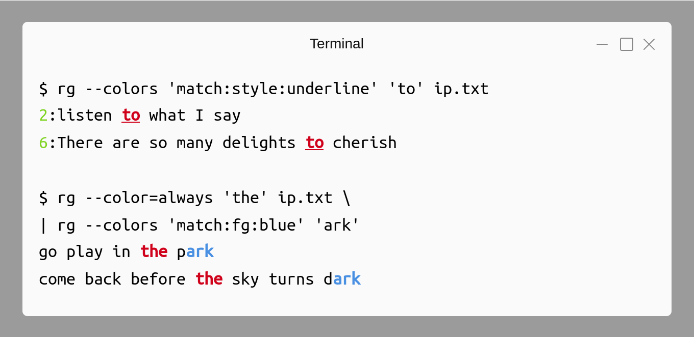

# Preface

You are likely to be familiar with using `Ctrl+F` from an editor, word processor, web browser, IDE, etc to quickly locate where a particular string occurs. `grep` is similar, but much more versatile and feature-rich version of the search functionality usable from command line. Modern requirements have given rise to tools like `ripgrep` that provide out-of-box features such as recursive search while respecting ignore rules of a version controlled directory. An important feature that the GUI applications may lack is **regular expressions**, which helps to precisely define a matching criteria. You could consider it as sort of a mini-programming language in itself. So, apart from covering command options, regular expressions will also be discussed in detail.

The book heavily leans on examples to present features one by one. It is recommended that you manually type each example and experiment with them. Understanding both the nature of sample input string and the output produced is essential. As an analogy, consider learning to drive a bike or a car — no matter how much you read about them or listen to explanations, you need to practice a lot and infer your own conclusions. Should you feel that copy-paste is ideal for you, [code snippets are available chapter wise on GitHub](https://github.com/learnbyexample/learn_gnugrep_ripgrep/tree/master/code_snippets).

My [Command Line Text Processing](https://github.com/learnbyexample/Command-line-text-processing) repository includes a chapter on `GNU grep` which has been edited and expanded to create this book.

## Prerequisites

Prior experience working with command line and `bash` shell, should know concepts like file redirection, command pipeline and so on.

If you are new to the world of command line, check out [ryanstutorials](https://ryanstutorials.net/linuxtutorial/) or my GitHub repository on [Linux Command Line](https://github.com/learnbyexample/Linux_command_line) before starting this book.

## Conventions

* The examples presented here have been tested on `GNU bash` shell with **GNU grep 3.4** and **ripgrep 12.1.0** and includes features not available in earlier versions
* Code snippets shown are copy pasted from `bash` shell and modified for presentation purposes. Some commands are preceded by comments to provide context and explanations. Blank lines have been added to improve readability, only `real` time is shown for speed comparisons, output is skipped for commands like `wget` and so on
* Unless otherwise noted, all examples and explanations are meant for **ASCII** characters
* External links are provided for further reading throughout the book. Not necessary to immediately visit them. They have been chosen with care and would help, especially during re-reads
* The [learn_gnugrep_ripgrep repo](https://github.com/learnbyexample/learn_gnugrep_ripgrep) has all the files used in examples and exercises and other details related to the book. If you are not familiar with `git` command, click the **Clone or download** button on the webpage to get the files

## Acknowledgements

* [GNU grep documentation](https://www.gnu.org/software/grep/manual/grep.html) — manual and examples
* [ripgrep](https://github.com/BurntSushi/ripgrep) — user guide and examples
* [stackoverflow](https://stackoverflow.com/) and [unix.stackexchange](https://unix.stackexchange.com/) — for getting answers to pertinent questions on `bash`, `grep` and other commands
* [tex.stackexchange](https://tex.stackexchange.com/) — for help on `pandoc` and `tex` related questions
* Cover image
    * [LibreOffice Draw](https://www.libreoffice.org/discover/draw/)
    * [detective](https://www.flickr.com/photos/32068925@N08/3028314931) by [olarte.ollie](https://www.flickr.com/photos/ollieolarte/) under [Creative Commons Attribution-Share Alike 2.0 Generic](https://creativecommons.org/licenses/by-sa/2.0/)
* [softwareengineering.stackexchange](https://softwareengineering.stackexchange.com/questions/39/whats-your-favourite-quote-about-programming) and [skolakoda](https://skolakoda.org/programming-quotes) for programming quotes
* [Warning](https://commons.wikimedia.org/wiki/File:Warning_icon.svg) and [Info](https://commons.wikimedia.org/wiki/File:Info_icon_002.svg) icons by [Amada44](https://commons.wikimedia.org/wiki/User:Amada44) under public domain
* [Andrew Gallant](https://blog.burntsushi.net/about/) (author of `ripgrep`) and [mikeblas](https://www.reddit.com/user/mikeblas) for critical feedback

Special thanks to all my friends and online acquaintances for their help, support and encouragement, especially during difficult times.

## Feedback and Errata

I would highly appreciate if you'd let me know how you felt about this book, it would help to improve this book as well as my future attempts. Also, please do let me know if you spot any error or typo.

Issue Manager: https://github.com/learnbyexample/learn_gnugrep_ripgrep/issues

Goodreads: https://www.goodreads.com/book/show/47406700-gnu-grep-and-ripgrep

E-mail: learnbyexample.net@gmail.com

Twitter: https://twitter.com/learn_byexample

## Author info

Sundeep Agarwal is a freelance trainer, author and mentor. His previous experience includes working as a Design Engineer at Analog Devices for more than 5 years. You can find his other works, primarily focused on Linux command line, text processing, scripting languages and curated lists, at [https://github.com/learnbyexample](https://github.com/learnbyexample). He has also been a technical reviewer for [Command Line Fundamentals](https://www.packtpub.com/application-development/command-line-fundamentals) book and video course published by Packt.

List of books: https://learnbyexample.github.io/books/

## License

This work is licensed under a
[Creative Commons Attribution-NonCommercial-ShareAlike 4.0 International License](https://creativecommons.org/licenses/by-nc-sa/4.0/)

Code snippets are available under [MIT License](https://github.com/learnbyexample/learn_gnugrep_ripgrep/blob/master/LICENSE)

Resources mentioned in Acknowledgements section are available under original licenses.

## Book version

1.6

See [Version_changes.md](https://github.com/learnbyexample/learn_gnugrep_ripgrep/blob/master/Version_changes.md) to track changes across book versions.

# Introduction

Quoting from [wikipedia](https://en.wikipedia.org/wiki/Grep):

>**`grep`** is a command-line utility for searching plain-text data sets for lines that match a regular expression. Its name comes from the ed command `g/re/p` (**g**lobally search a **r**egular **e**xpression and **p**rint), which has the same effect: doing a global search with the regular expression and printing all matching lines. Grep was originally developed for the Unix operating system, but later available for all Unix-like systems and some others such as OS-9.

Use of `grep` has become so ubiquitous that it has found its way into [Oxford dictionary](https://en.oxforddictionaries.com/definition/us/grep) as well. As part of daily computer usage, searching comes up often. It could be finding the right emoji by their name on social media or using `Ctrl+F` in word processor/IDE/web browser/ebook/bookmarks/etc. Some of these have options to refine the search further like matching case, ignoring case, limiting to whole word, using regular expressions etc. `grep` provides all of these features and much more when it comes to searching or extracting content from text files. After getting used to `grep`, the search features provided by GUI programs often feel inadequate and slower.

## Installation

If you are on a Unix like system, you are most likely to already have some version of `grep` installed. This book is primarily for `GNU grep` and also has a chapter on `ripgrep`. As there are syntax and feature differences between various implementations, please make sure to follow along with what is presented here. `GNU grep` is part of [text creation and manipulation](https://www.gnu.org/manual/manual.html) commands provided by `GNU` and comes by default on GNU/Linux. To install newer or particular version, visit [gnu: software](https://www.gnu.org/software/grep/) and check [release notes](https://savannah.gnu.org/news/?group_id=67) for an overview of changes between versions. See also [bug list](https://debbugs.gnu.org/cgi/pkgreport.cgi?package=grep).

```bash
$ wget https://ftp.gnu.org/gnu/grep/grep-3.4.tar.xz
$ tar -Jxf grep-3.4.tar.xz
$ cd grep-3.4/
$ ./configure 
$ make
$ sudo make install

$ type -a grep
grep is /usr/local/bin/grep
grep is /bin/grep
$ grep -V | head -n1
grep (GNU grep) 3.4
```

If you are not using a Linux distribution, you may be able to access `GNU grep` using below options:

* [git-bash](https://gitforwindows.org/)
* [WSL](https://en.wikipedia.org/wiki/Windows_Subsystem_for_Linux)
* [brew](https://brew.sh/)

## Options overview

It is always a good idea to know where to find the documentation. From command line, you can use `man grep` for a short manual and `info grep` for full documentation. For a better interface, visit [online gnu grep manual](https://www.gnu.org/software/grep/manual/grep.html).

```bash
$ man grep
NAME
       grep, egrep, fgrep - print lines that match patterns

SYNOPSIS
       grep [OPTION...] PATTERNS [FILE...]
       grep [OPTION...] -e PATTERNS ... [FILE...]
       grep [OPTION...] -f PATTERN_FILE ... [FILE...]

DESCRIPTION
       grep  searches  for PATTERNS in each FILE.  PATTERNS is one or patterns
       separated by newline characters, and grep prints each line that matches
       a pattern.

       A  FILE  of  “-”  stands  for  standard  input.   If  no FILE is given,
       recursive searches examine  the  working  directory,  and  nonrecursive
       searches read standard input.

```

For a quick overview of all the available options, use `grep --help` from the command line. These are shown below in table format:

**Regexp selection**:

| Option                   | Description    |
| ------------------------ | -------------- |
|   -E, --extended-regexp  |  PATTERN is an extended regular expression (ERE) |
|   -F, --fixed-strings    |  PATTERN is a set of newline-separated strings |
|   -G, --basic-regexp     |  PATTERN is a basic regular expression (BRE) |
|   -P, --perl-regexp      |  PATTERN is a Perl regular expression |
|   -e, --regexp=PATTERN   |  use PATTERN for matching |
|   -f, --file=FILE        |  obtain PATTERN from FILE |
|   -i, --ignore-case      |  ignore case distinctions |
|   -w, --word-regexp      |  force PATTERN to match only whole words |
|   -x, --line-regexp      |  force PATTERN to match only whole lines |
|   -z, --null-data        |  a data line ends in 0 byte, not newline |

**Miscellaneous**:

| Option                   | Description    |
| ------------------------ | -------------- |
|  -s, --no-messages       | suppress error messages |
|  -v, --invert-match      | select non-matching lines |
|  -V, --version           | display version information and exit |
|      --help              | display this help text and exit |

**Output control**:

| Option                       | Description    |
| ------------------------     | -------------- |
|  -m, --max-count=NUM         |  stop after NUM matches |
|  -b, --byte-offset           |  print the byte offset with output lines |
|  -n, --line-number           |  print line number with output lines |
|      --line-buffered         |  flush output on every line |
|  -H, --with-filename         |  print the file name for each match |
|  -h, --no-filename           |  suppress the file name prefix on output |
|      --label=LABEL           |  use LABEL as the standard input file name prefix |
|  -o, --only-matching         |  show only the part of a line matching PATTERN |
|  -q, --quiet, --silent       |  suppress all normal output |
|      --binary-files=TYPE     |  assume that binary files are TYPE; |
|                              |  TYPE is 'binary', 'text', or 'without-match' |
|  -a, --text                  |  equivalent to --binary-files=text |
|  -I                          |  equivalent to --binary-files=without-match |
|  -d, --directories=ACTION    |  how to handle directories; |
|                              |  ACTION is 'read', 'recurse', or 'skip' |
|  -D, --devices=ACTION        |  how to handle devices, FIFOs and sockets; |
|                              |  ACTION is 'read' or 'skip' |
|  -r, --recursive             |  like --directories=recurse |
|  -R, --dereference-recursive |  likewise, but follow all symlinks |
|      --include=FILE_PATTERN  |  search only files that match FILE_PATTERN |
|      --exclude=FILE_PATTERN  |  skip files and directories matching FILE_PATTERN |
|      --exclude-from=FILE     |  skip files matching any file pattern from FILE |
|      --exclude-dir=PATTERN   |  directories that match PATTERN will be skipped. |
|  -L, --files-without-match   |  print only names of FILEs containing no match |
|  -l, --files-with-matches    |  print only names of FILEs containing matches |
|  -c, --count                 |  print only a count of matching lines per FILE |
|  -T, --initial-tab           |  make tabs line up (if needed) |
|  -Z, --null                  |  print 0 byte after FILE name |

**Context control**:

| Option                    | Description    |
| ------------------------  | -------------- |
|  -B, --before-context=NUM |  print NUM lines of leading context |
|  -A, --after-context=NUM  |  print NUM lines of trailing context |
|  -C, --context=NUM        |  print NUM lines of output context |
|  -NUM                     |  same as --context=NUM |
|      --color[=WHEN],      |  use markers to highlight the matching strings; |
|      --colour[=WHEN]      |  WHEN is 'always', 'never', or 'auto' |
|  -U, --binary             |  do not strip CR characters at EOL (MSDOS/Windows) |
|  -u, --unix-byte-offsets  |  report offsets as if CRs were not there |
|                           |  (MSDOS/Windows) |

# Frequently used options

This chapter will cover many of the options provided by `GNU grep`. Regular expressions will be covered from next chapter, so the examples in this chapter will use only literal strings for input patterns. Literal or fixed string matching means exact string comparison is intended, no special meaning for any character.

> Files used in examples are available chapter wise from [learn_gnugrep_ripgrep repo](https://github.com/learnbyexample/learn_gnugrep_ripgrep/tree/master/example_files). The directory for this chapter is `freq_options`.

## Simple string search

By default, `grep` would print all input *lines* which matches the given search patterns. The newline character `\n` is considered as the line separator. This section will show you how to filter lines matching a given search string using `grep`.

```bash
$ # sample input file for this section
$ cat programming_quotes.txt
Debugging is twice as hard as writing the code in the first place.
Therefore, if you write the code as cleverly as possible, you are,
by definition, not smart enough to debug it by Brian W. Kernighan

Some people, when confronted with a problem, think - I know, I will
use regular expressions. Now they have two problems by Jamie Zawinski

A language that does not affect the way you think about programming,
is not worth knowing by Alan Perlis

There are 2 hard problems in computer science: cache invalidation,
naming things, and off-by-1 errors by Leon Bambrick
```

To filter the required lines, invoke `grep` command, pass the search string and then specify one or more filenames to be searched. As a good practice, always use single quotes around the search string. Examples requiring shell interpretation will be discussed later.

```bash
$ grep 'twice' programming_quotes.txt
Debugging is twice as hard as writing the code in the first place.

$ grep 'e th' programming_quotes.txt
Therefore, if you write the code as cleverly as possible, you are,
A language that does not affect the way you think about programming,
```

If the filename is `-` or left out, `grep` will perform the search on `stdin` data.

```bash
$ printf 'avocado\nmango\nguava' | grep 'v'
avocado
guava
```

> If your input file has some other format like `\r\n` (carriage return and newline characters) as line ending, convert the input file to Unix style before processing. See [stackoverflow: Why does my tool output overwrite itself and how do I fix it?](https://stackoverflow.com/questions/45772525/why-does-my-tool-output-overwrite-itself-and-how-do-i-fix-it) for a detailed discussion and mitigation methods. Make sure to remember this point, it'll come up in exercises.

```bash
$ # Unix and DOS style line endings
$ printf '42\n' | file -
/dev/stdin: ASCII text
$ printf '42\r\n' | file -
/dev/stdin: ASCII text, with CRLF line terminators
```

## Fixed string search

The search string (pattern) is treated as a Basic Regular Expression (BRE) by default. But regular expressions is a topic for next chapter. For now, use the `-F` option to indicate that the patterns should be matched literally. As a performance optimization, `GNU grep` automatically tries to perform literal search even if `-F` option is not used depending upon the kind of search string specified.

```bash
$ # oops, why did it not match?
$ echo 'int a[5]' | grep 'a[5]'
$ # where did that error come from??
$ echo 'int a[5]' | grep 'a['
grep: Invalid regular expression
$ # what is going on???
$ echo 'int a[5]' | grep 'a[5'
grep: Unmatched [, [^, [:, [., or [=

$ # use -F option or fgrep to match strings literally
$ echo 'int a[5]' | grep -F 'a[5]'
int a[5]
$ echo 'int a[5]' | fgrep 'a[5]'
int a[5]
```

## Case insensitive search

Sometimes, you don't know if the log file has `error` or `Error` or `ERROR` and so on. In such cases, you can use `-i` option to ignore case.

```bash
$ grep -i 'jam' programming_quotes.txt
use regular expressions. Now they have two problems by Jamie Zawinski

$ printf 'Cat\ncOnCaT\nscatter\ncut' | grep -i 'cat'
Cat
cOnCaT
scatter
```

## Invert matching lines

Use `-v` option to get lines other than those matching the given search string.

```bash
$ seq 5 | grep -v '3'
1
2
4
5

$ printf 'goal\nrate\neat\npit' | grep -v 'at'
goal
pit
```

> Text processing often involves negating a logic to arrive at a solution or to make it simpler. Look out for opposite pairs like `-l -L`, `-h -H`, negative logic in regular expression, etc in coming sections.

## Line number and count

The `-n` option will prefix line number and a colon character while displaying the output results. This is useful to quickly locate the matching lines for further editing.

```bash
$ grep -n 'not' programming_quotes.txt
3:by definition, not smart enough to debug it by Brian W. Kernighan
8:A language that does not affect the way you think about programming,
9:is not worth knowing by Alan Perlis

$ printf 'great\nnumber\numpteen' | grep -n 'r'
1:great
2:number
```

Having to count total number of matching lines comes up often. Somehow piping `grep` output to `wc` command is prevalent instead of simply using the `-c` option.

```bash
$ # count of lines matching the pattern
$ grep -c 'in' programming_quotes.txt
8

$ # to get count of lines NOT matching the pattern
$ printf 'goal\nrate\neat\npit' | grep -vc 'g'
3
```

With multiple file input, count is displayed for each file separately. Use `cat` if you need a combined count.

```bash
$ # here - is placeholder for stdin data
$ seq 15 | grep -c '1' programming_quotes.txt -
programming_quotes.txt:1
(standard input):7

$ # useful application of cat command
$ cat <(seq 15) programming_quotes.txt | grep -c '1'
8
```

> The output given by `-c` is total number of **lines** matching the given patterns, not total number of matches. Use `-o` option and pipe the output to `wc -l` to get total matches (example shown later).

## Limiting output lines

Sometimes there are too many results in which case you could pipe the output to a **pager** tool like `less`. Or use the `-m` option to limit how many matching lines should be displayed for each input file. `grep` would stop processing an input file as soon as condition specified by `-m` is satisfied. Just like `-c` option, *note* that `-m` works by line count, not by number of matches.

```bash
$ grep -m3 'in' programming_quotes.txt
Debugging is twice as hard as writing the code in the first place.
by definition, not smart enough to debug it by Brian W. Kernighan
Some people, when confronted with a problem, think - I know, I will

$ seq 1000 | grep -m4 '2'
2
12
20
21
```

## Multiple search strings

The `-e` option can be used to specify multiple search strings from the command line. This is similar to **conditional OR** boolean logic.

```bash
$ # search for '1' or 'two'
$ grep -e '1' -e 'two' programming_quotes.txt
use regular expressions. Now they have two problems by Jamie Zawinski
naming things, and off-by-1 errors by Leon Bambrick
```

If there are lot of search strings, save them in a file (one search string per line and make sure there are no empty lines). Use `-f` option to specify a file as source of search strings. You can use this option multiple times and also add more patterns from command line using the `-e` option.

```bash
$ printf 'two\n1\n' > search_strings.txt
$ cat search_strings.txt
two
1

$ grep -f search_strings.txt programming_quotes.txt
use regular expressions. Now they have two problems by Jamie Zawinski
naming things, and off-by-1 errors by Leon Bambrick

$ grep -f search_strings.txt -e 'twice' programming_quotes.txt
Debugging is twice as hard as writing the code in the first place.
use regular expressions. Now they have two problems by Jamie Zawinski
naming things, and off-by-1 errors by Leon Bambrick
```

To find lines matching all of the search strings, you'd need to resort to regular expressions (covered later) or workaround by using shell pipes. This is similar to **conditional AND** boolean logic.

```bash
$ # match lines containing both 'in' and 'not' in any order
$ # same as: grep 'not' programming_quotes.txt | grep 'in'
$ grep 'in' programming_quotes.txt | grep 'not'
by definition, not smart enough to debug it by Brian W. Kernighan
A language that does not affect the way you think about programming,
is not worth knowing by Alan Perlis
```

## Filename instead of matching lines

Often, you just want a list of filenames that match the search patterns. The output might get saved for future reference, passed to another command like `sed/awk/perl/sort/etc` for further processing and so on. Some of these commands can handle search by themselves, but `grep` is fast and specialized tool for searching and using shell pipes can improve performance if parallel processing is available. Similar to `-m` option, `grep` will stop processing the input file as soon as the given condition is satisfied.

* `-l` will list files matching the pattern
* `-L` will list files NOT matching the pattern

```bash
$ # list filename if it contains 'are' anywhere in the file
$ grep -l 'are' programming_quotes.txt search_strings.txt
programming_quotes.txt
$ # no output because no match was found
$ grep -l 'xyz' programming_quotes.txt search_strings.txt
$ # list filename if it contains '1' anywhere in the file
$ grep -l '1' programming_quotes.txt search_strings.txt
programming_quotes.txt
search_strings.txt

$ # list filename if it does NOT contain 'xyz' anywhere in the file
$ grep -L 'xyz' programming_quotes.txt search_strings.txt
programming_quotes.txt
search_strings.txt
$ grep -L 'are' programming_quotes.txt search_strings.txt
search_strings.txt
```

## Filename prefix for matching lines

If there are multiple file inputs, `grep` would automatically prefix filename while displaying matching lines. You can also control whether or not to add the prefix using options.

* `-h` option will prevent filename prefix in the output (this is the default for single file input)
* `-H` option will always show filename prefix (this is the default for multiple file input)

```bash
$ # -h is on by default for single file input
$ grep '1' programming_quotes.txt
naming things, and off-by-1 errors by Leon Bambrick
$ # using -h to suppress filename prefix
$ seq 1000 | grep -h -m3 '1' - programming_quotes.txt
1
10
11
naming things, and off-by-1 errors by Leon Bambrick

$ # -H is on by default for multiple file input
$ seq 1000 | grep -m3 '1' - programming_quotes.txt
(standard input):1
(standard input):10
(standard input):11
programming_quotes.txt:naming things, and off-by-1 errors by Leon Bambrick
$ # using -H to always show filename prefix
$ grep -H '1' programming_quotes.txt
programming_quotes.txt:naming things, and off-by-1 errors by Leon Bambrick
```

The `vim` editor has an option `-q` that allows to easily edit the matching lines from `grep` output if it has both line number and filename prefixes. Let me know if your favorite editor has equivalent feature, I'll update it here.

```bash
$ grep -Hn '1' *
programming_quotes.txt:12:naming things, and off-by-1 errors by Leon Bambrick
search_strings.txt:2:1

$ # use :cn and :cp to navigate to next/previous occurrences
$ # the status line at bottom will have additional info
$ # use -H option to ensure filename is always present in output
$ vim -q <(grep -Hn '1' *)
```

## Colored output

When working from terminal, having `--color` option enabled makes it easier to spot the matching portions in output. Especially when experimenting to get the correct regular expression. Modern terminal will usually have color support, see [unix.stackexchange: How to check if bash can print colors?](https://unix.stackexchange.com/questions/9957/how-to-check-if-bash-can-print-colors) for details.

The `--color` option will highlight matching patterns, line numbers, filename, etc. It has three different settings:

* `auto` will result in color highlighting when results are displayed on terminal, but not when output is redirected to another command, file, etc. This is the default setting
* `always` will result in color highlighting when results are displayed on terminal as well as when output is redirected to another command, file, etc
* `never` explicitly disable color highlighting


Below image shows difference between `auto` and `always`. In the first case, `in` is highlighted even after piping, while in the second case, `in` is not highlighted. In practice, `always` is rarely used as it has extra information added to matching lines and could cause undesirable results when processing such lines.


Usually, both `ls` and `grep` commands are aliased to include `--color=auto`.

```bash
$ # this is usually saved in ~/.bashrc or ~/.bash_aliases
$ alias grep='grep --color=auto'

$ # another use case for 'always' is piping the results to 'less' command
$ grep --color=always 'not' programming_quotes.txt | less -R
```

## Match whole word or line

A word character is any alphabet (irrespective of case), digit and the underscore character. You might wonder why there are digits and underscores as well, why not only alphabets? This comes from variable and function naming conventions — typically alphabets, digits and underscores are allowed. So, the definition is more programming oriented than natural language. The `-w` option will ensure that given patterns are not surrounded by other word characters. For example, this helps to distinguish `par` from `spar`, `park`, `apart`, `par2`, `_par`, etc

> The `-w` option behaves a bit differently than word boundaries in regular expressions. See [Word boundary differences](#word-boundary-differences) section for details.

```bash
$ # this matches 'par' anywhere in the line
$ printf 'par value\nheir apparent\n' | grep 'par'
par value
heir apparent
$ # this matches 'par' only as a whole word
$ printf 'par value\nheir apparent\n' | grep -w 'par'
par value
```

Another useful option is `-x` which will display a line only if the entire line satisfies the given pattern.

```bash
$ # this matches 'my book' anywhere in the line
$ printf 'see my book list\nmy book\n' | grep 'my book'
see my book list
my book
$ # this matches 'my book' only if no other characters are present
$ printf 'see my book list\nmy book\n' | grep -x 'my book'
my book

$ grep '1' *.txt
programming_quotes.txt:naming things, and off-by-1 errors by Leon Bambrick
search_strings.txt:1
$ grep -x '1' *.txt
search_strings.txt:1

$ # counting empty lines, won't work for files with DOS style line endings
$ grep -cx '' programming_quotes.txt
3
```

## Comparing lines between files

The `-f` and `-x` options can be combined to get common lines between two files or the difference when `-v` is used as well. In these cases, it is advised to use `-F` because you might not know if there are regular expression metacharacters present in the input files or not.

```bash
$ printf 'teal\nlight blue\nbrown\nyellow\n' > colors_1
$ printf 'blue\nblack\ndark green\nyellow\n' > colors_2

$ # common lines between two files
$ grep -Fxf colors_1 colors_2
yellow

$ # lines present in colors_2 but not in colors_1
$ grep -Fvxf colors_1 colors_2
blue
black
dark green

$ # lines present in colors_1 but not in colors_2
$ grep -Fvxf colors_2 colors_1
teal
light blue
brown
```

See also [stackoverflow: Fastest way to find lines of a text file from another larger text file](https://stackoverflow.com/questions/42239179/fastest-way-to-find-lines-of-a-text-file-from-another-larger-text-file-in-bash) — go through all the answers.

## Extract only matching portion

If total number of matches is required, use the `-o` option to display only the matching portions (one per line) and then use `wc` to count. This option is more commonly used with regular expressions.

```bash
$ grep -o -e 'twice' -e 'hard' programming_quotes.txt
twice
hard
hard

$ # -c only gives count of matching lines
$ grep -c 'in' programming_quotes.txt
8
$ # use -o to get each match on a separate line
$ grep -o 'in' programming_quotes.txt | wc -l
13
```

## Summary

In my initial years of cli usage as a VLSI engineer, I knew may be about five of the options listed in this chapter. Didn't even know about the `color` option. I've seen comments about not knowing `-c` option. These are some of the reasons why I'd advice to go through list of all the options if you are using a command frequently. Bonus points for maintaining a list of example usage for future reference, passing on to your colleagues, etc.

## Exercises

Create `exercises` directory and within it, create another directory for this chapter, say `freq_options` or `chapter_2`. Input is a file downloaded from internet — https://www.gutenberg.org/files/345/345.txt saved as `dracula.txt`. To solve the exercises, modify the partial command shown just before the expected output.

**a)** Display all lines containing `ablaze`

```bash
$ mkdir -p exercises/freq_options && cd $_
$ wget https://www.gutenberg.org/files/345/345.txt -O dracula.txt

$ grep ##### add your solution here
the room, his face all ablaze with excitement. He rushed up to me and
```

**b)** Display all lines containing `abandon` as a whole word.

```bash
$ grep ##### add your solution here
inheritors, being remote, would not be likely to abandon their just
```

**c)** Display all lines that satisfies both of these conditions:

* `professor` matched irrespective of case
* either `quip` or `sleep` matched case sensitively

```bash
$ grep ##### add your solution here
equipment of a professor of the healing craft. When we were shown in,
its potency; and she fell into a deep sleep. When the Professor was
sleeping, and the Professor seemingly had not moved from his seat at her
to sleep, and something weaker when she woke from it. The Professor and
```

**d)** Display first three lines containing `Count`

```bash
$ grep ##### add your solution here
town named by Count Dracula, is a fairly well-known place. I shall enter
must ask the Count all about them.)
Count Dracula had directed me to go to the Golden Krone Hotel, which I
```

**e)** Display first six lines containing `Harker` but not either of `Journal` or `Letter`

```bash
$ grep ##### add your solution here
said, "The Herr Englishman?" "Yes," I said, "Jonathan Harker." She
"I am Dracula; and I bid you welcome, Mr. Harker, to my house. Come in;
I shall be all alone, and my friend Harker Jonathan--nay, pardon me, I
Jonathan Harker will not be by my side to correct and aid me. He will be
"I write by desire of Mr. Jonathan Harker, who is himself not strong
junior partner of the important firm Hawkins & Harker; and so, as you
```

**f)** Display lines containing `Zooelogical Gardens` along with line number prefix.

```bash
$ grep ##### add your solution here
5597:         _Interview with the Keeper in the Zooelogical Gardens._
5601:the keeper of the section of the Zooelogical Gardens in which the wolf
8042:the Zooelogical Gardens a young one may have got loose, or one be bred
```

**g)** Find total count of whole word `the` (irrespective of case).

```bash
$ grep ##### add your solution here
8090
```

**h)** The below code snippet tries to get number of empty lines, but apparently shows wrong result, why?

```bash
$ grep -cx '' dracula.txt
0
```

# BRE/ERE Regular Expressions

This chapter will cover Basic and Extended Regular Expressions as implemented in `GNU grep`. Though not strictly conforming to [POSIX specifications]( https://pubs.opengroup.org/onlinepubs/9699919799/basedefs/V1_chap09.html), most of it is applicable to other `grep` implementations as well. Unless otherwise indicated, examples and descriptions will assume ASCII input. `GNU grep` also supports Perl Compatible Regular Expressions, which will be covered in a later chapter.

By default, `grep` treats the search pattern as Basic Regular Expression (BRE)

* `-G` option can be used to specify explicitly that BRE is needed
* `-E` option will enable Extended Regular Expression (ERE)
    * in `GNU grep`, BRE and ERE only differ in how metacharacters are specified, no difference in features
* `-F` option will cause the search patterns to be treated literally
* `-P` if available, this option will enable Perl Compatible Regular Expression (PCRE)

> Files used in examples are available chapter wise from [learn_gnugrep_ripgrep repo](https://github.com/learnbyexample/learn_gnugrep_ripgrep/tree/master/example_files). The directory for this chapter is `bre_ere`.

## Line Anchors

Instead of matching anywhere in the line, restrictions can be specified. For now, you'll see the ones that are already part of BRE/ERE. In later sections and chapters, you'll get to know how to define your own rules for restriction. These restrictions are made possible by assigning special meaning to certain characters and escape sequences. The characters with special meaning are known as **metacharacters** in regular expressions parlance. In case you need to match those characters literally, you need to escape them with a `\` (discussed in [Escaping metacharacters](#escaping-metacharacters) section).

There are two line anchors:

* `^` metacharacter restricts the matching to start of line
* `$` metacharacter restricts the matching to end of line

```bash
$ # lines starting with 'pa'
$ printf 'spared no one\npar\nspar\ndare' | grep '^pa'
par

$ # lines ending with 'ar'
$ printf 'spared no one\npar\nspar\ndare' | grep 'ar$'
par
spar

$ # lines containing only 'par'
$ printf 'spared no one\npar\nspar\ndare' | grep '^par$'
par
$ printf 'spared no one\npar\nspar\ndare' | grep -x 'par'
par
```

## Word Anchors

The second type of restriction is word anchors. A word character is any alphabet (irrespective of case), digit and the underscore character. This is similar to using `-w` option, with added flexibility of using word anchor only at start or end of word.

The escape sequence `\b` denotes a word boundary. This works for both start of word and end of word anchoring. Start of word means either the character prior to the word is a non-word character or there is no character (start of line). Similarly, end of word means the character after the word is a non-word character or no character (end of line).  This implies that you cannot have word boundary without a word character.

> As an alternate, you can use `\<` to indicate start of word anchor and `\>` to indicate end of word anchor. Using `\b` is preferred as it is more commonly used in other regular expression implementations and has `\B` as its opposite.

> Word boundaries behave a bit differently than `-w` option. See [Word boundary differences](#word-boundary-differences) section for details.

```bash
$ cat word_anchors.txt
sub par
spar
apparent effort
two spare computers
cart part tart mart

$ # match words starting with 'par'
$ grep '\bpar' word_anchors.txt
sub par
cart part tart mart

$ # match words ending with 'par'
$ grep 'par\b' word_anchors.txt
sub par
spar

$ # match only whole word 'par'
$ grep '\bpar\b' word_anchors.txt
sub par
$ grep -w 'par' word_anchors.txt
sub par
```

The word boundary has an opposite anchor too. `\B` matches wherever `\b` doesn't match. This duality will be seen with some other escape sequences too.

```bash
$ # match 'par' if it is surrounded by word characters
$ grep '\Bpar\B' word_anchors.txt
apparent effort
two spare computers

$ # match 'par' but not as start of word
$ grep '\Bpar' word_anchors.txt
spar
apparent effort
two spare computers

$ # match 'par' but not as end of word
$ grep 'par\B' word_anchors.txt
apparent effort
two spare computers
cart part tart mart
```

> Negative logic is handy in many text processing situations. But use it with care, you might end up matching things you didn't intend.

## Alternation

Many a times, you'd want to search for multiple terms. In a conditional expression, you can use the logical operators to combine multiple conditions. With regular expressions, the `|` metacharacter is similar to logical OR. The regular expression will match if any of the expression separated by `|` is satisfied. These can have their own independent anchors as well.

Alternation is similar to using multiple `-e` option, but provides more flexibility when combined with grouping. The `|` metacharacter syntax varies between BRE and ERE. Quoting from the manual:

>In basic regular expressions the meta-characters `?`, `+`, `{`, `|`, `(`, and `)` lose their special meaning; instead use the backslashed versions `\?`, `\+`, `\{`, `\|`, `\(`, and `\)`.

```bash
$ # three different ways to match either 'cat' or 'dog'
$ printf 'I like cats\nI like parrots\nI like dogs' | grep 'cat\|dog'
I like cats
I like dogs
$ printf 'I like cats\nI like parrots\nI like dogs' | grep -E 'cat|dog'
I like cats
I like dogs
$ printf 'I like cats\nI like parrots\nI like dogs' | grep -e 'cat' -e 'dog'
I like cats
I like dogs

$ # extract either 'cat' or 'dog' or 'fox' case insensitively
$ printf 'CATs dog bee parrot FoX' | grep -ioE 'cat|dog|fox'
CAT
dog
FoX
$ # lines starting with 'a' or words ending with 'e'
$ grep -E '^a|e\b' word_anchors.txt
apparent effort
two spare computers
```

A cool use case of alternation is combining line anchors to display entire input file but highlight only required search patterns. Standalone line anchors will match every input line, even empty lines as they are position markers.


There's some tricky situations when using alternation. If it is used for filtering a line, there is no ambiguity. However, for matching portion extraction with `-o` option, it depends on a few factors. Say, you want to extract `are` or `spared` — which one should get precedence? The bigger word `spared` or the substring `are` inside it or based on something else?

The alternative which matches earliest in the input gets precedence.

```bash
$ echo 'car spared spar' | grep -oE 'are|spared'
spared
$ echo 'car spared spar' | grep -oE 'spared|are'
spared
```

In case of matches starting from same location, for example `party` and `par`, the longest matching portion gets precedence. See [Longest match wins](#longest-match-wins) section for more examples. See [regular-expressions: alternation](https://www.regular-expressions.info/alternation.html) for more information on this topic.

```bash
$ echo 'pool party 2' | grep -oE 'party|par'
party
$ echo 'pool party 2' | grep -oE 'par|party'
party

$ # other implementations like PCRE have left-to-right priority
$ echo 'pool party 2' | grep -oP 'par|party'
par
```

## Grouping

Often, there are some common things among the regular expression alternatives. It could be common characters or qualifiers like the anchors. In such cases, you can group them using a pair of parentheses metacharacters. Similar to `a(b+c)d = abd+acd` in maths, you get `a(b|c)d = abd|acd` in regular expressions.

```bash
$ # without grouping
$ printf 'red\nreform\nread\narrest' | grep -E 'reform|rest'
reform
arrest
$ # with grouping
$ printf 'red\nreform\nread\narrest' | grep -E 're(form|st)'
reform
arrest

$ # without grouping
$ printf 'sub par\nspare\npart time' | grep -E '\bpar\b|\bpart\b'
sub par
part time
$ # taking out common anchors
$ printf 'sub par\nspare\npart time' | grep -E '\b(par|part)\b'
sub par
part time
$ # taking out common characters as well
$ # you'll later learn a better technique instead of using empty alternate
$ printf 'sub par\nspare\npart time' | grep -E '\bpar(|t)\b'
sub par
part time
```

## Escaping metacharacters

You have seen a few metacharacters and escape sequences that help to compose a regular expression. To match the metacharacters literally, i.e. to remove their special meaning, prefix those characters with a `\` character. To indicate a literal `\` character, use `\\`. Some of the metacharacters, like the line anchors, lose their special meaning when not used in their customary positions with BRE syntax.

If there are many metacharacters to be escaped, try to work out if the command can be simplified by using `-F` (paired with regular expression like options such as `-e`, `-f`, `-i`, `-w`, `-x`, etc) or by switching between ERE and BRE. Another option is to use PCRE (covered later), which has special constructs to mark whole or portion of pattern to be matched literally — especially useful when using shell variables.

```bash
$ # line anchors aren't special away from customary positions with BRE
$ echo 'a^2 + b^2 - C*3' | grep 'b^2'
a^2 + b^2 - C*3
$ echo '$a = $b + $c' | grep '$b'
$a = $b + $c
$ # escape line anchors to match literally at customary positions, also for ERE
$ echo '$a = $b + $c' | grep -o '\$' | wc -l
3
$ # or use -F where possible
$ echo '$a = $b + $c' | grep -oF '$' | wc -l
3

$ # BRE vs ERE
$ # cannot use -F here as line anchor is needed
$ printf '(a/b) + c\n3 + (a/b) - c' | grep '^(a/b)'
(a/b) + c
$ printf '(a/b) + c\n3 + (a/b) - c' | grep -E '^\(a/b)'
(a/b) + c
```

## Matching characters like tabs

`GNU grep` doesn't support escape sequences like `\t` (commonly used to represent tab character). Neither does it support formats like `\xNN` (specifying a character by its ASCII value in hexadecimal format). As an alternate, you can use `bash` [ANSI-C Quoting](https://www.gnu.org/software/bash/manual/bash.html#ANSI_002dC-Quoting) feature to use such escape sequences.

```bash
$ # any undefined escape sequence is treated as the character it escapes
$ # here \t is same as t
$ echo 'attempt' | grep -o 'a\tt'
att

$ # here $'..' is a bash feature to enable use of escape sequences
$ printf 'go\tto\ngo to' | grep $'go\tto'
go      to

$ # \x20 is hexadecimal for space character
$ printf 'go\tto\ngo to' | grep $'go\x20to'
go to
```

## The dot meta character

The dot metacharacter serves as a placeholder to match any character. Later you'll learn how to define your own custom placeholder for limited set of characters.

```bash
# extract 'c', followed by any character and then 't'
$ echo 'tac tin cot abc:tuv excite' | grep -o 'c.t'
c t
cot
c:t
cit

$ printf '42\t33\n'
42      33
# extract '2', followed by any character and then '3'
$ printf '42\t33\n' | grep -o '2.3'
2       3
```

If you are using a Unix-like distribution, you'll likely have `/usr/share/dict/words` dictionary file. This will be used as input file to illustrate regular expression examples. It is included in the [repo](https://github.com/learnbyexample/learn_gnugrep_ripgrep/blob/master/example_files/bre_ere/words.txt) as `words.txt` file (modified to make it ASCII only).

```bash
$ # 5 character lines starting with 'c' and ending with 'ty' or 'ly'
$ grep -xE 'c..(t|l)y' words.txt
catty
coyly
curly
```

## Quantifiers

As an analogy, alternation provides logical OR. Combining the dot metacharacter `.` and quantifiers (and alternation if needed) paves a way to perform logical AND. For example, to check if a string matches two patterns with any number of characters in between. Quantifiers can be applied to both characters and groupings. Apart from ability to specify exact quantity and bounded range, these can also match unbounded varying quantities. BRE/ERE support only one type of quantifiers, whereas PCRE supports three types. Quantifiers in `GNU grep` behave mostly like greedy quantifiers supported by PCRE, but there are subtle differences, which will be discussed with examples later on.

First up, the `?` metacharacter which quantifies a character or group to match `0` or `1` times. This helps to define optional patterns and build terser patterns compared to groupings for some cases.

```bash
$ # same as: grep -E '\b(fe.d|fed)\b'
$ # BRE version: grep -w 'fe.\?d'
$ printf 'fed\nfod\nfe:d\nfeed' | grep -wE 'fe.?d'
fed
fe:d
feed

$ # same as: grep -E '\bpar(|t)\b'
$ printf 'sub par\nspare\npart time' | grep -wE 'part?'
sub par
part time

$ # same as: grep -oE 'part|parrot'
$ echo 'par part parrot parent' | grep -oE 'par(ro)?t'
part
parrot
$ # same as: grep -oE 'part|parrot|parent'
$ echo 'par part parrot parent' | grep -oE 'par(en|ro)?t'
part
parrot
parent
```

The `*` metacharacter quantifies a character or group to match `0` or more times. There is no upper bound, more details will be discussed in the next section.

```bash
$ # extract 'f' followed by zero or more of 'e' followed by 'd'
$ echo 'fd fed fod fe:d feeeeder' | grep -o 'fe*d'
fd
fed
feeeed

$ # extract zero or more of '1' followed by '2'
$ echo '3111111111125111142' | grep -o '1*2'
11111111112
2
```

The `+` metacharacter quantifies a character or group to match `1` or more times. Similar to `*` quantifier, there is no upper bound.

```bash
$ # extract 'f' followed by one or more of 'e' followed by 'd'
$ # BRE version: grep -o 'fe\+d'
$ echo 'fd fed fod fe:d feeeeder' | grep -oE 'fe+d'
fed
feeeed

$ # extract 'f' followed by at least one of 'e' or 'o' or ':' followed by 'd'
$ echo 'fd fed fod fe:d feeeeder' | grep -oE 'f(e|o|:)+d'
fed
fod
fe:d
feeeed

$ # extract one or more of '1' followed by '2'
$ echo '3111111111125111142' | grep -oE '1+2'
11111111112
$ # extract one or more of '1' followed by optional '4' and then '2'
$ echo '3111111111125111142' | grep -oE '1+4?2'
11111111112
111142
```

You can specify a range of integer numbers, both bounded and unbounded, using `{}` metacharacters. There are four ways to use this quantifier as listed below:

| Pattern | Description |
| ------- | ----------- |
| `{m,n}` | match `m` to `n` times |
| `{m,}`  | match at least `m` times |
| `{,n}`  | match up to `n` times (including `0` times) |
| `{n}`   | match exactly `n` times |

```bash
$ # note that space is not allowed after ,
$ # BRE version: grep -o 'ab\{1,4\}c'
$ echo 'abc ac adc abbc xabbbcz bbb bc abbbbbc' | grep -oE 'ab{1,4}c'
abc
abbc
abbbc

$ echo 'abc ac adc abbc xabbbcz bbb bc abbbbbc' | grep -oE 'ab{3,}c'
abbbc
abbbbbc

$ echo 'abc ac adc abbc xabbbcz bbb bc abbbbbc' | grep -oE 'ab{,2}c'
abc
ac
abbc

$ echo 'abc ac adc abbc xabbbcz bbb bc abbbbbc' | grep -oE 'ab{3}c'
abbbc
```

> To match `{}` metacharacters literally (assuming ERE), escaping `{` alone is enough. Or if it doesn't conform strictly to any of the four forms listed above, escaping is not needed at all.

Next up, how to construct AND conditional using dot metacharacter and quantifiers. To allow matching in any order, you'll have to bring in alternation as well. That is somewhat manageable for 2 or 3 patterns. With PCRE, you can use lookarounds for a comparatively easier approach.

```bash
$ # match 'Error' followed by zero or more characters followed by 'valid'
$ echo 'Error: not a valid input' | grep -o 'Error.*valid'
Error: not a valid

$ echo 'a cat and a dog' | grep -E 'cat.*dog|dog.*cat'
a cat and a dog
$ echo 'dog and cat' | grep -E 'cat.*dog|dog.*cat'
dog and cat
```

## Longest match wins

You've already seen an example with alternation, where the longest matching portion was chosen if two alternatives started from same location. For example `spar|spared` will result in `spared` being chosen over `spar`. The same applies whenever there are two or more matching possibilities from same starting location. For example, `f.?o` will match `foo` instead of `fo` if the input string to match is `foot`.

```bash
$ # longest match among 'foo' and 'fo' wins here
$ echo 'foot' | grep -oE 'f.?o'
foo
$ # everything will match here
$ echo 'car bat cod map scat dot abacus' | grep -o '.*'
car bat cod map scat dot abacus

$ # longest match happens when (1|2|3)+ matches up to '1233' only
$ # so that '12baz' can match as well
$ echo 'foo123312baz' | grep -oE 'o(1|2|3)+(12baz)?'
o123312baz
$ # in other implementations like PCRE, that is not the case
$ # precedence is left to right for greedy quantifiers
$ echo 'foo123312baz' | grep -oP 'o(1|2|3)+(12baz)?'
o123312
```

While determining the longest match, overall regular expression matching is also considered. That's how `Error.*valid` example worked. If `.*` had consumed everything after `Error`, there wouldn't be any more characters to try to match `valid`. So, among the varying quantity of characters to match for `.*`, the longest portion that satisfies the overall regular expression is chosen. Something like `a.*b` will match from first `a` in the input string to the last `b` in the string. In other implementations, like PCRE, this is achieved through a process called **backtracking**. Both approaches have their own advantages and disadvantages and have cases where the pattern can result in exponential time consumption.

```bash
$ # extract from start of line to last 'm' in the line
$ echo 'car bat cod map scat dot abacus' | grep -o '.*m'
car bat cod m

$ # extract from first 'c' to last 't' in the line
$ echo 'car bat cod map scat dot abacus' | grep -o 'c.*t'
car bat cod map scat dot

$ # extract from first 'c' to last 'at' in the line
$ echo 'car bat cod map scat dot abacus' | grep -o 'c.*at'
car bat cod map scat

$ # here 'm*' will match 'm' zero times as that gives the longest match
$ echo 'car bat cod map scat dot abacus' | grep -o 'b.*m*'
bat cod map scat dot abacus
```

## Character classes

To create a custom placeholder for limited set of characters, enclose them inside `[]` metacharacters. It is similar to using single character alternations inside a grouping, but with added flexibility and features. Character classes have their own versions of metacharacters and provide special predefined sets for common use cases. Quantifiers are also applicable to character classes.

```bash
$ # same as: grep -E 'cot|cut' or grep -E 'c(o|u)t'
$ printf 'cute\ncat\ncot\ncoat\ncost\nscuttle' | grep 'c[ou]t'
cute
cot
scuttle

$ # same as: grep -E '(a|e|o)+t'
$ printf 'meeting\ncute\nboat\nsite\nfoot' | grep -E '[aeo]+t'
meeting
boat
foot

$ # same as: grep -owE '(s|o|t)(o|n)'
$ echo 'do so in to no on' | grep -ow '[sot][on]'
so
to
on

$ # lines made up of letters 'o' and 'n', line length at least 2
$ grep -xE '[on]{2,}' words.txt
no
non
noon
on
```

Character classes have their own metacharacters to help define the sets succinctly. Metacharacters outside of character classes like `^`, `$`, `()` etc either don't have special meaning or have completely different one inside the character classes. First up, the `-` metacharacter that helps to define a range of characters instead of having to specify them all individually.

```bash
$ # same as: grep -oE '[0123456789]+'
$ echo 'Sample123string42with777numbers' | grep -oE '[0-9]+'
123
42
777

$ # whole words made up of lowercase alphabets only
$ echo 'coat Bin food tar12 best' | grep -owE '[a-z]+'
coat
food
best

$ # whole words made up of lowercase alphabets and digits only
$ echo 'coat Bin food tar12 best' | grep -owE '[a-z0-9]+'
coat
food
tar12
best

$ # whole words made up of lowercase alphabets, starting with 'p' to 'z'
$ echo 'go no u grip read eat pit' | grep -owE '[p-z][a-z]*'
u
read
pit
```

Character classes can also be used to construct numeric ranges. However, it is easy to miss corner cases and some ranges are complicated to design.

```bash
$ # numbers between 10 to 29
$ echo '23 154 12 26 34' | grep -ow '[12][0-9]'
23
12
26

$ # numbers >= 100
$ echo '23 154 12 26 98234' | grep -owE '[0-9]{3,}'
154
98234

$ # numbers >= 100 if there are leading zeros
$ echo '0501 035 154 12 26 98234' | grep -owE '0*[1-9][0-9]{2,}'
0501
154
98234
```

Next metacharacter is `^` which has to specified as the first character of the character class. It negates the set of characters, so all characters other than those specified will be matched. As highlighted earlier, handle negative logic with care, you might end up matching more than you wanted. 

```bash
$ # all non-digits
$ echo 'Sample123string42with777numbers' | grep -oE '[^0-9]+'
Sample
string
with
numbers

$ # extract characters from start of string based on a delimiter
$ echo 'foo=42; baz=123' | grep -o '^[^=]*'
foo

$ # extract last two columns based on a delimiter
$ echo 'foo:123:bar:baz' | grep -oE '(:[^:]+){2}$'
:bar:baz

$ # get all sequence of characters surrounded by unique character
$ echo 'I like "mango" and "guava"' | grep -oE '"[^"]+"'
"mango"
"guava"
```

Sometimes, it is easier to use positive character class and `-v` option instead of using negated character class.

```bash
$ # lines not containing vowel characters
$ # note that this will match empty lines too
$ printf 'tryst\nfun\nglyph\npity\nwhy' | grep -xE '[^aeiou]*'
tryst
glyph
why

$ # easier to write and maintain
$ printf 'tryst\nfun\nglyph\npity\nwhy' | grep -v '[aeiou]'
tryst
glyph
why
```

Some commonly used character sets have predefined escape sequences:

* `\w` matches all **word** characters `[a-zA-Z0-9_]` (recall the description for `-w` option)
* `\W` matches all non-word characters (recall duality seen earlier, like `\b` and `\B`)
* `\s` matches all **whitespace** characters: tab, newline, vertical tab, form feed, carriage return and space
* `\S` matches all non-whitespace characters

These escape sequences cannot be used inside character classes (but PCRE allows this). Also, as mentioned earlier, these definitions assume ASCII input.

```bash
$ # extract all word character sequences
$ printf 'load;err_msg--\nant,r2..not\n' | grep -o '\w*'
load
err_msg
ant
r2
not

$ # extract all non-whitespace character sequences
$ printf '   1..3  \v\f  foo_baz 42\tzzz   \r\n1-2-3\n\n' | grep -o '\S*'
1..3
foo_baz
42
zzz
1-2-3
```

A **named character set** is defined by a name enclosed between `[:` and `:]` and has to be used within a character class `[]`, along with any other characters as needed.

| Named set    | Description |
| ------------ | ----------- |
| `[:digit:]`  | `[0-9]` |
| `[:lower:]`  | `[a-z]` |
| `[:upper:]`  | `[A-Z]` |
| `[:alpha:]`  | `[a-zA-Z]` |
| `[:alnum:]`  | `[0-9a-zA-Z]` |
| `[:xdigit:]` | `[0-9a-fA-F]` |
| `[:cntrl:]`  | control characters — first 32 ASCII characters and 127th (DEL) |
| `[:punct:]`  | all the punctuation characters |
| `[:graph:]`  | `[:alnum:]` and `[:punct:]` |
| `[:print:]`  | `[:alnum:]`, `[:punct:]` and space |
| `[:blank:]`  | space and tab characters |
| `[:space:]`  | whitespace characters, same as `\s` |

```bash
$ printf 'err_msg\nxerox\nant\nm_2\nP2\nload1\neel' | grep -x '[[:lower:]]*'
xerox
ant
eel

$ printf 'err_msg\nxerox\nant\nm_2\nP2\nload1\neel' | grep -x '[[:lower:]_]*'
err_msg
xerox
ant
eel

$ printf 'err_msg\nxerox\nant\nm_2\nP2\nload1\neel' | grep -x '[[:alnum:]]*'
xerox
ant
P2
load1
eel

$ echo 'pie tie#ink-eat_42;' | grep -o '[^[:punct:]]*'
pie tie
ink
eat
42
```

Specific placement is needed to match character class metacharacters literally.

> Combinations like `[.` or `[:` cannot be used together to mean two individual characters, as they have special meaning within `[]`. See [Character Classes and Bracket Expressions](https://www.gnu.org/software/grep/manual/grep.html#Character-Classes-and-Bracket-Expressions) section in `info grep` for more details.

```bash
$ # - should be first or last character within []
$ echo 'ab-cd gh-c 12-423' | grep -owE '[a-z-]{2,}'
ab-cd
gh-c

$ # ] should be first character within []
$ printf 'int a[5]\nfoo\n1+1=2\n' | grep '[=]]'
$ printf 'int a[5]\nfoo\n1+1=2\n' | grep '[]=]'
int a[5]
1+1=2

$ # to match [ use [ anywhere in the character set
$ # but not combinations like [. or [:
$ # [][] will match both [ and ]
$ echo 'int a[5]' | grep '[x[.y]'
grep: Unmatched [, [^, [:, [., or [=
$ echo 'int a[5]' | grep '[x[y.]'
int a[5]

$ # ^ should be other than first character within []
$ echo 'f*(a^b) - 3*(a+b)/(a-b)' | grep -o 'a[+^]b'
a^b
a+b

$ # characters like \ and $ are not special within []
$ echo '5ba\babc2' | grep -o '[a\b]*'
ba\bab
```

## Backreferences

The grouping metacharacters `()` are also known as **capture groups**. Similar to variables in programming languages, the string captured by `()` can be referred later using backreference `\N` where `N` is the capture group you want. Leftmost `(` in the regular expression is `\1`, next one is `\2` and so on up to `\9`.

> Backreference will provide the string that was matched, not the pattern that was inside the capture group. For example, if `([0-9][a-f])` matches `3b`, then backreferencing will give `3b` and not any other valid match like `8f`, `0a` etc. This is akin to how variables behave in programming, only the result of expression stays after variable assignment, not the expression itself.

```bash
$ # 8 character lines having same 3 lowercase letters at start and end
$ grep -xE '([a-z]{3})..\1' words.txt
mesdames
respires
restores
testates
$ # different than: grep -xE '([a-d]..){2}'
$ grep -xE '([a-d]..)\1' words.txt
bonbon
cancan
chichi

$ # whole words that have at least one consecutive repeated character
$ echo 'effort flee facade oddball rat tool' | grep -owE '\w*(\w)\1\w*'
effort
flee
oddball
tool

$ # same word next to each other
$ # use \s instead of \W if only whitespaces are allowed between words
$ printf 'spot the the error\nno issues here' | grep -wE '(\w+)\W+\1'
spot the the error
```

## Known Bugs

Visit [grep bug list](https://debbugs.gnu.org/cgi/pkgreport.cgi?package=grep) for known issues.

From `man grep` under **Known Bugs** section:

>Large repetition counts in the {n,m} construct may cause grep to use lots of memory. In addition, certain other obscure regular expressions require exponential time and space, and may cause grep to run out of memory.
>Back-references are very slow, and may require exponential time.

Here's is an [issue for certain usage of backreferences and quantifier](https://debbugs.gnu.org/cgi/bugreport.cgi?bug=26864) that was filed by yours truly.

```bash
$ # takes some time and results in no output
$ # aim is to get words having two occurrences of repeated characters
$ grep -m5 -xiE '([a-z]*([a-z])\2[a-z]*){2}' words.txt
$ # works when nesting is unrolled
$ grep -m5 -xiE '[a-z]*([a-z])\1[a-z]*([a-z])\2[a-z]*' words.txt
Abbott
Annabelle
Annette
Appaloosa
Appleseed

$ # no problem if PCRE is used
$ grep -m5 -xiP '([a-z]*([a-z])\2[a-z]*){2}' words.txt
Abbott
Annabelle
Annette
Appaloosa
Appleseed
```

> [unix.stackexchange: Why doesn't this sed command replace the 3rd-to-last "and"?](https://unix.stackexchange.com/questions/579889/why-doesnt-this-sed-command-replace-the-3rd-to-last-and) shows another interesting bug when word boundaries and group repetition are involved. Some examples are shown below. Again, workaround is to use PCRE or expand the group.

```bash
$ # wrong output
$ echo 'cocoa' | grep -E '(\bco){2}'
cocoa
$ # correct behavior, no output
$ echo 'cocoa' | grep -E '\bco\bco'
$ echo 'cocoa' | grep -P '(\bco){2}'

$ # wrong output
$ echo 'it line with it here sit too' | grep -oE 'with(.*\bit\b){2}'
with it here sit
$ # correct behavior, no output
$ echo 'it line with it here sit too' | grep -oE 'with.*\bit\b.*\bit\b'
$ echo 'it line with it here sit too' | grep -oP 'with(.*\bit\b){2}'

$ # changing word boundaries to \< and \> results in a different problem
$ # this correctly gives no output
$ echo 'it line with it here sit too' | grep -oE 'with(.*\<it\>){2}'
$ # this correctly gives output
$ echo 'it line with it here it too' | grep -oE 'with(.*\<it\>){2}'
with it here it
$ # but this one fails
$ echo 'it line with it here it too sit' | grep -oE 'with(.*\<it\>){2}'
$ echo 'it line with it here it too sit' | grep -oP 'with(.*\bit\b){2}'
with it here it
```

## Summary

Knowing regular expressions very well is not only important to use `grep` effectively, but also comes in handy when moving onto use regular expressions in other tools like `sed` and `awk` and programming languages like `Python` and `Ruby`. These days, some of the GUI applications also support regular expressions. One main thing to remember is that syntax and features will vary. This book itself discusses five variations — BRE, ERE, PCRE, Rust regex and PCRE2. However, core concepts are likely to be same and having a handy reference sheet would go a long way in reducing misuse.

## Exercises

**a)** Extract all pairs of `()` with/without text inside them, provided they do not contain `()` characters inside.

```bash
$ echo 'I got (12) apples' | grep ##### add your solution here
(12)

$ echo '((2 +3)*5)=25 and (4.3/2*()' | grep ##### add your solution here
(2 +3)
()
```

**b)** For the given input, match all lines that start with `den` or end with `ly`

```bash
$ lines='lovely\n1 dentist\n2 lonely\neden\nfly away\ndent'
$ printf '%b' "$lines" | grep ##### add your solution here
lovely
2 lonely
dent
```

**c)** Extract all whole words that contains `42` but not at edge of word. Assume a word cannot contain `42` more than once.

```bash
$ echo 'hi42bye nice1423 bad42 cool_42a 42fake' | grep ##### add your solution here
hi42bye
nice1423
cool_42a
```

**d)** Each line in given input contains a single word. Match all lines containing `car` but not as a whole word.

```bash
$ printf 'car\nscar\ncare\npot\nscare\n' | grep ##### add your solution here
scar
care
scare
```

**e)** For `dracula.txt` file, count the total number of lines that contain `removed` or `rested` or `received` or `replied` or `refused` or `retired` as whole words.

```bash
$ grep ##### add your solution here
73
```

**f)** Extract words starting with `s` and containing `e` and `t` in any order.

```bash
$ words='sequoia subtle exhibit sets tests sit'
$ echo "$words" | grep ##### add your solution here
subtle
sets
```

**g)** Extract all whole words having the same first and last character.

```bash
$ echo 'oreo not a pip roar took 22' | grep ##### add your solution here
oreo
a
pip
roar
22
```

**h)** Match all lines containing `*[5]`

```bash
$ printf '4*5]\n(9-2)*[5]\n[5]*3\nr*[5\n' | grep ##### add your solution here
(9-2)*[5]
```

**i)** For the given quantifiers, what would be the equivalent form using `{m,n}` representation?

* `?` is same as
* `*` is same as
* `+` is same as

**j)** In ERE, `(a*|b*)` is same as `(a|b)*` — True or False?

**k)** `grep -wE '[a-z](on|no)[a-z]'` is same as `grep -wE '[a-z][on]{2}[a-z]'`. True or False? Sample input shown below might help to understand the differences, if any.

```bash
$ printf 'known\nmood\nknow\npony\ninns\n'
known
mood
know
pony
inns
```

**l)** Display all lines that start with `hand` and ends with no further character or `s` or `y` or `le`.

```bash
$ lines='handed\nhand\nhandy\nunhand\nhands\nhandle\n'
$ printf '%b' "$lines" | grep ##### add your solution here
hand
handy
hands
handle
```


# Context matching

Sometimes you want not just the matching lines, but the lines relative to the matches as well. For example, it could be to see the comments at start of a function block that was matched while searching a program file. Or, it could be to see extended information from a log file while searching for a particular error message. `GNU grep` has three options to display lines **after**, **before** or both **combined** relative to matching lines.

> Files used in examples are available chapter wise from [learn_gnugrep_ripgrep repo](https://github.com/learnbyexample/learn_gnugrep_ripgrep/tree/master/example_files). The directory for this chapter is `context_matching`.

The sample input file for this chapter is shown below:

```bash
$ cat context.txt
wheat
    roti
    bread

blue
    toy
    flower
    sand stone
light blue
    flower
    sky
    water
dark red
    ruby
    blood
    evening sky
    rose

language
    english
    hindi
    spanish
    tamil

programming language
    python
    kotlin
    ruby
```

## -A

Additionally display lines **after** the matching lines. The number of lines required has to be specified after `-A`

> If there are multiple matches, by default `grep` adds a separator line `--` between the results.

```bash
$ # show lines containing 'blue' and two lines after such lines
$ grep -A2 'blue' context.txt
blue
    toy
    flower
--
light blue
    flower
    sky

$ # use other options and regular expressions to refine the search
$ grep -x -A2 'blue' context.txt
blue
    toy
    flower
```

## -B

Additionally display lines **before** the matching lines.

```bash
$ grep -B2 'bread' context.txt
wheat
    roti
    bread

$ grep -B3 'ruby' context.txt
    sky
    water
dark red
    ruby
--
programming language
    python
    kotlin
    ruby
```

## -C

This option can be used instead of specifying both `-A` and `-B` if the count of lines required is the same. You can also use `-N` instead of `-CN`.

```bash
$ # same as: grep -A1 -B1 'sky' context.txt
$ # can also use: grep -1 'sky' context.txt
$ grep -C1 'sky' context.txt
    flower
    sky
    water
--
    blood
    evening sky
    rose

$ grep -A1 -B2 'sky' context.txt
light blue
    flower
    sky
    water
--
    ruby
    blood
    evening sky
    rose
```

> No error or warning if the count goes beyond lines available for any of these three options.

```bash
$ grep -C2 'kotlin' context.txt
programming language
    python
    kotlin
    ruby
```

## Contiguous matches

The separator `--` won't be added if two or more groups of matching lines have overlapping lines or are next to each other in input file.

```bash
$ # -n option used only for illustration purposes
$ # prefix is : for matching lines and - for relative lines
$ # group 6-8 and group 9-11 are next to each other here
$ grep -n -C1 'flower' context.txt
6-    toy
7:    flower
8-    sand stone
9-light blue
10:    flower
11-    sky

$ # example for overlapping case (line number 9)
$ # last line of 1st group overlaps with matching line of 2nd group
$ grep -n -A4 'blue' context.txt
5:blue
6-    toy
7-    flower
8-    sand stone
9:light blue
10-    flower
11-    sky
12-    water
13-dark red
```

## Customizing separators

Use `--group-separator` to change the default separator `--` to something else.

```bash
$ seq 29 | grep --group-separator='*****' -A1 '3'
3
4
*****
13
14
*****
23
24

$ # only matching line is shown if count 0 is used with -A/-B/-C
$ grep -A0 --group-separator='*-----------*-----------*' 'in' context.txt
    evening sky
*-----------*-----------*
    hindi
*-----------*-----------*
programming language
*-----------*-----------*
    kotlin
```

Use `--no-group-separator` option if the separator line is a hindrance, for example feeding the output of `grep` to another program.

```bash
$ seq 29 | grep --no-group-separator -A1 '3'
3
4
13
14
23
24

$ # sum of values based on grep output
$ seq 29 | grep --no-group-separator -A1 '3' | datamash sum 1
81
```

## Summary

Context matching got its own chapter mainly due to corner cases and customization options (on Ubuntu, `man grep` doesn't even list them).

## Exercises

**a)** For this question, create `exercises/context_matching` directory and then save [this file from learn_gnugrep_ripgrep repo](https://raw.githubusercontent.com/learnbyexample/learn_gnugrep_ripgrep/master/exercises/palindrome.py) as `palindrome.py`. For this input file, display all lines matching `raise` and one line before it.

```bash
$ # assumes 'exercises/context_matching' as CWD
$ grep ##### add your solution here
    if re.search(r'[^a-zA-Z]', ip_str):
        raise ValueError("Characters other than alphabets and punctuations")
    elif len(ip_str) < 3:
        raise ValueError("Less than 3 alphabets")
```

**b)** Input has group of lines with single empty line in between. Change it to double empty lines between groups.

```bash
$ lines='rat\ndog\nbat\n\n42\n3.14\n\nhi there\nhave a nice day'
$ printf '%b' "$lines" | grep ##### add your solution here
rat
dog
bat


42
3.14


hi there
have a nice day
```

# Recursive search

This chapter will cover recursive search options and ways to filter the files to be searched. Shell globs and `find` command are also discussed to show alternate methods. Finally, there is a section to show how to pass file list output from `grep` to other commands.

For sample files and directories used in this chapter, go to `example_files` directory and follow the steps given below:

```bash
$ # create directory for this chapter and cd into it
$ mkdir recursive_matching && cd $_

$ # create a text file and a hidden file
$ printf 'hide\nobscure\nconceal\ncover\nblot\nshield' > patterns.txt
$ grep -Ff patterns.txt ../bre_ere/words.txt > .hidden
$ # create another text file
$ grep -E '([as]([b-g]|po)[r-t]){2}' ../bre_ere/words.txt > nested_group.txt

$ # create sub-directory, two scripts and another hidden file
$ mkdir scripts
$ echo 'yrneaolrknzcyr 86960' > scripts/.key
$ echo "tr 'a-z0-9' 'n-za-m5-90-4' < .key" > scripts/decode.sh
$ printf "import math\n\nprint(math.pi)\n" > scripts/pi.py

$ # create link to a directory
$ ln -s ../context_matching/

$ # final directory structure including hidden files and links
$ tree -al
.
├── context_matching -> ../context_matching/
│   └── context.txt
├── .hidden
├── nested_group.txt
├── patterns.txt
└── scripts
    ├── decode.sh
    ├── .key
    └── pi.py

2 directories, 7 files
```

## -r and -R

From `man grep`

```bash
-r, --recursive
      Read all files under each directory, recursively,  following
      symbolic  links  only if they are on the command line.  Note
      that if no file operand is given, grep searches the  working
      directory.  This is equivalent to the -d recurse option.

-R, --dereference-recursive
      Read  all  files  under each directory, recursively.  Follow
      all symbolic links, unlike -r.
```

> `-r` and `-R` will work as if `-H` option was specified as well, even if there is only one file found during recursive search. Hidden files are included by default.

```bash
$ # no need to specify path(s) if searching CWD
$ # show all matching lines with digit characters
$ grep -r '[0-9]'
scripts/.key:yrneaolrknzcyr 86960
scripts/decode.sh:tr 'a-z0-9' 'n-za-m5-90-4' < .key

$ # without filename prefix
$ grep -rh '[0-9]'
yrneaolrknzcyr 86960
tr 'a-z0-9' 'n-za-m5-90-4' < .key

$ # list of files containing 'in'
$ grep -rl 'in'
.hidden
nested_group.txt
scripts/pi.py

$ # list of files in 'scripts' directory NOT containing 'in'
$ grep -rL 'in' scripts
scripts/.key
scripts/decode.sh
```

Difference between `-r` and `-R`

```bash
$ # -r will not follow links
$ # files containing empty lines
$ grep -rlx ''
scripts/pi.py

$ # explicitly specify directories, files or links to be searched
$ grep -rlx '' . context_matching
./scripts/pi.py
context_matching/context.txt

$ # -R will automatically follow links
$ grep -Rlx ''
scripts/pi.py
context_matching/context.txt
```

## Customize search path

By default, recursive search options `-r` and `-R` will include hidden files as well. There are situations, for example a directory under version control, where specific directories should be ignored or all the files mentioned in a specific file should be ignored. To aid in such custom searches, four options are available: 

| Option                  | Description    |
| ----------------------- | -------------- |
| --include=FILE_PATTERN  | search only files that match FILE_PATTERN |
| --exclude=FILE_PATTERN  | skip files and directories matching FILE_PATTERN |
| --exclude-from=FILE     | skip files matching any file pattern from FILE |
| --exclude-dir=PATTERN   | directories that match PATTERN will be skipped |

> `PATTERN` here refers to `glob` or `wildcard` patterns used by shell to expand filenames (not the same as regular expressions). The `PATTERN` applies only to basename of file or directory, not the pathname. Which implies that you cannot use `/` in the globs specified in conjunction with recursive options.

Each of these options can be used multiple times to precisely specify the search paths. These can be used without recursive options too. If you mix `--include` and `--exclude` options, their order of declaration matters. To know more about `wildcards` see [wooledge: glob](https://mywiki.wooledge.org/glob).

```bash
$ # without customizing
$ grep -Rl 'in'
.hidden
nested_group.txt
scripts/pi.py
context_matching/context.txt

$ # excluding 'scripts' directory and all hidden files
$ grep -Rl --exclude-dir='scripts' --exclude='.*' 'in'
nested_group.txt
context_matching/context.txt

$ # allow only filenames ending with '.txt' (will match hidden files too)
$ grep -Rl --include='*.txt' 'in'
nested_group.txt
context_matching/context.txt
$ # allow only filenames ending with '.txt' or '.py'
$ grep -Rl --include='*.txt' --include='*.py' 'in'
nested_group.txt
scripts/pi.py
context_matching/context.txt

$ # exclude all filenames ending with 'en' or '.txt'
$ printf '*en\n*.txt' | grep -Rl --exclude-from=- 'in'
scripts/pi.py
```

## Extended globs

Modern versions of shells like `bash` and `zsh` provide feature rich extensions to `glob`. These can be used instead of `-r` and `-R` options for some cases. See my [tutorial on glob](https://github.com/learnbyexample/Linux_command_line/blob/master/Shell.md#wildcards) for details on extended globs.

> Use `-d skip` to prevent `grep` from treating directories (matched as part of glob expansion) as input file to be searched.

```bash
$ # same as: grep -Rl --include='*.txt' --include='*.py' 'in'
$ # to include hidden files, dotglob should be set as well 
$ shopt -s extglob globstar 
$ grep -l 'in' **/*.@(txt|py)
context_matching/context.txt
nested_group.txt
scripts/pi.py

$ # if directory name can match the glob, use '-d skip'
$ printf '%s\n' **/*context*
context_matching
context_matching/context.txt
$ grep -l 'in' **/*context*
grep: context_matching: Is a directory
context_matching/context.txt
$ grep -d skip -l 'in' **/*context*
context_matching/context.txt
```

## Using find command

The `find` command is more versatile than recursive options and extended globs. Apart from searching based on filename, it has provisions to match based on file characteristics like size and time. See my [tutorial on find](https://github.com/learnbyexample/Command-line-text-processing/blob/master/wheres_my_file.md) for more details.

```bash
$ # files (including hidden ones) less than 50 bytes
$ # '-type f' to match only files (not directories) and '-L' to follow links
$ find -L -type f -size -50c
./scripts/.key
./scripts/decode.sh
./scripts/pi.py
./patterns.txt

$ # apply 'grep' command to matched files
$ find -L -type f -size -50c -exec grep 'e$' {} +
./patterns.txt:hide
./patterns.txt:obscure
```

## Piping filenames

File systems like `ext3` and `ext4` allows filenames with any bytes other than `/` and ASCII NUL. This can cause all sorts of problems if list of filenames from one command is passed to another as is. Space, newline, semicolon, etc are special to shell, so filenames containing these characters have to be properly quoted. Or, where applicable, separate the list of filenames with NUL character. For example, `grep -Z` will generate NUL separated list and `xargs -0` will interpret the list as NUL separated.

```bash
$ # note the \0 characters after filenames
$ grep -rlZ '[0-9]' | od -c
0000000   s   c   r   i   p   t   s   /   .   k   e   y  \0   s   c   r
0000020   i   p   t   s   /   d   e   c   o   d   e   .   s   h  \0
0000037

$ # print last column from all lines of all input files
$ grep -rlZ '[0-9]' | xargs -0 awk '{print $NF}'
86960
.key
```

Example to show filenames with problematic characters like space causing issue if `-Z` is not used.

```bash
$ echo 'how are you?' > normal.txt
$ echo 'how dare you!' > 'filename with spaces.txt'
$ grep -r 'are'
filename with spaces.txt:how dare you!
normal.txt:how are you?

$ # problem when -Z is not used
$ grep -rl 'are' | xargs wc
wc: filename: No such file or directory
wc: with: No such file or directory
wc: spaces.txt: No such file or directory
 1  3 13 normal.txt
 1  3 13 total

$ # -Z to the rescue
$ grep -rlZ 'are' | xargs -0 wc
 1  3 14 filename with spaces.txt
 1  3 13 normal.txt
 2  6 27 total
```

Example for matching more than one search string anywhere in file:

```bash
$ # files containing 'in'
$ grep -rl 'in'
.hidden
nested_group.txt
scripts/pi.py

$ # files containing 'in' and 'or'
$ grep -rlZ 'in' | xargs -0 grep -l 'or'
.hidden
scripts/pi.py

$ # files containing 'in' but NOT 'at'
$ grep -rlZ 'in' | xargs -0 grep -L 'at'
.hidden
nested_group.txt

$ # files containing 'in' and 'or' and 'at'
$ # note the use of -Z for middle command
$ grep -rlZ 'in' | xargs -0 grep -lZ 'or' | xargs -0 grep -l 'at'
scripts/pi.py
```

## Summary

Having recursive options when there is already `find` command seems unnecessary, but in my opinion, these options are highly convenient. Some cases may require falling back to shell globs or `find` or even a combination of these methods. Tools like `ack`, `ag` and `ripgrep` provide a default recursive search behavior, with out of box features like ignoring hidden files, respecting `.gitignore` rules, etc.

## Exercises

For sample directory, a particular version of one of my GitHub repo is used. All the exercises will assume recursive searching, unless otherwise specified. There are no symbolic links.

```bash
$ # assumes 'exercises' as CWD
$ mkdir recursive_searching && cd $_
$ repo='https://github.com/learnbyexample/Command-line-text-processing.git'
$ git clone -b apr19 "$repo"
$ cd Command-line-text-processing
```

**a)** List all files containing `xargs` or `python3`

```bash
$ grep ##### add your solution here
gnu_grep.md
miscellaneous.md
wheres_my_file.md
exercises/GNU_grep/ex07_recursive_search/progs/hello.py
README.md
```

**b)** List all files containing `grep` but do not list if they are from `.git` or `exercises` directories.

```bash
$ grep ##### add your solution here
gnu_grep.md
sorting_stuff.md
file_attributes.md
whats_the_difference.md
wheres_my_file.md
gnu_sed.md
gnu_awk.md
tail_less_cat_head.md
README.md
ruby_one_liners.md
perl_the_swiss_knife.md
```

**c)** List all files containing `baz` if the filename ends with `.txt` but do not search hidden directories.

```bash
$ grep ##### add your solution here
exercises/GNU_grep/ex12_regex_character_class_part1/sample_words.txt
exercises/GNU_grep/ex16_misc_and_extras/sample.txt
exercises/GNU_grep/ex08_search_pattern_from_file.txt
```

**d)** Search files ending with `.md` only in current directory (i.e. no recursive searching) and count the total number of occurrences of whole words `grep` or `sed` or `awk`.

```bash
$ grep ##### add your solution here
1532
```

**e)** List all files containing `Hello` unless the filename ends with `.txt` or `.sh`

```bash
$ grep ##### add your solution here
gnu_grep.md
miscellaneous.md
file_attributes.md
whats_the_difference.md
gnu_sed.md
gnu_awk.md
tail_less_cat_head.md
exercises/GNU_grep/ex07_recursive_search/progs/hello.py
ruby_one_liners.md
perl_the_swiss_knife.md
```

**f)** List all files containing whole words `awk` and `perl` but not `basename`. Although not the case here, assume that filenames can contain shell special characters like space, semicolon, newline, etc.

```bash
$ grep ##### add your solution here
sorting_stuff.md
gnu_sed.md
gnu_awk.md
ruby_one_liners.md
perl_the_swiss_knife.md
```

# Miscellaneous options

Options not yet covered will be discussed in this chapter.

> Files used in examples are available chapter wise from [learn_gnugrep_ripgrep repo](https://github.com/learnbyexample/learn_gnugrep_ripgrep/tree/master/example_files). The directory for this chapter is `miscellaneous`.

## Scripting options

While writing scripts, sometimes you just need to know if a file contains the pattern and act based on exit status of the command. Instead of usual workarounds like redirecting output to `/dev/null` you can use `-q` option. This will avoid printing anything on `stdout` and also provides speed benefit as `grep` would stop processing as soon as given condition is satisfied. Check out one of my [command line tool](https://github.com/learnbyexample/command_help/blob/master/ch) for a practical case study of this option.

```bash
$ cat find.md
The find command is more versatile than recursive options and
and extended globs. Apart from searching based on filename, it
has provisions to match based on the the file characteristics
like size and time.

$ grep -wE '(\w+) \1' find.md
has provisions to match based on the the file characteristics
$ grep -qwE '(\w+) \1' find.md
$ echo $?
0
$ grep -q 'xyz' find.md
$ echo $?
1
$ grep -qwE '(\w+) \1' find.md && echo 'Repeated words found!'
Repeated words found!
```

The `-s` option will suppress error messages that are intended for `stderr`.

```bash
$ # when file doesn't exist
$ grep 'in' xyz.txt
grep: xyz.txt: No such file or directory
$ grep -s 'in' xyz.txt
$ echo $?
2

$ # when sufficient permission is not available
$ touch foo.txt
$ chmod -r foo.txt
$ grep 'rose' foo.txt
grep: foo.txt: Permission denied
$ grep -s 'rose' foo.txt
$ echo $?
2
```

Errors regarding regular expressions and invalid options will be on `stderr` even with `-s` option.

```bash
$ grep -sE 'a(' find.md
grep: Unmatched ( or \(

$ grep -sE 'a(' find.md 2> /dev/null
$ echo $?
2
```

## Multiline matching

If input is small enough to meet memory requirements, the `-z` option comes in handy to match across multiple lines. This assumes that input doesn't contain the NUL character and thus entire file is read as single string. The `-z` option is similar to `-0` option for `xargs`, it will cause `grep` to separate input based on NUL character, instead of newline character.

```bash
$ # note that each match ends with \0
$ grep -zowE '(\w+)\s+\1' find.md | od -c
0000000   a   n   d  \n   a   n   d  \0   t   h   e       t   h   e  \0
0000020

$ # handy sed one-liner transformation for nicely formatted output
$ grep -zowE '(\w+)\s+\1' find.md | sed 's/\x0/\n---\n/g'
and
and
---
the the
---
```

If input contents includes the NUL character and `-z` is used, then whole file will not be read at once. Rather, `grep` will process chunks of data using NUL character as separator.

```bash
$ # with -z, \0 marks the different 'lines'
$ printf 'dark red\nteal\0a2\0spared' | grep -z 'red' | sed 's/\x0/\n---\n/g'
dark red
teal
---
spared
---

$ # always remember that -z will add \0 to each result
$ # just like \n is added for normal newline separated usage
$ printf 'dark red\nteal\0a2\0spared' | grep -z 'red' | od -c
0000000   d   a   r   k       r   e   d  \n   t   e   a   l  \0   s   p
0000020   a   r   e   d  \0
0000025
```

## Byte offset

Sometimes you also want to know where the patterns you are searching for are located in the file. The `-b` option will give the byte location (starting with `0` for first byte) of matching lines or matching portions (if `-o` is also used).

```bash
$ # offset for starting line of each match
$ grep -b 'is' find.md
0:The find command is more versatile than recursive options and
125:has provisions to match based on the the file characteristics
$ grep -b 'it' find.md
62:and extended globs. Apart from searching based on filename, it

$ # offset for start of matching portion instead of line
$ grep -ob 'art\b' find.md
84:art

$ # to get offset line-wise instead of location in entire input file
$ # line number and offset for start of matching portion
$ awk '/is/{print NR, index($0, "is")-1}' find.md
1 17
3 8
```

## --label

Allows to customize the string to be used when indicating standard input as the data that was processed.

```bash
$ echo 'red and blue' | grep -c 'and' - find.md
(standard input):1
find.md:3

$ echo 'red and blue' | grep --label='stdin' -c 'and' - find.md
stdin:1
find.md:3
```

## Options not covered

| Option | Description |
| ------ | ----------- |
| --binary-files, -a, -I | how to deal with binary input |
| -d, -D | how to deal with directory, device, FIFO or socket as input |
| -u, -U | how to deal with files on MS-DOS and MS-Windows platforms |
| --line-buffered | [useful for processing continuous stream](https://stackoverflow.com/questions/7161821/how-to-grep-a-continuous-stream) |
| -T | align output with prefixes (ex: `-H`, `-b`) when input has Tab characters |

## Summary

A few more options were covered in this chapter. I wish I had known about the `-s` and `-q` options for script usage in my early years of job, instead of trying to mess with redirections (which was another topic I struggled with). Another topic not covered in this book is [environment variable settings](https://www.gnu.org/software/grep/manual/grep.html#Environment-Variables) like **locale** and **color**.

## Exercises

**a)** Use the correct binary option to get output for second command shown below:

```bash
$ printf 'hi there\0good day\n' | grep 'good'
Binary file (standard input) matches

$ printf 'hi there\0good day\n' | grep ##### add your solution here
hi theregood day
```

**b)** Read about `--line-buffered` from the manual (also [this link](https://stackoverflow.com/questions/7161821/how-to-grep-a-continuous-stream)) and see it in action with code below:

```bash
$ for i in {1..5}; do seq 12; sleep 1; done | grep '[1-489]' | grep -v '0'

$ for i in {1..5}; do seq 12; sleep 1; done | \
> grep --line-buffered '[1-489]' | grep -v '0'
```

**c)** Consider non-binary input having multiple lines of text. Display `Match` if input starts with a number and `Nope` if it doesn't.

```bash
$ printf 'oh\n42' | grep ##### add your solution here
Nope
$ printf '2a\nhi' | grep ##### add your solution here
Match
```

# Perl Compatible Regular Expressions

Using `-P` option will enable use of Perl Compatible Regular Expressions (PCRE) instead of BRE/ERE. PCRE is mostly similar, but not exactly same as regular expressions present in Perl programming language. As per `man` page

>This option is experimental when combined with the -z (--null-data) option, and grep -P may warn of unimplemented features.

In my experience, `-P` works very well (except perhaps when combined with `-z` in older versions of `GNU grep`) and should be considered as a powerful option when non-trivial backreferences are needed or when BRE/ERE features fall short of requirements like lookarounds, non-greedy quantifiers, etc.

> Only some of the commonly used features are presented here. See `man pcrepattern` or [online manual](https://www.pcre.org/original/doc/html/pcrepattern.html) for complete details.

> Files used in examples are available chapter wise from [learn_gnugrep_ripgrep repo](https://github.com/learnbyexample/learn_gnugrep_ripgrep/tree/master/example_files). The directory for this chapter is `pcre`.

## BRE/ERE vs PCRE subtle differences

1) Escaping metacharacters

```bash
$ # examples in this section will show both BRE/ERE and PCRE versions
$ echo 'a^2 + b^2 - C*3' | grep 'b^2'
a^2 + b^2 - C*3

$ # line anchors have to be always escaped to match literally
$ echo 'a^2 + b^2 - C*3' | grep -P 'b^2'
$ echo 'a^2 + b^2 - C*3' | grep -P 'b\^2'
a^2 + b^2 - C*3
```

2) Character class metacharacters

```bash
$ echo 'int a[5]' | grep '[x[.y]'
grep: Unmatched [, [^, [:, [., or [=
$ # [. and [= aren't special
$ echo 'int a[5]' | grep -P '[x[.y]'
int a[5]

$ echo '5ba\babc2' | grep -o '[a\b]*'
ba\bab
$ # \ is special inside character class
$ echo '5ba\babc2' | grep -oP '[a\b]*'
a
a
$ echo '5ba\babc2' | grep -oP '[a\\b]*'
ba\bab
```

3) Backslash sequences inside character class

```bash
$ # \w here matches \ and w
$ echo 'w=y\x+9*3' | grep -oE '[\w=]+'
w=
\

$ # \w here matches word characters
$ echo 'w=y\x+9*3' | grep -oP '[\w=]+'
w=y
x
9
3
```

4) Backreferences greater than `\9`

```bash
$ # no match as '\10' will be treated as '\1' and '0'
$ echo '123456789abc42az' | grep -E '(.)(.)(.)(.)(.)(.)(.)(.)(.)(.).*\10'

$ # no such limitation for PCRE, use '\g{1}0` to represent '\1' and '0'
$ echo '123456789abc42az' | grep -P '(.)(.)(.)(.)(.)(.)(.)(.)(.)(.).*\10'
123456789abc42az
```

5) Dot metacharacter

```bash
$ # dot metacharacter will match any character
$ printf 'blue green\nteal brown' | grep -oz 'g.*n'
green
teal brown

$ # by default dot metacharacter won't match newline characters
$ printf 'blue green\nteal brown' | grep -ozP 'g.*n'
green
$ # can be changed using (?s) modifier (covered later)
$ printf 'blue green\nteal brown' | grep -ozP '(?s)g.*n'
green
teal brown 
```

6) Alternation precedence

```bash
$ # order doesn't matter, longest match wins
$ printf 'spared PARTY PaReNt' | grep -ioE 'par|pare|spare'
spare
PAR
PaRe

$ # alternative which matches earliest in the input gets precedence
$ printf 'spared PARTY PaReNt' | grep -ioP 'par|pare|spare'
spare
PAR
PaR

$ # left to right precedence if alternatives match on same index
$ # workaround is to sort alternations based on length, longest first
$ printf 'spared PARTY PaReNt' | grep -ioP 'spare|pare|par'
spare
PAR
PaRe
```

7) `-f` and `-e` options

```bash
$ cat five_words.txt
sequoia
subtle
questionable
exhibit
equation

$ printf 'sub\nbit' | grep -f- five_words.txt
subtle
exhibit
$ grep -e 'sub' -e 'bit' five_words.txt 
subtle
exhibit

$ printf 'sub\nbit' | grep -P -f- five_words.txt
grep: the -P option only supports a single pattern
$ grep -P -e 'sub' -e 'bit' five_words.txt 
grep: the -P option only supports a single pattern
```

## String anchors

This restriction is about qualifying a pattern to match only at start or end of an input string. A string can contain zero or more newline characters. This is helpful if you want to distinguish between start/end of string and start/end of line (see [Modifiers](#modifiers) section for examples).

`\A` restricts the match to start of string and `\z` restricts the match to end of string. There is another end of string anchor `\Z` which is similar to `\z` but if newline is last character, then `\Z` allows matching just before the newline character.

```bash
$ # start of string
$ echo 'hi-hello;top-spot' | grep -oP '\A\w+'
hi
$ # end of string
$ # note that grep strips newline from each input line
$ # and adds it back for matching lines
$ echo 'hi-hello;top-spot' | grep -oP '\w+\z'
spot

$ # here, newline is not stripped as -z is used
$ # \z matches exact end of string
$ # \Z matches just before newline (if present) at end of string
$ echo 'hi-hello;top-spot' | grep -zoP '\w+\z'
$ echo 'hi-hello;top-spot' | grep -zoP '\w+\Z'
spot
```

## Escape sequences

Apart from `\w`, `\s` and their opposites, PCRE provides more such handy sequences.

* `\d` for digits `[0-9]`
* `\h` for horizontal blank characters `[ \t]`
* `\n` for newline character
* `\D`, `\H`, `\N` respectively for their opposites

```bash
$ # same as: grep -oE '[0-9]+'
$ echo 'Sample123string42with777numbers' | grep -oP '\d+'
123
42
777
$ # same as: grep -oE '[^0-9]+'
$ echo 'Sample123string42with777numbers' | grep -oP '\D+'
Sample
string
with
numbers
```

PCRE also supports escape sequences like `\t`, `\n`, etc and formats like `\xNN` are allowed. See [pcre: escape sequences](https://www.pcre.org/original/doc/html/pcrepattern.html#SEC5) for full list and other details.

```bash
$ printf 'blue green\nteal\n' | grep -z $'n\nt'
blue green
teal
$ printf 'blue green\nteal\n' | grep -zP 'n\nt'
blue green
teal
```

## Non-greedy quantifiers

As the name implies, these quantifiers will try to match as minimally as possible. Also known as **lazy** or **reluctant** quantifiers. Appending a `?` to greedy quantifiers makes them non-greedy.

```bash
$ # greedy
$ echo 'foot' | grep -oP 'f.?o'
foo
$ # non-greedy
$ echo 'foot' | grep -oP 'f.??o'
fo
$ # overall regex has to be satisfied as minimally as possible
$ echo 'frost' | grep -oP 'f.??o'
fro

$ echo 'foo 314' | grep -oP '\d{2,5}'
314
$ echo 'foo 314' | grep -oP '\d{2,5}?'
31

$ echo 'that is quite a fabricated tale' | grep -oP 't.*a'
that is quite a fabricated ta
$ echo 'that is quite a fabricated tale' | grep -oP 't.*?a'
tha
t is quite a
ted ta
$ echo 'that is quite a fabricated tale' | grep -oP 't.*?a.*?f'
that is quite a f
```

## Possessive quantifiers

Appending a `+` to greedy quantifiers makes them possessive. These are like greedy quantifiers, but without the backtracking. So, something like `Error.*+valid` will never match because `.*+` will consume all the remaining characters. If both greedy and possessive quantifier versions are functionally equivalent, then possessive is preferred because it will fail faster for non-matching cases.

```bash
$ # functionally equivalent greedy and possessive versions
$ printf 'abc\nac\nadc\nxabbbcz\nbbb' | grep -oP 'ab*c'
abc
ac
abbbc
$ printf 'abc\nac\nadc\nxabbbcz\nbbb' | grep -oP 'ab*+c'
abc
ac
abbbc
$ # practical example, get numbers >= 100
$ echo '0501 035 154 12 26 98234' | grep -woP '0*+\d{3,}'
0501
154
98234
```

The effect of possessive quantifier can also be expressed using **atomic grouping**. The syntax is `(?>pattern)` where pattern uses normal greedy quantifiers.

```bash
$ # same as: grep -woP '0*+\d{3,}'
$ echo '0501 035 154 12 26 98234' | grep -woP '(?>0*)\d{3,}'
0501
154
98234
```

## Grouping variants

You can use a **non-capturing group** to avoid keeping a track of groups not needed for backreferencing. The syntax is `(?:pattern)` to define a non-capturing group.

```bash
$ # lines containing same contents for 3rd and 4th fields
$ # the first group is needed to apply quantifier, not backreferencing
$ echo '1,2,3,3,5' | grep -P '^([^,]+,){2}([^,]+),\2,'
1,2,3,3,5

$ # you can use non-capturing group in such cases
$ echo '1,2,3,3,5' | grep -P '^(?:[^,]+,){2}([^,]+),\1,'
1,2,3,3,5
```

Regular expressions can get cryptic and difficult to maintain, even for seasoned programmers. There are a few constructs to help add clarity. One such is **named capture groups** and using that name for backreferencing instead of plain numbers. The naming can be specified in multiple ways:

* `(?<name>pattern)`
* `(?P<name>pattern)` — Python style
* `(?'name'pattern)` — not suited for cli usage, as single quotes are usually used around the entire pattern

and any of these can be used for backreferencing:

* `\k<name>`
* `\k{name}`
* `\g{name}`
* `(?P=name)`
* `\N` or `\g{N}` numbering can also be used

```bash
$ # one of the combinations to use named capture groups
$ echo '1,2,3,3,5' | grep -P '^(?:[^,]+,){2}(?<col3>[^,]+),\k<col3>,'
1,2,3,3,5

$ # here's another
$ echo '1,2,3,3,5' | grep -P '^(?:[^,]+,){2}(?P<col3>[^,]+),(?P=col3),'
1,2,3,3,5
```

Another useful approach when there are numerous capture groups is to use **negative backreference**. The negative numbering starts with `-1` to refer to capture group closest to the backreference that was defined before the backreference. Based on opening `(` not closing parentheses. In other words, the highest numbered capture group prior to backreference will be `-1`, the second highest will be `-2` and so on.

```bash
$ # \g{-1} here is same as using \2
$ echo '1,2,3,3,5' | grep -P '^([^,]+,){2}([^,]+),\g{-1},'
1,2,3,3,5

$ # {} are optional if there is no ambiguity
$ echo '1,2,3,3,5' | grep -P '^([^,]+,){2}([^,]+),\g-1,'
1,2,3,3,5
```

**Subexpression calls** can be used instead of backreferencing to reuse the pattern itself (similar to function calls in programming). The syntax is `(?N)` to refer to that particular capture group by number (relative numbering is allowed as well). Named capture groups can be called in various ways as `(?&name)` or `(?P>name)` or `\g<name>` or `\g'name'`.

```bash
$ row='today,2008-03-24,food,2012-08-12,nice,5632'
$ echo "$row" | grep -oP '(\d{4}-\d{2}-\d{2}).*(?1)'
2008-03-24,food,2012-08-12

$ echo "$row" | grep -oP '(?<date>\d{4}-\d{2}-\d{2}).*(?&date)'
2008-03-24,food,2012-08-12
```

## Lookarounds

Lookarounds helps to create custom anchors and add conditions to a pattern. These assertions are also known as **zero-width patterns** because they add restrictions similar to anchors and are not part of matched portions (especially helpful with `-o` option). These can also be used to negate a grouping similar to negated character sets. Lookaround assertions can be added to a pattern in two ways — as a prefix known as **lookbehind** and as a suffix known as **lookahead**. Syntax wise, these two ways are differentiated by adding a `<` for the lookbehind version. Each of these has **negative** (syntax `!`) and **positive** (syntax `=`) versions.

| Syntax | Lookaround type |
| ------- | ----------- |
| `(?!pattern)` | Negative lookahead |
| `(?<!pattern)` | Negative lookbehind |
| `(?=pattern)` | Positive lookahead |
| `(?<=pattern)` | Positive lookbehind |

```bash
$ # extract whole words only if NOT preceded by : or -
$ # can also use '(?<![:-])\b\w++'
$ echo ':cart<apple-rest;tea' | grep -oP '(?<![:-])\b\w+\b'
apple
tea

$ # note that end of string satisfies the given assertion
$ # 'bazbiz' has two matches as the assertion doesn't consume characters
$ echo 'boz42 bezt5 bazbiz' | grep -ioP 'b.z(?!\d)'
bez
baz
biz

$ # extract digits only if it is followed by ,
$ # note that end of string doesn't qualify as this is positive assertion
$ echo '42 foo-5, baz3; x-83, y-20: f12' | grep -oP '\d+(?=,)'
5
83
$ # extract digits only if it is preceded by - and not followed by ,
$ # note that this would give different results for greedy quantifier
$ echo '42 foo-5, baz3; x-83, y-20: f12' | grep -oP '(?<=-)\d++(?!,)'
20
```

As promised earlier, here's how lookarounds can be used to construct simpler AND conditional.

```bash
$ # words containing 'b' and 'e' and 't' in any order
$ # same as: 'b.*e.*t|b.*t.*e|e.*b.*t|e.*t.*b|t.*b.*e|t.*e.*b'
$ # or: grep 'b' five_words.txt | grep 'e' | grep 't'
$ grep -P '(?=.*b)(?=.*e).*t' five_words.txt
subtle
questionable
exhibit

$ # words containing all lowercase vowels in any order
$ grep -P '(?=.*a)(?=.*e)(?=.*i)(?=.*o).*u' five_words.txt
sequoia
questionable
equation

$ # in addition to previous example, line cannot start with 'e'
$ grep -P '^(?!e)(?=.*a)(?=.*e)(?=.*i)(?=.*o).*u' five_words.txt
sequoia
questionable
```

## Variable length lookbehind

When using lookbehind assertion (both positive and negative), the assertion pattern cannot *imply* matching variable length of text. Using fixed length quantifier or alternations of different lengths (but each alternative being fixed length) is allowed. Here's some examples to clarify these points:

```bash
$ # allowed
$ echo 'pore42 car3 pare7 care5' | grep -oP '(?<=(?:po|ca)re)\d+'
42
5
$ echo 'pore42 car3 pare7 care5' | grep -oP '(?<=\b[a-z]{4})\d+'
42
7
5
$ echo 'pore42 car3 pare7 care5' | grep -oP '(?<!car|pare)\d+'
42
5
$ # not allowed
$ echo 'pore42 car3 pare7 care5' | grep -oP '(?<=\b[a-z]+)\d+'
grep: lookbehind assertion is not fixed length
$ echo 'pore42 car3 pare7 care5' | grep -oP '(?<=\b[a-z]{1,3})\d+'
grep: lookbehind assertion is not fixed length
$ echo 'cat scatter cater scat' | grep -oP '(?<=(cat.*?){2})cat[a-z]*'
grep: lookbehind assertion is not fixed length
```

Some of the variable length **positive** lookbehind cases can be simulated by using `\K` as a suffix to the pattern that is needed as lookbehind assertion. Similar to lookarounds, any matching text up to `\K` will not be part of output. Most, if not all of the time, you can use `\K` and avoid using positive lookbehind altogether.

```bash
$ # extract digits that follow =
$ # same as: (?<==)\d+
$ echo 'foo=42, bar=314' | grep -oP '=\K\d+'
42
314

$ # simulating variable length positive lookbehind
$ # extract 3rd occurrence of 'cat' followed by optional lowercase letters
$ echo 'cat scatter cater scat' | grep -oP '(cat.*?){2}\Kcat[a-z]*'
cater
$ # extract digits only if preceded by 1-3 lowercase letters at word boundary
$ echo 'or42 car3 pare7 care5' | grep -oP '\b[a-z]{1,3}\K\d+'
42
3
```

Variable length **negative** lookbehind can be simulated using negative lookahead (which doesn't have restriction on variable length) inside a grouping and applying quantifier to match characters one by one. This also showcases how grouping can be negated in certain cases.

```bash
$ # match 'dog' only if it is not preceded by 'cat' anywhere in the line
$ # note the use of anchor to force matching all characters up to 'dog'
$ echo 'fox,cat,dog,parrot' | grep -qP '^((?!cat).)*dog' || echo 'No match'
No match
$ # match 'dog' only if it is not preceded by 'parrot' anywhere in the line
$ echo 'fox,cat,dog,parrot' | grep -qP '^((?!parrot).)*dog' && echo 'Match'
Match
$ # match if 'go' is not there between 'at' and 'par'
$ echo 'fox,cat,dog,parrot' | grep -qP 'at((?!go).)*par' && echo 'Match'
Match

$ # extract matched portion to understand negated grouping better
$ echo 'fox,cat,dog,parrot' | grep -oP '^((?!cat).)*'
fox,
$ echo 'fox,cat,dog,parrot' | grep -oP '^((?!parrot).)*'
fox,cat,dog,
$ echo 'fox,cat,dog,parrot' | grep -oP '^((?!(.)\2).)*'
fox,cat,dog,pa
```

## Modifiers

Modifiers are like command line options to change the default behavior of the pattern. The `-i` option is an example for modifier. However, unlike `-i`, these modifiers can be applied selectively to portions of a pattern. In regular expression parlance, modifiers are also known as **flags**.

| Modifier | Description |
| -------- | ----------- |
| `i` | case sensitivity |
| `m` | multiline for line anchors |
| `s` | matching newline with `.` metacharacter |
| `x` | readable pattern with whitespace and comments |

To apply modifiers selectively, specify them inside a special grouping syntax. This will override the modifiers applied to entire pattern, if any. The syntax variations are:

* `(?modifiers:pattern)` will apply modifiers only for this portion
* `(?-modifiers:pattern)` will negate modifiers only for this portion
* `(?modifiers-modifiers:pattern)` will apply and negate particular modifiers only for this portion
* `(?modifiers)` when pattern is not given, modifiers (including negation) will be applied from this point onwards

In these ways, modifiers can be specified precisely only where it is needed. Especially useful for constructing patterns programmatically.

```bash
$ # same as: grep -i 'cat'
$ printf 'Cat\ncOnCaT\nscatter\ncut' | grep -P '(?i)cat'
Cat
cOnCaT
scatter
$ # override -i option
$ printf 'Cat\ncOnCaT\nscatter\ncut' | grep -iP '(?-i)cat'
scatter
$ # same as: grep -ioP '(?-i:Cat)[a-z]*\b' or grep -oP 'Cat(?i)[a-z]*\b'
$ echo 'Cat SCatTeR CATER cAts' | grep -oP 'Cat(?i:[a-z]*)\b'
Cat
CatTeR

$ # allow . metacharacter to match newline character as well
$ printf 'Hi there\nHave a Nice Day' | grep -zoP '(?s)the.*ice'
there
Have a Nice

$ # multiple options can be used together
$ # whole word 'python3' in 1st line and a line starting with 'import'
$ # note the use of string anchor and \N to match non-newline characters
$ grep -zlP '(?ms)\A\N*\bpython3\b.*^import' *
script
```

The `x` modifier allows to use literal unescaped whitespaces for readability purposes and add comments after unescaped `#` character. This modifier has limited usage for cli applications as multiline pattern cannot be specified.

```bash
$ # same as: grep -oP '^((?!(.)\2).)*'
$ echo 'fox,cat,dog,parrot' | grep -oP '(?x) ^( (?! (.)\2 ) . )*'
fox,cat,dog,pa

$ echo 'fox,cat,dog,parrot' | grep -oP '(?x) (,[^,]+){2}$ #last 2 columns'
,dog,parrot
$ # Comments can also be added using (?#comment) special group
$ echo 'fox,cat,dog,parrot' | grep -oP '(,[^,]+){2}$(?#last 2 columns)'
,dog,parrot

$ # need to escape whitespace or use them inside [] to match literally
$ echo 'a cat and a dog' | grep -P '(?x)t a'
$ echo 'a cat and a dog' | grep -P '(?x)t\ a'
a cat and a dog
$ echo 'foo a#b 123' | grep -oP '(?x)a#.'
a
$ echo 'foo a#b 123' | grep -oP '(?x)a\#.'
a#b
```

## \Q and \E

A pattern surrounded by `\Q` and `\E` will be matched literally, just like how `-F` option behaves. This can be used inside character class too. If `\E` is not specified, the effect will be applicable until the end of pattern (syntax error if `\Q` alone is used inside character class).

```bash
$ # same as: grep -F 'a[5]'
$ echo 'int a[5]' | grep -P '\Qa[5]'
int a[5]

$ expr='(a^b)'
$ # as good practice, use double quotes only where needed
$ echo '\S*\Q'"$expr"'\E\S*'
\S*\Q(a^b)\E\S*
$ echo 'f*(2-a/b) - 3*(a^b)-42' | grep -oP '\S*\Q'"$expr"'\E\S*'
3*(a^b)-42

$ # same as: grep -oP '[a\\\-b]*'
$ echo '5b-a\b-abc2' | grep -oP '[\Q\-\Eab]*'
b-a\b-ab
```

## \G anchor

The `\G` anchor restricts matching from start of string like the `\A` anchor. In addition, after a match is done, ending of that match is considered as the new anchor location. This process is repeated again and continues until the given pattern fails to match.

```bash
$ # all digits and optional hyphen combo from start of string
$ echo '123-87-593 42 foo' | grep -oP '\G\d+-?'
123-
87-
593

$ # all non-whitespace characters from start of string
$ printf '@A-.\tcar' | grep -oP '\G\S'
@
A
-
.
```

## Skipping matches

Sometimes, you want to extract all matches except particular matches. Usually, there are common characteristics between the two types of matches that makes it hard or impossible to define pattern only for the required matches. For example: field values unless it is a particular name, or perhaps don't touch double quoted values and so on.  To use the skipping feature, define the matches to be ignored suffixed by `(*SKIP)(*FAIL)` and then define the matches required as part of alternation. `(*F)` can also be used instead of `(*FAIL)`.

```bash
$ # all words except bat and map
$ echo 'car bat cod map' | grep -oP '(bat|map)(*SKIP)(*F)|\w+'
car
cod

$ # all words except those surrounded by double quotes
$ # do you think grep -oP '(?<!")\w++(?!")' will work the same for all cases?
$ echo 'I like2 "mango" and "guava"' | grep -oP '"[^"]+"(*SKIP)(*F)|\w+'
I
like2
and
```

> See also [rexegg: The Greatest Regex Trick Ever](https://www.rexegg.com/regex-best-trick.html) and [rexegg: Backtracking Control Verbs](https://www.rexegg.com/backtracking-control-verbs.html)

## Recursive matching

Subexpression call can be considered as analogous to function call. And in typical function fashion, it does support recursion. Useful to match nested patterns, which is usually not recommended to be done with regular expressions. Indeed, if you are looking to parse file formats like html, xml, json, csv, etc — use a proper parser library. But for some cases, a parser might not be available and using regular expressions might be simpler than writing a parser from scratch.

First up, a pattern to match a set of parentheses that is not nested (termed as **level-one** for reference).

```bash
$ eqn0='a + (b * c) - (d / e)'
$ eqn1='((f+x)^y-42)*((3-g)^z+2)'

$ # literal ( followed by non () characters followed by literal )
$ # use *+ instead of ++ if you want to match empty pairs as well
$ echo "$eqn0" | grep -oP '\([^()]++\)'
(b * c)
(d / e)
$ echo "$eqn1" | grep -oP '\([^()]++\)'
(f+x)
(3-g)
```

Next, matching a set of parentheses which may optionally contain any number of non-nested sets of parentheses (termed as **level-two** for reference). Breaking down the pattern, you can see `(` and `)` have to be matched literally. Inside that, valid string is made up of either non-parentheses characters or a non-nested parentheses sequence — i.e. **level-one**.

```bash
$ # x modifier used for readability
$ echo "$eqn1" | grep -oP '(?x) \( (?: [^()]++ | \([^()]++\) )++ \)'
((f+x)^y-42)
((3-g)^z+2)

$ eqn2='a + (b) + ((c)) + (((d)))'
$ echo "$eqn2" | grep -oP '(?x) \( (?: [^()]++ | \([^()]++\) )++ \)'
(b)
((c))
((d))
```

To recursively match any number of nested sets of parentheses, use a subexpression call within its capture group itself. Since entire pattern needs to be called here, you can use the default zeroth capture group. Comparing with **level-two**, the only change is that subexpression call `(?0)` is used instead of the **level-one** in the second alternation.

```bash
$ # (?R) can also be used instead of (?0)
$ echo "$eqn0" | grep -oP '(?x) \( (?: [^()]++ | (?0) )++ \)'
(b * c)
(d / e)
$ echo "$eqn1" | grep -oP '(?x) \( (?: [^()]++ | (?0) )++ \)'
((f+x)^y-42)
((3-g)^z+2)
$ echo "$eqn2" | grep -oP '(?x) \( (?: [^()]++ | (?0) )++ \)'
(b)
((c))
(((d)))

$ eqn3='(3+a) * ((r-2)*(t+2)/6) + 42 * (a(b(c(d(e)))))'
$ echo "$eqn3" | grep -oP '(?x) \( (?: [^()]++ | (?0) )++ \)'
(3+a)
((r-2)*(t+2)/6)
(a(b(c(d(e)))))
```

## Unicode

Similar to named character classes and escape sequences, the `\p{}` construct offers various predefined sets to work with Unicode strings.

> See [pcre manual](https://www.pcre.org/original/doc/html/pcrepattern.html#SEC5) under topic **Unicode character properties** for details.

```bash
$ # assumes current locale supports unicode
$ # extract all consecutive letters
$ echo 'fox:αλεπού,eagle:αετός' | grep -oP '\p{L}+'
fox
αλεπού
eagle
αετός

$ # extract all consecutive Greek letters
$ echo 'fox:αλεπού,eagle:αετός' | grep -oP '\p{Greek}+'
αλεπού
αετός

$ # extract all words
$ echo 'φοο12,βτ_4,foo' | grep -oP '\p{Xwd}+'
φοο12
βτ_4
foo

$ # extract all characters other than letters
$ # \p{^L} can also be used instead of \P{L}
$ echo 'φοο12,βτ_4,foo' | grep -oP '\P{L}+'
12,
_4,
```

Characters can be specified using octal `\o` or hexadecimal `\x` codepoints as well.

```bash
$ # \x{20} and \o{40} can be used instead of literal space character
$ echo 'a cat and a dog' | grep -P 't\x20a'
a cat and a dog

$ # {} are optional if only two hex characters are needed
$ echo 'fox:αλεπού,eagle:αετός' | grep -oP '[\x{61}-\x{7a}]+'
fox
eagle

$ echo 'fox:αλεπού,eagle:αετός' | grep -oP '[\x{3b1}-\x{3bb}]+'
αλε
αε
```

## Summary

PCRE is one of the most feature rich regular expression library. Apart from use in command line tools like `GNU grep`, [pcregrep](https://www.pcre.org/original/doc/html/pcregrep.html) and `ripgrep`, it is also used in programming languages — for example `Nim`. There are many more complex constructs that have not been presented here. However, I feel I've covered most of the features that might come up for command line usage with `grep`.

## Exercises

**a)** Filter all lines that satisfy all of these rules:

* should have at least two alphabets
* should have at least 3 digits
* should have at least one special character among `%` or `*` or `#` or `$`
* should not end with a whitespace character

```bash
$ pswds='hunter2\nF2H3u#9\n*X3Yz3.14\t\nr2_d2_42\nA $ C1234'
$ printf "$pswds" | grep ##### add your solution here
F2H3u#9
A $ C1234
```

**b)** Extract all fields from second to second last from the given rows having `,` as delimiter. There shouldn't be empty lines in output.

```bash
$ printf 'foo,abc\ncat,x,dog' | grep ##### add your solution here
x
$ echo 'foo,42,baz,3.14,abc' | grep ##### add your solution here
42,baz,3.14
```

**c)** Create `exercises/pcre` directory and then save [this file from learn_gnugrep_ripgrep repo](https://github.com/learnbyexample/learn_gnugrep_ripgrep/raw/master/exercises/price.txt) as `price.txt`. For this input file, match lines if it contains `qty` followed by `price` but not if there is **whitespace** or the string **error** between them.

```bash
$ # assumes 'exercises/pcre' as CWD
$ cat price.txt
23,qty,price,42
qty price,oh
3.14,qty,6,errors,9,price,3
42 qty-6,apple-56,price-234,error
4,price,3.14,qty,4
4,qtyprice,3

$ grep ##### add your solution here
23,qty,price,42
42 qty-6,apple-56,price-234,error
4,qtyprice,3
```

**d)** Correct the command to get output as shown below. Problem statement is to find sequence of duplicate word characters, with the second occurrence matching just before a newline character.

```bash
$ # no output
$ printf '2\nice\nwater\nNice\n42' | grep -zoP '(\w+).*\1\n'

$ # correct the command to get expected output as shown
$ printf '2\nice\nwater\nNice\n42' | grep ##### add your solution here
ice
water
Nice
```

**e)** Extract all whole words except those that start with `p` or `e` or `n`

```bash
$ echo 'a pip at tea top earn row nice' | grep ##### add your solution here
a
at
tea
top
row
```

# Gotchas and Tricks

## Shell quoting

Always use single quotes for search string/pattern, unless other forms of shell expansion is needed and you know what you are doing.

```bash
$ # spaces separate command arguments
$ echo 'a cat and a dog' | grep and a
grep: a: No such file or directory
$ echo 'a cat and a dog' | grep 'and a'
a cat and a dog

$ # use of # indicates start of comment
$ printf 'foo\na#2\nb#3\n' | grep #2
Usage: grep [OPTION]... PATTERN [FILE]...
Try 'grep --help' for more information.
$ printf 'foo\na#2\nb#3\n' | grep '#2'
a#2

$ # assumes 'bre_ere' as CWD
$ ls *.txt
word_anchors.txt  words.txt
$ # will get expanded to: grep -F word_anchors.txt words.txt
$ echo '*.txt' | grep -F *.txt
$ echo '*.txt' | grep -F '*.txt'
*.txt
```

When double quotes are needed, try to use them only for the portion required. See [mywiki.wooledge Quotes](https://mywiki.wooledge.org/Quotes) for detailed discussion of various quoting and expansions in `bash` shell.

```bash
$ expr='(a^b)'
$ # in bash, strings placed next to each other will be concatenated
$ echo '\S*\Q'"$expr"'\E\S*'
\S*\Q(a^b)\E\S*

$ echo 'f*(2-a/b) - 3*(a^b)-42' | grep -oP '\S*\Q'"$expr"'\E\S*'
3*(a^b)-42
```

## Patterns starting with hyphen

Patterns cannot start with `-` as it will be treated as a command line option. Either escape it or use `--` as an option before the pattern to indicate that no more options will be used (handy if pattern is programmatically constructed). This problem and the solution is not unique to `grep` command.

```bash
$ # command assumes - is start of an option, hence the errors
$ printf '-2+3=1\n'
bash: printf: -2: invalid option
printf: usage: printf [-v var] format [arguments]
$ echo '5*3-2=13' | grep '-2'
Usage: grep [OPTION]... PATTERN [FILE]...
Try 'grep --help' for more information.

$ # escape it (won't work if -F option is also needed)
$ echo '5*3-2=13' | grep '\-2'
5*3-2=13

$ # or use --
$ echo '5*3-2=13' | grep -- '-2'
5*3-2=13
$ printf -- '-2+3=1\n'
-2+3=1
```

As a corollary, you can use options after filename arguments. Useful if you forgot some option(s) and want to edit the previous command from history.

```bash
$ printf 'boat\nsite\nfoot' | grep '[aeo]+t'
$ printf 'boat\nsite\nfoot' | grep '[aeo]+t' -E
boat
foot
```

## Word boundary differences

The `-w` option is not exactly the same as using word boundaries in regular expressions. The `\b` anchor by definition requires word characters to be present, but this is not the case with `-w` as described in the manual:

>**-w, --word-regexp**
>Select  only  those  lines  containing  matches  that  form whole words.  The test is that the matching substring must either be at the beginning of the line, or preceded by a non-word constituent character.  Similarly,  it  must  be either at the end of the line or followed by a non-word constituent character.  Word-constituent characters are letters, digits, and the underscore.  This option has no effect  if  -x is also specified.

```bash
$ # no output because there are no word characters
$ echo '*$' | grep '\b\$\b'
$ # matches because $ is preceded by non-word character
$ # and followed by end of line
$ echo '*$' | grep -w '\$'
*$
```

Consider `I have 12, he has 2!` as sample text, shown below as image with vertical bars as word boundaries. The last character `!` doesn't have end of word boundary as it is not a word character. This should hopefully make it clear the differences between using `\b` and `-w` and `\<\>` features.


```bash
$ # \b matches both start and end of word boundaries
$ # 1st and 3rd line have space as second character
$ echo 'I have 12, he has 2!' | grep -o '\b..\b'
I 
12
, 
he
 2

$ # \< and \> strictly match only start and end word boundaries respectively
$ echo 'I have 12, he has 2!' | grep -o '\<..\>'
12
he

$ # -w ensures there are no word characters around the matching text
$ # same as: grep -oP '(?<!\w)..(?!\w)'
$ echo 'I have 12, he has 2!' | grep -ow '..'
12
he
2!
```

## Faster execution for ASCII input

Changing locale to ASCII (assuming default is not ASCII locale) can give significant speed boost.

```bash
$ # assumes 'bre_ere' as CWD
$ # time shown is best result from multiple runs
$ # speed benefit will vary depending on computing resources, input, etc
$ time grep -xE '([a-d][r-z]){3}' words.txt > f1
real    0m0.058s

$ # LC_ALL=C will give ASCII locale, active only for this command
$ time LC_ALL=C grep -xE '([a-d][r-z]){3}' words.txt > f2
real    0m0.006s

$ # check that results are same for both versions of the command
$ diff -s f1 f2
Files f1 and f2 are identical
```

Here's another example.

```bash
$ time grep -xE '([a-z]..)\1' words.txt > f1
real    0m0.224s
$ time LC_ALL=C grep -xE '([a-z]..)\1' words.txt > f2
real    0m0.132s

$ # clean up temporary files
$ rm f[12]
```

There's been plenty of speed improvements in recent versions, see [release notes](https://savannah.gnu.org/news/?group_id=67) for details.

```bash
$ # assumes 'bre_ere' as CWD
$ /bin/grep --version | head -n1
/bin/grep (GNU grep) 2.25
$ time /bin/grep -wE '([a-d][r-z]){3}' words.txt > f1
real    0m0.107s

$ grep --version | head -n1
grep (GNU grep) 3.4
$ time grep -wE '([a-d][r-z]){3}' words.txt > f2
real    0m0.057s

$ # clean up
$ rm f[12]
```

## Speed benefits with PCRE

Using PCRE usually will be faster if search pattern has backreferences.

As mentioned earlier, from `man grep` under **Known Bugs** section (applies to BRE/ERE)

>Large repetition counts in the {n,m} construct may cause grep to use lots of memory. In addition, certain other obscure regular expressions require exponential time and space, and may cause grep to run out of memory. Back-references are very slow, and may require exponential time.

```bash
$ time LC_ALL=C grep -xE '([a-z]..)\1' words.txt > f1
real    0m0.132s
$ time LC_ALL=C grep -xP '([a-z]..)\1' words.txt > f2
real    0m0.011s

$ # clean up
$ rm f[12]
```

## Parallel execution

While searching huge code bases, you could consider using more than one processing resource (if available) to speed up results. This example dataset will be used again in `ripgrep` chapter.

> `xargs -P` may return mangled output unlike `parallel`, see [unix.stackexchange: xargs vs parallel](https://unix.stackexchange.com/questions/104778/gnu-parallel-vs-i-mean-background-vs-xargs-p) for details.

```bash
$ # assumes 'gotchas_tricks' as CWD
$ # note that the download size is 154M
$ wget https://github.com/torvalds/linux/archive/v4.19.tar.gz
$ tar -zxf v4.19.tar.gz
$ du -sh linux-4.19
908M    linux-4.19

$ cd linux-4.19
$ # note that the time is significantly different from first run to next
$ # due to caching, in this case 28.046s to 0.610s
$ time grep -rl 'include' . > ../f1
real    0m0.610s
$ # even default find+grep may be faster than grep -r
$ # note the use of -print0 and -0 to handle filenames correctly
$ time find -type f -print0 | xargs -0 grep -l 'include' > ../f2
real    0m0.568s
$ # much better performance as 2 cores are used here instead of 1
$ # assuming output order of results do not matter
$ time find -type f -print0 | xargs -0 -P2 grep -l 'include' > ../f3
real    0m0.366s

$ # however, output is not usable for the third case
$ diff -sq <(sort ../f1) <(sort ../f2)
Files /dev/fd/63 and /dev/fd/62 are identical
$ diff -sq <(sort ../f1) <(sort ../f3)
Files /dev/fd/63 and /dev/fd/62 differ

$ # clean up
$ rm ../f[1-3]
```

With this, chapters on `GNU grep` are done. Would highly suggest to maintain your own list of frequently used `grep` commands, tips and tricks, etc. Next chapter is on `ripgrep` which is rapidly gaining popularity, mainly due to its speed, recursive options and customization features. Also, do check out various resources linked in [Further Reading](#further-reading) chapter.

# ripgrep

`ripgrep` is definitely becoming a popular alternative (if not the most popular) to `grep` command. Editors like [Visual Studio Code](https://code.visualstudio.com/updates/v1_11) and [Atom](https://github.com/atom/fuzzy-finder/pull/369) are using `ripgrep` to power their search offerings. The major selling point is its default behavior for recursive search and speed. The project doesn't aim to be compatible with POSIX and behavior varies with respect to `GNU grep` in terms of features, option names, output style, regular expressions, etc. 

**Project links**

* [github: ripgrep](https://github.com/BurntSushi/ripgrep)
* [issue manager](https://github.com/BurntSushi/ripgrep/issues)
* [User guide](https://github.com/BurntSushi/ripgrep/blob/master/GUIDE.md)
* [FAQ](https://github.com/BurntSushi/ripgrep/blob/master/FAQ.md)
* [Benchmark with other grep implementations](https://blog.burntsushi.net/ripgrep/) — published in 2016

> See [Feature comparison of ack, ag, git-grep, GNU grep and ripgrep](https://beyondgrep.com/feature-comparison/) for quick overview between different `grep` implementations. See also [issues](https://github.com/beyondgrep/website/issues/) as the chart might be pending updates.

## Installation

See [ripgrep: installation](https://github.com/BurntSushi/ripgrep/blob/master/README.md#installation) for details on various methods and platforms. Instructions shown below is for Debian-like distributions.

```bash
$ # link shown here on two lines as it is too long
$ # visit using the first part to get latest version
$ link='https://github.com/BurntSushi/ripgrep/releases/'
$ link="$link"'download/12.1.0/ripgrep_12.1.0_amd64.deb'
$ wget "$link"
$ sudo gdebi ripgrep_12.1.0_amd64.deb 

$ # note that the installed command name is rg, not ripgrep
$ rg --version
ripgrep 12.1.0 (rev 6162b000a3)
-SIMD -AVX (compiled)
+SIMD -AVX (runtime)
```

## Default behavior

Compared to `GNU grep`, the following is a list of default `rg` behavior (there could be more such differences):

* recursive search, if any input path is a directory (CWD if source is not specified) and
    * ignores files and directories that match rules specified by ignore files like `.gitignore`
    * ignores hidden files and directories
    * ignores binary files (files containing ASCII NUL character) — but displays the match if found before encountering NUL character along with a warning
    * blank line between matches from different files
    * filename is added as a prefix line above matching lines instead of prefix for each matching line
* line number prefix
* color option is enabled by default

> Files used in examples are available chapter wise from [learn_gnugrep_ripgrep repo](https://github.com/learnbyexample/learn_gnugrep_ripgrep/tree/master/example_files). This chapter will reuse directories used for `GNU grep`. The `recursive_matching` directory was created in [Recursive search](#recursive-search) chapter.

```bash
$ # assumes 'recursive_matching' as CWD
$ # by default line numbers are shown on terminal
$ rg 'repo' nested_group.txt
10:prepossesses
13:repossesses

$ # recursive search example
$ rg 'a' scripts
scripts/pi.py
1:import math
3:print(math.pi)

scripts/decode.sh
1:tr 'a-z0-9' 'n-za-m5-90-4' < .key
```

## Options overview

It is always a good idea to know where to find the documentation. From command line, you can use `man rg` for manual and `rg -h` for list of all the options. See also [ripgrep: User guide](https://github.com/BurntSushi/ripgrep/blob/master/GUIDE.md).

```bash
$ man rg
NAME
       rg - recursively search current directory for lines matching a pattern

SYNOPSIS
       rg [OPTIONS] PATTERN [PATH...]
       rg [OPTIONS] -e PATTERN... [PATH...]
       rg [OPTIONS] -f PATTERNFILE... [PATH...]
       rg [OPTIONS] --files [PATH...]
       rg [OPTIONS] --type-list
       command | rg [OPTIONS] PATTERN
       rg [OPTIONS] --help
       rg [OPTIONS] --version

DESCRIPTION
       ripgrep (rg) recursively searches your current directory for a regex
       pattern. By default, ripgrep will respect your .gitignore and
       automatically skip hidden files/directories and binary files.

       ripgrep’s default regex engine uses finite automata and guarantees
       linear time searching. Because of this, features like backreferences
       and arbitrary look-around are not supported. However, if ripgrep is
       built with PCRE2, then the --pcre2 flag can be used to enable
       backreferences and look-around.

       ripgrep supports configuration files. Set RIPGREP_CONFIG_PATH to a
       configuration file. The file can specify one shell argument per line.
       Lines starting with # are ignored. For more details, see the man page
       or the README.

       ripgrep will automatically detect if stdin exists and search stdin for
       a regex pattern, e.g. ls | rg foo. In some environments, stdin may
       exist when it shouldn’t. To turn off stdin detection explicitly specify
       the directory to search, e.g. rg foo ./.

       Tip: to disable all smart filtering and make ripgrep behave a bit more
       like classical grep, use rg -uuu.
```

This section will cover some of the options provided by `ripgrep` with examples. These are adapted from examples presented for `GNU grep` and explanations will be kept to a minimum. Regular expressions will be covered in separate sections later on.

### Literal search

```bash
$ # assumes 'freq_options' as CWD
$ rg -F 'twice' programming_quotes.txt
1:Debugging is twice as hard as writing the code in the first place.

$ echo 'int a[5]' | rg -F 'a[5]'
int a[5]
```

### Case insensitive search

```bash
$ rg -i 'jam' programming_quotes.txt
6:use regular expressions. Now they have two problems by Jamie Zawinski

$ printf 'Cat\ncOnCaT\nscatter\ncut' | rg -i 'cat'
Cat
cOnCaT
scatter
```

### Invert matching lines

```bash
$ seq 5 | rg -v '3'
1
2
4
5

$ printf 'goal\nrate\neat\npit' | rg -v 'at'
goal
pit
```

### Line number and count

Default settings like line number and color depend upon context. If output is terminal, these are on, but if output is redirected to file, another command, etc then they are turned off. Also, if `stdin` is the only source of input, line number option won't turn on.

```bash
$ # -n will ensure line numbers are available for further processing
$ rg -n 'twice' programming_quotes.txt
1:Debugging is twice as hard as writing the code in the first place.
$ # -N to turn off default line number prefix on terminal
$ rg -N 'twice' programming_quotes.txt
Debugging is twice as hard as writing the code in the first place.

$ # count of matching/non-matching lines
$ rg -c 'in' programming_quotes.txt
8
$ printf 'goal\nrate\neat\npit' | rg -vc 'g'
3

$ # multiple file input
$ seq 15 | rg -c '1' programming_quotes.txt -
<stdin>:7
programming_quotes.txt:1
$ cat <(seq 15) programming_quotes.txt | rg -c '1'
8
```

If any input file doesn't have a match, `-c` will not display that file in output. You can use `--include-zero` to display files without matches as well.

```bash
$ rg -c '1' *
search_strings.txt:1
programming_quotes.txt:1

$ # same as: grep -c '1' *
$ rg -c --include-zero '1' *
search_strings.txt:1
programming_quotes.txt:1
colors_1:0
colors_2:0
```

### Limiting output lines

```bash
$ # limit no. of matching lines displayed for each input file
$ rg -m3 'in' programming_quotes.txt
1:Debugging is twice as hard as writing the code in the first place.
3:by definition, not smart enough to debug it by Brian W. Kernighan
5:Some people, when confronted with a problem, think - I know, I will

$ seq 1000 | rg -m4 '2'
2
12
20
21
```

### Multiple search strings

```bash
$ # search for '1' or 'two', similar to conditional OR boolean logic
$ rg -e '1' -e 'two' programming_quotes.txt
6:use regular expressions. Now they have two problems by Jamie Zawinski
12:naming things, and off-by-1 errors by Leon Bambrick

$ # specify a file as source of search strings
$ printf 'two\n1\n' > search_strings.txt
$ rg -f search_strings.txt programming_quotes.txt
6:use regular expressions. Now they have two problems by Jamie Zawinski
12:naming things, and off-by-1 errors by Leon Bambrick

$ # -f and -e can be combined and used multiple times
$ rg -f search_strings.txt -e 'twice' programming_quotes.txt
1:Debugging is twice as hard as writing the code in the first place.
6:use regular expressions. Now they have two problems by Jamie Zawinski
12:naming things, and off-by-1 errors by Leon Bambrick

$ # match lines containing both 'in' and 'not' in any order
$ # similar to conditional AND boolean logic
$ rg 'in' programming_quotes.txt | rg 'not'
by definition, not smart enough to debug it by Brian W. Kernighan
A language that does not affect the way you think about programming,
is not worth knowing by Alan Perlis
```

### Filename instead of matching lines

```bash
$ # list filename if it contains 'are' anywhere in the file
$ rg -l 'are' programming_quotes.txt search_strings.txt
programming_quotes.txt
$ rg -l 'xyz' programming_quotes.txt search_strings.txt
$ rg -l '1' programming_quotes.txt search_strings.txt
search_strings.txt
programming_quotes.txt

$ # list filename if it does NOT contain 'xyz' anywhere in the file
$ rg --files-without-match 'xyz' programming_quotes.txt search_strings.txt
search_strings.txt
programming_quotes.txt
$ rg --files-without-match 'are' programming_quotes.txt search_strings.txt
search_strings.txt
```

### Filename prefix for matching lines

```bash
$ # by default, filename isn't printed for single input
$ rg '1' programming_quotes.txt
12:naming things, and off-by-1 errors by Leon Bambrick
$ # use -I to suppress filename prefix for multiple input
$ seq 1000 | rg -I -m3 '1' - programming_quotes.txt
1:1
10:10
11:11

12:naming things, and off-by-1 errors by Leon Bambrick

$ # default behavior for multiple file input
$ seq 1000 | rg -m3 '1' - programming_quotes.txt
programming_quotes.txt
12:naming things, and off-by-1 errors by Leon Bambrick

<stdin>
1:1
10:10
11:11
$ # use -H to always show filename prefix
$ rg -H '1' programming_quotes.txt
programming_quotes.txt
12:naming things, and off-by-1 errors by Leon Bambrick
```

To get output format same as `GNU grep`

```bash
$ # use --no-heading to get same style as GNU grep
$ rg --no-heading -H '1' programming_quotes.txt
programming_quotes.txt:12:naming things, and off-by-1 errors by Leon Bambrick

$ # --no-heading is automatically assumed when output is redirected
$ rg -Hn '1' *.txt | cat -
search_strings.txt:2:1
programming_quotes.txt:12:naming things, and off-by-1 errors by Leon Bambrick
```

The `vim` editor has an option `-q` that allows to easily edit the matching lines from `rg` output if it has both line number and filename prefixes. Use `--vimgrep` option instead of `-Hn` to allow `vim` to place cursor from start of match instead of start of line.

```bash
$ rg --vimgrep '1' *.txt
search_strings.txt:2:1:1
programming_quotes.txt:12:27:naming things, and off-by-1 errors by Leon Bambrick

$ # use :cn and :cp to navigate to next/previous occurrences
$ # the status line at bottom will have additional info
$ vim -q <(rg --vimgrep '1' *.txt)
```

### Colored output

By default, `--color=auto` setting is used to distinguish matching portions, line numbers, filenames, etc. Use `never` to disable color and `always` to carry forward color information for further processing.


Below image shows difference between `auto` and `always`. In the first case, `in` is highlighted even after piping, while in the second case, `in` is not highlighted. In practice, `always` is rarely used (for example: piping results to `less -R`) as it has extra information added to matching lines and could cause undesirable results when processing such lines. You can also use `-p` option, which is a shortcut to enable `--color=always --heading --line-number` options.


The `--colors` (note the plural form) option is useful to customize colors and style used for matching text, line numbers, etc. A common usage is to highlight multiple terms in different colors. See manual for complete details.



### Match whole word or line

> The `-w` option behaves a bit differently than word boundaries in regular expressions. See [Word boundary differences](#word-boundary-differences) section for details.

```bash
$ # this matches 'par' anywhere in the line
$ printf 'par value\nheir apparent\n' | rg 'par'
par value
heir apparent

$ # this matches 'par' only as a whole word
$ # word character means any alphabet, digit or underscore characters
$ printf 'par value\nheir apparent\n' | rg -w 'par'
par value
```

Use `-x` to display a line only if entire line satisfies the given pattern.

```bash
$ # this matches 'my book' anywhere in the line
$ printf 'see my book list\nmy book\n' | rg 'my book'
see my book list
my book
$ # this matches 'my book' only if no other characters are present
$ printf 'see my book list\nmy book\n' | rg -x 'my book'
my book

$ # counting empty lines
$ rg -cx '' programming_quotes.txt
3
```

The `-f` and `-x` options can be combined to get common lines between two files or the difference when `-v` is used as well. Add `-F` as well depending on whether literal or regular expressions matching is needed.

```bash
$ # common lines between two files
$ rg -Fxf colors_1 colors_2
4:yellow

$ # lines present in colors_2 but not in colors_1
$ rg -Fvxf colors_1 colors_2
1:blue
2:black
3:dark green

$ # lines present in colors_1 but not in colors_2
$ rg -Fvxf colors_2 colors_1
1:teal
2:light blue
3:brown
```

### Extract only matching portion

```bash
$ rg -o -e 'twice' -e 'hard' programming_quotes.txt
1:twice
1:hard
11:hard

$ # -c only gives count of matching lines
$ rg -c 'in' programming_quotes.txt
8
$ # add -o to get total count of matches (differs from GNU grep)
$ # can also use --count-matches option instead of -co
$ rg -co 'in' programming_quotes.txt
13
```

### Context matching

Use `-A` and `-B` to display lines **after** and **before** matching lines.

```bash
$ # assumes 'context_matching' as CWD
$ # show lines containing 'blue' and two lines after such lines
$ # for multiple matches, -- is added between the results
$ # prefix is : for matching lines and - for relative lines
$ rg -A2 'blue' context.txt
5:blue
6-    toy
7-    flower
--
9:light blue
10-    flower
11-    sky

$ # show lines containing 'bread' and two lines before such lines
$ rg -B2 'bread' context.txt
1-wheat
2-    roti
3:    bread
```

Use `-C` to display lines around the matching ones.

```bash
$ # same as: rg -A1 -B1 'sky' context.txt
$ rg -C1 'sky' context.txt
10-    flower
11:    sky
12-    water
--
15-    blood
16:    evening sky
17-    rose

$ rg -A1 -B2 'sky' context.txt
9-light blue
10-    flower
11:    sky
12-    water
--
14-    ruby
15-    blood
16:    evening sky
17-    rose
```

The separator `--` won't be added if two or more groups of matching lines have overlapping lines or are next to each other in input file.

```bash
$ # the two groups are next to each other here
$ rg -C1 'flower' context.txt
6-    toy
7:    flower
8-    sand stone
9-light blue
10:    flower
11-    sky

$ # example for overlapping case
$ # last line of 1st group overlaps with matching line of 2nd group
$ rg -A4 'blue' context.txt
5:blue
6-    toy
7-    flower
8-    sand stone
9:light blue
10-    flower
11-    sky
12-    water
13-dark red
```

Use `--context-separator` to change the default separator `--` to something else. You can also use escape sequences like `\t`, `\n`, etc as part of the separator.

```bash
$ seq 29 | rg --context-separator='*****' -A1 '3'
3
4
*****
13
14
*****
23
24
```

You cannot use `--context-separator=''` to display only the matches without any separator as a newline is always added in addition to the given string. Use `--no-context-separator` for such cases.

```bash
$ seq 29 | rg --no-context-separator -A1 '3'
3
4
13
14
23
24
```

### Scripting options

While writing scripts, sometimes you just need to know if a file contains the pattern and act based on exit status of the command. Instead of usual workarounds like redirecting output to `/dev/null` you can use `-q` option. This will avoid printing anything on `stdout` and also provides speed benefit as `rg` would stop processing as soon as given condition is satisfied.

```bash
$ # assumes 'miscellaneous' as CWD
$ rg -q 'the the' find.md
$ echo $?
0
$ rg -q 'xyz' find.md
$ echo $?
1

$ rg -q 'the the' find.md && echo 'Repeated word found!'
Repeated word found!
```

The `--no-messages` option will suppress error messages that are intended for `stderr`.

```bash
$ # when file doesn't exist
$ rg 'in' xyz.txt
xyz.txt: No such file or directory (os error 2)
$ rg --no-messages 'in' xyz.txt
$ echo $?
2

$ # when sufficient permission is not available
$ rg 'rose' foo.txt
foo.txt: Permission denied (os error 13)
$ rg --no-messages 'rose' foo.txt
$ echo $?
2
```

Errors regarding regular expressions and invalid options will be on `stderr` even with `--no-messages` option.

```bash
$ rg --no-messages 'a(' find.md
regex parse error:
    a(
     ^
error: unclosed group

$ rg --no-messages 'a(' find.md 2> /dev/null
$ echo $?
2
```

### Byte offset

```bash
$ # zero-based offset for starting line of each match
$ # if line number prefix is also active, it will be before byte offset
$ rg -Nb 'is' find.md
0:The find command is more versatile than recursive options and
125:has provisions to match based on the the file characteristics

$ # offset for start of matching portion instead of line
$ rg -Nob 'is' find.md
17:is
133:is
180:is
```

## Rust Regex

This section will cover regular expressions syntax and features of [Rust regex crate](https://docs.rs/regex/1.3.7/regex/index.html) — the engine that powers the default regex offered by `rg`. From the docs:

>Its syntax is similar to Perl-style regular expressions, but lacks a few features like look around and backreferences. In exchange, all searches execute in linear time with respect to the size of the regular expression and search text.

By default, `rg` treats the search pattern as a regex

* `-F` option will cause the search patterns to be treated literally
* `-P` option will enable Perl Compatible Regular Expression 2 (PCRE2) instead of Rust regex
* `--engine=auto` option will dynamically use PCRE2 if needed

Content for this section is adapted from [BRE/ERE Regular Expressions](#breere-regular-expressions) and [Perl Compatible Regular Expressions](#perl-compatible-regular-expressions) chapters, with reduced description and examples.

> `rg` allows to replace matching portions as well (`sed 's/search/replace/g'` will be similar to `rg -N --passthru 'search' -r 'replace'`) for both Rust regex and PCRE2 (substitution is the major feature-wise difference compared to PCRE).

### Line Anchors

```bash
$ # lines starting with 'pa'
$ printf 'spared no one\npar\nspar\ndare' | rg '^pa'
par

$ # lines ending with 'ar'
$ printf 'spared no one\npar\nspar\ndare' | rg 'ar$'
par
spar

$ # lines containing only 'par', same as: rg -x 'par'
$ printf 'spared no one\npar\nspar\ndare' | rg '^par$'
par
```

### Word Anchors

A word character is any alphabet (irrespective of case), digit and the underscore character. The regex engine implementation is Unicode by default, but consider examples and descriptions as intended for ASCII characters unless otherwise specified.

> Word boundaries behave a bit differently than `-w` option. See [Word boundary differences](#word-boundary-differences) section for details.

```bash
$ # assumes 'bre_ere' as CWD
$ # match words starting with 'par'
$ rg '\bpar' word_anchors.txt
1:sub par
5:cart part tart mart

$ # match words ending with 'par'
$ rg 'par\b' word_anchors.txt
1:sub par
2:spar

$ # match only whole word 'par', same as: rg -w 'par'
$ rg '\bpar\b' word_anchors.txt
1:sub par
```

The word boundary has an opposite anchor too. `\B` matches wherever `\b` doesn't match. This duality will be seen with some other escape sequences too.

```bash
$ # replace 'par' with 'PAR' if it is surrounded by word characters
$ rg '\Bpar\B' -r 'PAR' word_anchors.txt
3:apPARent effort
4:two sPARe computers

$ # match 'par' but not as start of word
$ rg '\Bpar' word_anchors.txt
2:spar
3:apparent effort
4:two spare computers

$ # match 'par' but not as end of word
$ rg 'par\B' word_anchors.txt
3:apparent effort
4:two spare computers
5:cart part tart mart

$ printf 'copper' | rg '\b' -r ':'
:copper:
$ printf 'copper' | rg '\B' -r ':'
c:o:p:p:e:r
```

### String anchors

`\A` restricts the match to start of string and `\z` restricts the match to end of string. This makes a difference if you are working with input data containing more than one line (based on newline character).

```bash
$ # -U enables multiline matching
$ # regex multiline modifier m (covered later) is also enabled by default
$ # note that output will contain only matching line(s), not entire input
$ printf 'hi-hello;top\nfoo-spot\n' | rg -U '\Ahi'
hi-hello;top
$ printf 'hi-hello;top\nfoo-spot\n' | rg -U '\Afoo'
$ printf 'hi-hello;top\nfoo-spot\n' | rg -U '^foo'
foo-spot

$ # note that you need to mention \n (if present) for \z
$ printf 'hi-hello;top\nfoo-spot\n' | rg -U 'pot\n\z'
foo-spot
$ printf 'hi-hello;top\nfoo-spot\n' | rg -U 'pot$'
foo-spot
$ printf 'hi-hello;top\nfoo-spot\n' | rg -U 'top$'
hi-hello;top
```

### Alternation

Alternation is similar to using multiple `-e` option, but provides more flexibility when combined with grouping.

```bash
$ # match either 'cat' or 'dog', same as: rg -e 'cat' -e 'dog'
$ printf 'I like cats\nI like parrots\nI like dogs' | rg 'cat|dog'
I like cats
I like dogs

$ # match either 'cat' or 'dog' or 'fox' case insensitively
$ echo 'CATs dog bee parrot FoX' | rg -io 'cat|dog|fox'
CAT
dog
FoX
$ echo 'CATs dog bee parrot FoX' | rg -i 'cat|dog|fox' -r 'mammal'
mammals mammal bee parrot mammal

$ # lines starting with 'a' or words ending with 'e'
$ rg '^a|e\b' word_anchors.txt
3:apparent effort
4:two spare computers
```

A cool use case of alternation is combining line anchors to display entire input file but highlight only required search patterns. This effect can also be achieved using `--passthru` option instead of using standalone anchors as part of alternation.


There's some tricky situations when using alternation. If it is used to get matching line, there is no ambiguity. However, for matching portion extraction with `-o` option, it depends on a few factors. Say, you want to get either `are` or `spared` — which one should get precedence? The bigger word `spared` or the substring `are` inside it or based on something else?

```bash
$ # alternative which matches earliest in the input gets precedence
$ # left to right precedence if alternatives match on same index
$ printf 'spared PARTY PaReNt' | rg -io 'par|pare|spare'
spare
PAR
PaR
$ # workaround is to sort alternations based on length, longest first
$ printf 'spared PARTY PaReNt' | rg -io 'spare|pare|par'
spare
PAR
PaRe

$ echo 'best years' | rg 'year|years' -r 'X'
best Xs
$ echo 'best years' | rg 'years|year' -r 'X'
best X
```

### Grouping

Similar to `a(b+c)d = abd+acd` in maths, you get `a(b|c)d = abd|acd` in regular expressions.

```bash
$ # same as: rg 'reform|rest'
$ printf 'red\nreform\nread\narrest' | rg 're(form|st)'
reform
arrest

$ # same as: '\bpar\b|\bpart\b'
$ # you'll later learn a better technique using quantifiers
$ printf 'sub par\nspare\npart time' | rg '\b(par|part)\b'
sub par
part time
```

### Escaping metacharacters

You have seen a few metacharacters and escape sequences that help to compose a regular expression. To match the metacharacters literally, i.e. to remove their special meaning, prefix those characters with a `\` character. To indicate a literal `\` character, use `\\`. If there are many metacharacters to be escaped, try to work out if the command can be simplified by using `-F` (paired with options such as `-e`, `-f`, `-i`, `-w`, `-x`, etc).

```bash
$ # same as: rg -F 'b^2'
$ echo 'a^2 + b^2 - C*3' | rg 'b\^2'
a^2 + b^2 - C*3

$ # cannot use -F here as line anchor is needed
$ printf '(a/b) + c\n3 + (a/b) - c' | rg '^\(a/b\)'
(a/b) + c
```

### The dot meta character

The dot metacharacter serves as a placeholder to match any character except newline.

```bash
# extract 'c', followed by any character and then 't'
$ echo 'tac tin cot abc:tuv excite' | rg -o 'c.t'
c t
cot
c:t
cit

# '2', followed by any character and then '3'
$ printf '42\t33\n' | rg '2.3' -r '8'
483

$ # 5 character lines starting with 'c' and ending with 'ty' or 'ly'
$ rg -Nx 'c..(t|l)y' words.txt
catty
coyly
curly
```

### Greedy Quantifiers

The `?` metacharacter quantifies a character or group to match `0` or `1` times.

```bash
$ # same as: rg '\b(par|part)\b' or rg -w 'par|part'
$ printf 'sub par\nspare\npart time' | rg -w 'part?'
sub par
part time

$ # same as: rg 'part|parrot' -r 'X'
$ echo 'par part parrot parent' | rg 'par(ro)?t' -r 'X'
par X X parent
$ # same as: rg -o 'part|parrot|parent'
$ echo 'par part parrot parent' | rg -o 'par(en|ro)?t'
part
parrot
parent
```

The `*` metacharacter quantifies a character or group to match `0` or more times.

```bash
$ # extract 'f' followed by zero or more of 'e' followed by 'd'
$ echo 'fd fed fod fe:d feeeeder' | rg -o 'fe*d'
fd
fed
feeeed
$ # replace zero or more of '1' followed by '2' with 'X'
$ echo '3111111111125111142' | rg '1*2' -r 'X'
3X511114X
```

The `+` metacharacter quantifies a character or group to match `1` or more times.

```bash
$ # extract 'f' followed by at least one of 'e' or 'o' or ':' followed by 'd'
$ echo 'fd fed fod fe:d feeeeder' | rg -o 'f(e|o|:)+d'
fed
fod
fe:d
feeeed

$ # extract one or more of '1' followed by '2'
$ echo '3111111111125111142' | rg -o '1+2'
11111111112
$ # replace one or more of '1' followed by optional '4' and then '2' with 'X'
$ echo '3111111111125111142' | rg '1+4?2' -r 'X'
3X5X
```

You can specify a range of integer numbers, both bounded and unbounded, using `{}` metacharacters. There are three ways to use this quantifier as listed below:

| Pattern | Description |
| ------- | ----------- |
| `{m,n}` | match `m` to `n` times |
| `{m,}`  | match at least `m` times |
| `{n}`   | match exactly `n` times |

```bash
$ # note that whitespace is allowed within {} but not recommended
$ echo 'abc ac adc abbc xabbbcz bbb bc abbbbbc' | rg -o 'ab{1,4}c'
abc
abbc
abbbc

$ echo 'abc ac adc abbc xabbbcz bbb bc abbbbbc' | rg -o 'ab{3,}c'
abbbc
abbbbbc

$ echo 'abc ac adc abbc xabbbcz bbb bc abbbbbc' | rg -o 'ab{3}c'
abbbc

$ echo 'abc ac adc abbc xabbbcz bbb bc abbbbbc' | rg -o 'ab{0,2}c'
abc
ac
abbc
```

> The `{}` metacharacters have to be escaped to match them literally. However, unlike `()` metacharacters, escaping `{` alone is enough.

Next up, how to construct AND conditional using dot metacharacter and quantifiers. To allow matching in any order, you'll have to bring in alternation as well. That is somewhat manageable for 2 or 3 patterns. With PCRE2, you can use lookarounds for a comparatively easier approach.

```bash
$ # match 'Error' followed by zero or more characters followed by 'valid'
$ echo 'Error: not a valid input' | rg -o 'Error.*valid'
Error: not a valid

$ echo 'a cat and a dog' | rg 'cat.*dog|dog.*cat'
a cat and a dog
$ echo 'dog and cat' | rg 'cat.*dog|dog.*cat'
dog and cat
```

Why are these called **greedy** quantifiers? If multiple quantities can satisfy the pattern, the longest match wins.

```bash
$ # longest match among 'foo' and 'fo' wins here
$ echo 'foot' | rg 'f.?o' -r 'X'
Xt

$ # everything will match here
$ echo 'car bat cod map scat dot abacus' | rg -o '.*'
car bat cod map scat dot abacus
```

But wait, how did `Error.*valid` example work? Shouldn't `.*` consume all the characters after `Error`? Good question. Depending on the implementation of regular expression engine, longest match will be selected from all valid matches generated with varying number of characters for `.*` or the engine would **backtrack** character by character from end of string until the pattern can be satisfied or fails.

```bash
$ # extract from start of line to last 'm' in the line
$ echo 'car bat cod map scat dot abacus' | rg -o '.*m'
car bat cod m

$ # extract from first 'c' to last 't' in the line
$ echo 'car bat cod map scat dot abacus' | rg -o 'c.*t'
car bat cod map scat dot

$ # extract from first 'c' to last 'at' in the line
$ echo 'car bat cod map scat dot abacus' | rg -o 'c.*at'
car bat cod map scat
```

Precedence for quantifiers is left to right, even if it ends in matching less number of characters.

```bash
$ # (1|2|3)+ matches as much as possible here, which is '123312'
$ # which results in (12baz)? matching 0 times
$ echo 'foo123312baz' | rg -o 'o(1|2|3)+(12baz)?'
o123312

$ # (1|2|3)+ here matches '1233' to allow overall regex to pass
$ echo 'foo123312baz' | rg -o 'o(1|2|3)+12baz'
o123312baz
```

### Non-greedy quantifiers

As the name implies, these quantifiers will try to match as minimally as possible. Also known as **lazy** or **reluctant** quantifiers. Appending a `?` to greedy quantifiers makes them non-greedy.

```bash
$ # smallest match among 'foo' and 'fo' wins here
$ echo 'foot' | rg 'f.??o' -r 'X'
Xot
$ # overall regex has to be satisfied as minimally as possible
$ echo 'frost' | rg 'f.??o' -r 'X'
Xst

$ echo 'foo 314' | rg -o '\d{2,5}?'
31

$ echo 'that is quite a fabricated tale' | rg -o 't.*?a'
tha
t is quite a
ted ta
```

### Character classes

To create a custom placeholder for limited set of characters, enclose them inside `[]` metacharacters. It is similar to using single character alternations inside a grouping, but with added flexibility and features. Character classes have their own versions of metacharacters and provide special predefined sets for common use cases. Quantifiers are also applicable to character classes.

```bash
$ # same as: rg '(a|e|o)+t'
$ printf 'meeting\ncute\nboat\nsite\nfoot' | rg '[aeo]+t'
meeting
boat
foot

$ echo 'so in to no on' | rg -w '[sot][on]' -r 'X'
X in X no X

$ # lines of length at least 2 and made up of letters 'o' and 'n'
$ rg -Nx '[on]{2,}' words.txt
no
non
noon
on
```

Character classes have their own metacharacters to help define the sets succinctly. First up, the `-` metacharacter that helps to define a range of characters instead of having to specify them all individually.

```bash
$ # same as: rg -o '[0123456789]+'
$ echo 'Sample123string42with777numbers' | rg -o '[0-9]+'
123
42
777

$ # whole words made up of lowercase alphabets and digits only
$ echo 'coat Bin food tar12 best' | rg -w '[a-z0-9]+' -r 'X'
X Bin X X X
$ # whole words made up of lowercase alphabets, starting with 'p' to 'z'
$ echo 'road i post grip read eat pit' | rg -w '[p-z][a-z]*' -r 'X'
X i X grip X eat X

$ # numbers between 10 to 29
$ echo '23 154 12 26 34' | rg -ow '[12][0-9]'
23
12
26
$ # numbers >= 100 with optional leading zeros
$ echo '0501 035 154 12 26 98234' | rg -ow '0*[1-9][0-9]{2,}'
0501
154
98234
```

Next metacharacter is `^` which has to specified as the first character of the character class. It negates the set of characters, so all characters other than those specified will be matched.

```bash
$ # replace all non-digits
$ echo 'Sample123string42with777numbers' | rg '[^0-9]+' -r 'X'
X123X42X777X

$ # extract last two columns based on a delimiter
$ echo 'foo:123:bar:baz' | rg -o '(:[^:]+){2}$'
:bar:baz

$ # get all sequence of characters surrounded by unique character
$ echo 'I like "mango" and "guava"' | rg -o '"[^"]+"'
"mango"
"guava"

$ # use -v option if it is simpler than negated set: rg -x '[^aeiou]*'
$ printf 'tryst\nfun\nglyph\npity\nwhy' | rg -v '[aeiou]'
tryst
glyph
why
```

Some commonly used character sets have predefined escape sequences:

* `\d` matches all **digit** characters `[0-9]`
* `\D` matches all non-digit characters
* `\w` matches all **word** characters `[a-zA-Z0-9_]`
* `\W` matches all non-word characters
* `\s` matches all **whitespace** characters: tab, newline, vertical tab, form feed, carriage return and space
* `\S` matches all non-whitespace characters

```bash
$ echo 'Sample123string42with777numbers' | rg '\d+' -r ':'
Sample:string:with:numbers
$ echo 'Sample123string42with777numbers' | rg '\D+' -r ':'
:123:42:777:

$ printf 'lo2ad.;.err_msg--\nant,;.' | rg -o '\w+'
lo2ad
err_msg
ant

$ echo 'tea sea-pit sit-lean bean' | rg -o '[\w\s]+'
tea sea
pit sit
lean bean
```

A **named character set** is defined by a name enclosed between `[:` and `:]` and has to be used within a character class `[]`, along with any other characters as needed. Using `[:^` instead of `[:` will negate the named character set. See [BRE/ERE Character classes](#character-classes) section for full list.

```bash
$ # all alphabets and digits
$ printf 'errMsg\nant2\nm_2\n' | rg -x '[[:alnum:]]+'
errMsg
ant2

$ # other than punctuation characters
$ echo 'pie tie#ink-eat_42;' | rg -o '[[:^punct:]]+'
pie tie
ink
eat
42
```

**Set** operations can be applied inside character class between sets. Mostly used to get intersection or difference between two sets, where one/both of them is a character range or predefined character set. To aid in such definitions, you can use `[]` in nested fashion.

```bash
$ # intersection of lowercase alphabets and other than vowel characters
$ # can also use set difference: rg -ow '[a-z--aeiou]+'
$ echo 'tryst glyph pity why' | rg -ow '[a-z&&[^aeiou]]+'
tryst
glyph
why

$ # symmetric difference, [[a-l]~~[g-z]] is same as [a-fm-z]
$ echo 'gets eat top sigh' | rg -ow '[[a-l]~~[g-z]]+'
eat
top

$ # remove all punctuation characters except . ! and ?
$ para='"Hi", there! How *are* you? All fine here.'
$ echo "$para" | rg '[[:punct:]--[.!?]]+' -r ''
Hi there! How are you? All fine here.
```

Character class metacharacters can be matched literally by specific placement or using `\` to escape them.

```bash
$ # - should be first or last character within []
$ echo 'ab-cd gh-c 12-423' | rg -ow '[a-z-]{2,}'
ab-cd
gh-c

$ # ] should be first character within []
$ printf 'int a[5]\nfoo\n1+1=2\n' | rg '[]=]'
int a[5]
1+1=2
$ # [ has to be escaped with \
$ echo 'int a[5]' | rg '[x\[.y]'
int a[5]

$ # ^ should be other than first character within []
$ echo 'f*(a^b) - 3*(a+b)/(a-b)' | rg -o 'a[+^]b'
a^b
a+b
```

### Backreferences

The grouping metacharacters `()` are also known as **capture groups**. Similar to variables in programming languages, the string captured by `()` can be referred later using backreference `$N` where `N` is the capture group you want. Leftmost `(` in the regular expression is `$1`, next one is `$2` and so on. By default, `$0` will give entire matched portion. Use `${N}` to avoid ambiguity between backreference and other characters.

```bash
# remove square brackets that surround digit characters
$ echo '[52] apples [and] [31] mangoes' | rg '\[(\d+)]' -r '$1'
52 apples [and] 31 mangoes

# add something around the matched strings
$ echo '52 apples and 31 mangoes' | rg '\d+' -r '(${0}4)'
(524) apples and (314) mangoes

# replace __ with _ and delete _ if it is alone
$ echo '_foo_ __123__ _baz_' | rg '(_)?_' -r '$1'
foo _123_ baz

# swap words that are separated by a comma
$ echo 'good,bad 42,24' | rg '(\w+),(\w+)' -r '$2,$1'
bad,good 24,42
```

You can use a **non-capturing group** to avoid keeping a track of groups not needed for backreferencing. The syntax is `(?:pattern)` to define a non-capturing group.

```bash
$ # with normal grouping, need to keep track of all the groups
$ echo '1,2,3,4,5,6,7' | rg '^(([^,]+,){3})([^,]+)' -r '$1($3)'
1,2,3,(4),5,6,7

$ # using non-capturing groups, only relevant groups have to be tracked
$ echo '1,2,3,4,5,6,7' | rg '^((?:[^,]+,){3})([^,]+)' -r '$1($2)'
1,2,3,(4),5,6,7
```

Regular expressions can get cryptic and difficult to maintain, even for seasoned programmers. There are a few constructs to help add clarity. One such is **named capture groups** and using that name for backreferencing instead of plain numbers.

```bash
$ echo 'a,b 42,24' | rg '(?P<fw>\w+),(?P<sw>\w+)' -r '$sw,$fw'
b,a 24,42

$ row='today,2008-24-03,food,2012-12-08,nice,5632'
$ echo "$row" | rg '(?P<dd>-\d{2})(?P<mm>-\d{2})' -r '$mm$dd'
today,2008-03-24,food,2012-08-12,nice,5632
```

Using backreference along with `-o` and `-r` options will allow to extract matches that should also satisfy some surrounding conditions. This is a workaround for some of the cases where lookarounds are needed.

```bash
$ # extract digits that follow =
$ echo 'foo=42, bar=314, baz:512' | rg -o '=(\d+)' -r '$1'
42
314

$ # extract digits only if it is preceded by - and followed by ; or :
$ echo '42 foo-5, baz3; x-83, y-20: f12' | rg -o '\-(\d+)[:;]' -r '$1'
20

$ # extract 3rd occurrence of 'cat' followed by optional lowercase letters
$ echo 'cat scatter cater scat' | rg -o '(?:cat.*?){2}(cat[a-z]*)' -r '$1'
cater
```

As `$` is special in replacement section, you'll need `$$` to represent it literally.

```bash
$ echo 'a b a' | rg 'a' -r '$${a}'
${a} b ${a}
```

### Modifiers

Modifiers are like command line options to change the default behavior of the pattern. The `-i` option is an example for modifier. However, unlike `-i`, these modifiers can be applied selectively to portions of a pattern. In regular expression parlance, modifiers are also known as **flags**.

| Modifier | Description |
| -------- | ----------- |
| `i` | case sensitivity |
| `m` | multiline for line anchors |
| `s` | matching newline with `.` metacharacter |
| `x` | readable pattern with whitespace and comments |
| `u` | unicode |

To apply modifiers to selectively, specify them inside a special grouping syntax. This will override the modifiers applied to entire pattern, if any. The syntax variations are:

* `(?modifiers:pattern)` will apply modifiers only for this portion
* `(?-modifiers:pattern)` will negate modifiers only for this portion
* `(?modifiers-modifiers:pattern)` will apply and negate particular modifiers only for this portion
* `(?modifiers)` when pattern is not given, modifiers (including negation) will be applied from this point onwards

```bash
$ # same as: rg -i 'cat' -r 'X'
$ echo 'Cat cOnCaT scatter cut' | rg '(?i)cat' -r 'X'
X cOnX sXter cut
$ # override -i option
$ printf 'Cat\ncOnCaT\nscatter\ncut' | rg -i '(?-i)cat'
scatter
$ # same as: rg -i '(?-i:Cat)[a-z]*\b' -r 'X' or rg 'Cat(?i)[a-z]*\b' -r 'X'
$ echo 'Cat SCatTeR CATER cAts' | rg 'Cat(?i:[a-z]*)\b' -r 'X'
X SX CATER cAts

$ # allow . metacharacter to match newline character as well
$ printf 'Hi there\nHave a Nice Day' | rg -U '(?s)the.*ice' -r ''
Hi  Day

$ # multiple modifiers can be used together
$ printf 'Hi there\nHave a Nice Day' | rg -Uo '(?is)the.*day'
there
Have a Nice Day

$ # assumes 'pcre' as CWD
$ # whole word 'python3' in 1st line and a line starting with 'import'
$ # note the use of string anchor and that m modifier is enabled by default
$ rg -Ul '\A.*\bpython3\b(?s).*^import'
script
$ # no output if m is disabled
$ rg -Ul '(?-m)\A.*\bpython3\b(?s).*^import'
```

The `x` modifier allows to use literal unescaped whitespaces for readability purposes and add comments after unescaped `#` character. This modifier has limited usage for cli applications as multiline pattern cannot be specified.

```bash
$ echo 'fox,cat,dog,parrot' | rg -o '(?x) ( ,[^,]+ ){2}$ #last 2 columns'
,dog,parrot

$ # need to escape whitespaces or use them inside [] to match literally
$ echo 'a cat and a dog' | rg '(?x)t a'
$ echo 'a cat and a dog' | rg '(?x)t\ a'
a cat and a dog
$ echo 'foo a#b 123' | rg -o '(?x)a#.'
a
$ echo 'foo a#b 123' | rg -o '(?x)a\#.'
a#b
```

### Unicode

Similar to named character classes and escape sequences, the `\p{}` construct offers various predefined sets to work with Unicode strings. See [regular-expressions: Unicode](https://www.regular-expressions.info/unicode.html) for details. See also `-E` option regarding other encoding support.

```bash
$ # all consecutive letters
$ # note that {} is not necessary here as L is single character
$ echo 'fox:αλεπού,eagle:αετός' | rg '\p{L}+' -r '($0)'
(fox):(αλεπού),(eagle):(αετός)

$ # extract all consecutive Greek letters
$ echo 'fox:αλεπού,eagle:αετός' | rg -o '\p{Greek}+'
αλεπού
αετός

$ # \d, \w, etc are unicode aware
$ echo 'φοο12,βτ_4,foo' | rg '\w+' -r '[$0]'
[φοο12],[βτ_4],[foo]
$ # can be changed by using u modifier
$ echo 'φοο12,βτ_4,foo' | rg '(?-u)\w+' -r '[$0]'
φοο[12],βτ[_4],[foo]

$ # extract all characters other than letters, \PL can also be used
$ echo 'φοο12,βτ_4,foo' | rg -o '\P{L}+'
12,
_4,
```

Characters can be specified using hexadecimal `\x{}` codepoints as well.

```bash
$ # {} are optional if only two hex characters are needed
$ echo 'a cat and a dog' | rg 't\x20a'
a cat and a dog

$ echo 'fox:αλεπού,eagle:αετός' | rg -o '[\x61-\x7a]+'
fox
eagle

$ echo 'fox:αλεπού,eagle:αετός' | rg -o '[\x{3b1}-\x{3bb}]+'
αλε
αε
```

## PCRE2

Use `-P` option to enable Perl Compatible Regular Expressions 2 (PCRE2) instead of default Rust regex. PCRE2 is mostly similar, but not exactly same as regular expressions present in Perl programming language. The main feature difference between PCRE and PCRE2 is substitution. Most of the features covered in [Perl Compatible Regular Expressions](#perl-compatible-regular-expressions) chapter will work exactly the same with `rg -P` as well. There could be differences with regards to how certain things are handled between `GNU grep` and `ripgrep` — for example, `-f` and `-e` options, empty matches, etc.

```bash
$ # empty match handling
$ echo '1a42z' | grep -oP '[a-z]*'
a
z
$ echo '1a42z' | rg -oP '[a-z]*'

a

z

$ # assumes 'pcre' as CWD
$ printf 'sub\nbit' | grep -P -f- five_words.txt
grep: the -P option only supports a single pattern
$ printf 'sub\nbit' | rg -P -f- five_words.txt
2:subtle
4:exhibit
```

This section will only show a few examples. For complete documentation and other information, see [pcre: current doc](https://www.pcre.org/current/doc/html/index.html).

```bash
$ # lookarounds is major feature not present in Rust regex
$ rg -P '(?=.*a)(?=.*e)(?=.*i)(?=.*o).*u' five_words.txt
1:sequoia
3:questionable
5:equation
$ echo 'hey food! foo42 foot5 foofoo' | rg -P 'foo(?!\d)' -r 'X'
hey Xd! foo42 Xt5 XX
$ # same as: rg -o '(?:cat.*?){2}(cat[a-z]*)' -r '$1'
$ echo 'cat scatter cater scat' | rg -oP '(cat.*?){2}\Kcat[a-z]*'
cater
$ # match if 'go' is not there between 'at' and 'par'
$ echo 'fox,cat,dog,parrot' | rg -qP 'at((?!go).)*par' && echo 'Match'
Match

$ # backreference within regex definition
$ # remove any number of consecutive duplicate words separated by space
$ echo 'aa a a a 42 f_1 f_1 f_13.14' | rg -P '\b(\w+)( \1)+\b' -r '$1'
aa a 42 f_1 f_13.14

$ # mixing regex and literal matching
$ expr='(a^b)'
$ echo 'f*(2-a/b) - 3*(a^b)-42' | rg -oP '\S*\Q'"$expr"'\E\S*'
3*(a^b)-42
```

If you wish to use Rust regex normally and switch to PCRE2 when needed, use the `--engine=auto` option.

```bash
$ # using a feature not present normally
$ echo 'car bat cod map' | rg -o '(bat|map)(*SKIP)(*F)|\w+'
regex parse error:
    (bat|map)(*SKIP)(*F)|\w+
              ^
error: repetition operator missing expression

$ # automatically switch to PCRE2
$ echo 'car bat cod map' | rg -o --engine=auto '(bat|map)(*SKIP)(*F)|\w+'
car
cod
```

## Recursive options

This section reuses `recursive_matching` directory that was created in an earlier chapter. To avoid any issues, you can delete the existing directory and recreate it again using the following commands.

```bash
$ # assumes 'example_files' as CWD
$ # create directory for this section and cd into it
$ mkdir recursive_matching && cd $_

$ # create some files
$ printf 'hide\nobscure\nconceal\ncover\nblot\nshield' > patterns.txt
$ grep -Ff patterns.txt ../bre_ere/words.txt > .hidden
$ grep -E '([as]([b-g]|po)[r-t]){2}' ../bre_ere/words.txt > nested_group.txt
$ echo 'how are you?' > normal.txt
$ echo 'how dare you!' > 'filename with spaces.txt'

$ # create sub-directory, two scripts and another hidden file
$ mkdir scripts
$ echo 'yrneaolrknzcyr 86960' > scripts/.key
$ echo "tr 'a-z0-9' 'n-za-m5-90-4' < .key" > scripts/decode.sh
$ printf "import math\n\nprint(math.pi)\n" > scripts/pi.py

$ # create link to a directory
$ ln -s ../context_matching/

$ tree -al
.
├── context_matching -> ../context_matching/
│   └── context.txt
├── filename with spaces.txt
├── .hidden
├── nested_group.txt
├── normal.txt
├── patterns.txt
└── scripts
    ├── decode.sh
    ├── .key
    └── pi.py

2 directories, 9 files
```

This section will cover the feature most attractive for users — the default recursive behavior and options to customize it. For beginners to recursive search using `rg`, the `--files` option to get list of files being searched can be useful. The `--debug` and `--trace` options could be used for further analysis, especially to know why a file is ignored. The `--files` option is also handy if you want to use features of `rg` in pruning filenames for further processing instead of glob match, `find` command, etc.

```bash
$ # assumes 'recursive_matching' as CWD
$ rg --files
patterns.txt
scripts/pi.py
scripts/decode.sh
nested_group.txt
normal.txt
filename with spaces.txt
```

As seen from the example above, some of the files seem missing. That is because `rg` performs recursive search with certain pre-set conditions:

* ignore files and directories that match rules specified by ignore files like `.gitignore`
* ignore hidden files and directories
* ignore binary files (files containing ASCII NUL character) — but displays the match if found before encountering NUL character along with a warning
* ignore symbolic links (same as `grep -r`)

Here's an example to show `.gitignore` in action. The presence of `.git` directory (either in current directory or in parent directories) would mark `.gitignore` to be used for ignoring. Recently, `--no-require-git` flag was added to avoid the need for empty `.git` directory. For illustration purposes, empty `.git` would be created here instead of using an actual `git` project. In addition to `.gitignore`, the `rg` command also uses filenames like `.ignore` and `.rgignore` for determining files to ignore. For complete details and various ignore options, refer to manual as well as [ripgrep: user guide](https://github.com/BurntSushi/ripgrep/blob/master/GUIDE.md).

> See [stackoverflow: .gitignore pattern format](https://stackoverflow.com/questions/8527597/how-do-i-ignore-files-in-a-directory-in-git) to learn about the various rules.

```bash
$ mkdir .git
$ echo 'patterns.txt' > .gitignore
$ rg -wl 'obscure|are'
normal.txt

$ # --no-ignore option will disable pruning based on ignore files
$ rg --no-ignore -wl 'obscure|are'
patterns.txt
normal.txt
```

Use the `--hidden` option to search hidden files and directories as well.

```bash
$ # create normal file in a hidden directory
$ cp patterns.txt .git/pat.txt
$ # no output, and patterns.txt isn't matched because of .gitignore
$ rg -l 'obscure|ne'

$ rg --hidden -l 'obscure|ne'
scripts/.key
.git/pat.txt
.hidden
```

As a shortcut, you can use

* `-u` to indicate `--no-ignore`
* `-uu` to indicate `--no-ignore --hidden`
* `-uuu` to indicate `--no-ignore --hidden --binary`

Use `-L` option to follow symbolic links.

```bash
$ rg 'red'
$ rg -Ll 'red'
context_matching/context.txt
```

The `-t` option provides a handy way to search files based on their extension. Use `rg --type-list` to see all available types and their glob patterns. Use `-T` to invert the selection.

```bash
$ rg -t=py -t=sh --files
scripts/pi.py
scripts/decode.sh

$ # note that .gitignore is active
$ rg -t=txt --files
nested_group.txt
normal.txt
filename with spaces.txt

$ rg -T=txt --files
scripts/pi.py
scripts/decode.sh
```

Use `-g` option to search only files matching the given glob pattern. Prefix `!` to exclude the matches. If `/` is not used, the glob will be matched against basename of all the files found recursively.

```bash
$ rg -g='*.{sh,py}' --files
scripts/pi.py
scripts/decode.sh

$ rg -g='*gr*' --files
nested_group.txt

$ # exclude filenames ending with py
$ rg -g='!*.py' --files
scripts/decode.sh
nested_group.txt
normal.txt
filename with spaces.txt
$ # exclude scripts directory
$ rg -g='!scripts' --files
nested_group.txt
normal.txt
filename with spaces.txt
```

> There are many more options to customize the search experience (for ex: defining your own type using `--type-add` option, `--max-depth` to control depth of traversal, etc). See [ripgrep user guide: configuration](https://github.com/BurntSushi/ripgrep/blob/master/GUIDE.md#configuration-file) for examples and details on how to maintain them in a file.

## Speed comparison

See [Parallel execution](#parallel-execution) section for sample directory used for comparison shown below.

```bash
$ # assumes 'linux-4.19' as CWD
$ # note that my machine has two cores
$ # rg automatically makes the best use of both cores, awesome and convenient
$ # GNU grep would need external tools like parallel to do so

$ time grep -rw 'user' > ../f1
real    0m1.353s

$ time rg -uuu -w 'user' > ../f2
real    0m0.626s

$ diff -sq <(sort ../f1) <(sort ../f2)
Files /dev/fd/63 and /dev/fd/62 are identical
```

Lot of factors like file size, file encoding, line size, sparse or dense matches, hardware features, etc will affect performance. `rg` has options like `-j`, `--dfa-size-limit` and `--mmap` to tweak performance for some cases.

> See [Benchmark with other grep implementations](https://blog.burntsushi.net/ripgrep/) by the author of `ripgrep` command for a methodological detailed analysis and insights.

> See [Speed comparison](https://github.com/learnbyexample/learn_gnugrep_ripgrep/blob/032f0a2d00bd125902caec0666309a5532c981cb/gnu_grep.md#speed-comparison) section from an earlier version of this book for some more examples. It also compares features like PCRE, `rg -r` vs `GNU sed`, etc.

## ripgrep-all

From [GitHub repo](https://github.com/phiresky/ripgrep-all):

>**rga** is a line-oriented search tool that allows you to look for a regex in a multitude of file types. `rga` wraps the awesome `ripgrep` and enables it to search in pdf, docx, sqlite, jpg, movie subtitles (mkv, mp4), etc.

The main usp is pairing file types and relevant tools to enable text searching. `rga` also has a handy caching feature that speeds up the search for subsequent usages on the same input.

## Summary

`ripgrep` is an excellent alternative to `GNU grep`. If you are working with large code bases, I'd definitely recommend `ripgrep` for its performance and customization options. Recently, the author added [github: discussions](https://github.com/BurntSushi/ripgrep/discussions) to the repository, which is very handy too. There are interesting features in the pipeline, for example [ngram indexing support](https://github.com/BurntSushi/ripgrep/issues/1497).

## Exercises

Would be a good idea to first redo all the exercises using `rg` from all the previous chapters. Some exercises will require reading the manual, as those options aren't covered in the chapter.

**a)** Go through the manual and find an option that will change the line separator from `\n` to `\r\n`. See [Frequently used options: Exercises](#exercises) section for details about the input file used here.

```bash
$ # assumes 'exercises/freq_options' as CWD

$ # no output
$ rg -cx '' dracula.txt

$ rg ##### add your solution here
2559
```

**b)** Commands like `sed` and `perl` require special care if you need to search and replace a text literally. `rg` provides an easier alternative, which can be seen with these exercises.

```bash
$ # replace [4]* with 2
$ printf '2.3/[4]*6\nfoo\n5.3-[4]*9\n' | rg ##### add your solution here
2.3/26
foo
5.3-29

$ # replace '3$a with &
$ printf "a'3\$a\nb'3\$a6\nc\n" | rg ##### add your solution here
a&
b&6
c
```

**c)** Create `exercises/ripgrep` directory and then save [this file from learn_gnugrep_ripgrep repo](https://github.com/learnbyexample/learn_gnugrep_ripgrep/raw/master/exercises/sample.md) as `sample.md`. For this input file, match all lines containing `ruby` irrespective of case, but not if it is part of code blocks that are bounded by triple backticks.

```bash
$ # assumes 'exercises' as CWD
$ mkdir ripgrep && cd $_

$ rg ##### add your solution here
3:REPL is a good way to learn RUBY for beginners.
16:ruby comes loaded with awesome methods. Enjoy learning RuBy.
```

**d)** Sum all integer numbers (floating-point numbers should be ignored) if the file also contains the string `is`

```bash
$ # assumes 'exercises/ripgrep' as CWD
$ # which already has one file named 'sample.md'

$ # create two more files with these commands
$ echo 'hi,31,3.14,bye' > 'space in filename.txt'
$ echo 'This is 2 good' > $'weird \n symbols'

$ # all three files should be considered as input
$ # use awk '{s+=$1} END{print s}' if datamash is not available
$ rg ##### add your solution here | datamash sum 1
61
```

**e)** Default behavior changes depending upon output is intended for terminal or not. Use appropriate option(s) to get the output as shown below. Search for `good way` or `bye` in all the files in the given directory and save the output in `out.txt` file.

```bash
$ # assumes 'exercises/ripgrep' as CWD

$ rg ##### add your solution here
$ cat out.txt
space in filename.txt
1:hi,31,3.14,bye

sample.md
3:REPL is a good way to learn RUBY for beginners.
```

**f)** Which option will show both line number and 1-based byte offset of first matching portion for matching lines?

```bash
$ # assumes 'exercises/ripgrep' as CWD

$ # normal output
$ rg 'good' sample.md
3:REPL is a good way to learn RUBY for beginners.

$ # expected output
$ rg ##### add your solution here
3:11:REPL is a good way to learn RUBY for beginners.
```

**g)** By default, `ripgrep` uses `\n` as the line separator. Use appropriate option to change the separator to `NUL` and display all lines containing `red` for the given input.

```bash
$ printf 'dark red\nteal\n\0brown\n\0spared' | rg ##### add your solution here
dark red
teal
spared
```

**h)** Use appropriate options to replace all `NUL` characters with `---` and a newline character as shown below.

```bash
$ printf 'dark red\nteal\n\0brown\n\0spared' | rg ##### add your solution here
dark red
teal
---
brown
---
spared
```

# Further Reading

* `man grep` and `info grep` and `man rg`
    * At least go through all options ;)
    * **Usage section** in `info grep` has good examples as well
* A bit of history
    * [Brian Kernighan remembers the origins of grep](https://thenewstack.io/brian-kernighan-remembers-the-origins-of-grep/)
    * [How grep command was born](https://medium.com/@rualthanzauva/grep-was-a-private-command-of-mine-for-quite-a-while-before-i-made-it-public-ken-thompson-a40e24a5ef48)
    * [Why GNU grep is fast](https://lists.freebsd.org/pipermail/freebsd-current/2010-August/019310.html)
    * [unix.stackexchange: Difference between grep, egrep and fgrep](https://unix.stackexchange.com/questions/17949/what-is-the-difference-between-grep-egrep-and-fgrep)
* Q&A on stackoverflow/stackexchange are good source of learning material, good for practice exercises as well
    * [grep Q&A on stackoverflow](https://stackoverflow.com/questions/tagged/grep?sort=votes&pageSize=15)
    * [grep Q&A on unix stackexchange](https://unix.stackexchange.com/questions/tagged/grep?sort=votes&pageSize=15)
* Learn Regular Expressions (has information on flavors other than BRE/ERE/PCRE too)
    * [regular-expressions](https://www.regular-expressions.info/) — tutorials and tools
    * [rexegg](https://www.rexegg.com/) — tutorials, tricks and more
    * [stackoverflow: What does this regex mean?](https://stackoverflow.com/questions/22937618/reference-what-does-this-regex-mean)
    * [online regex tester and debugger](https://regex101.com/) — by default `pcre` flavor
* [My repo on cli text processing tools](https://github.com/learnbyexample/Command-line-text-processing)

Here's some links for specific topics:

* ASCII reference and locale usage
    * [ASCII code table](https://ascii.cl/)
    * [wiki.archlinux: locale](https://wiki.archlinux.org/index.php/locale)
    * [shellhacks: Define Locale and Language Settings](https://www.shellhacks.com/linux-define-locale-language-settings/)
    * [unix.stackexchange: What does LC_ALL=C do?](https://unix.stackexchange.com/questions/87745/what-does-lc-all-c-do)
* [unix.stackexchange: When to use grep, sed, awk, perl, etc](https://unix.stackexchange.com/questions/303044/when-to-use-grep-less-awk-sed)
* [stackoverflow: Grep output with multiple Colors](https://stackoverflow.com/questions/17236005/grep-output-with-multiple-colors)
* [unix.stackexchange: Multicolored Grep](https://unix.stackexchange.com/questions/104350/multicolored-grep)
* [unix.stackexchange: grep -r vs find+grep](https://unix.stackexchange.com/questions/131535/recursive-grep-vs-find-type-f-exec-grep-which-is-more-efficient-faster)
* [unix.stackexchange: Counting the number of lines having a number > 100](https://unix.stackexchange.com/questions/312297/counting-the-number-of-lines-having-a-number-greater-than-100/312330#312330)

Happy learning and please do let me know your feedback :)

